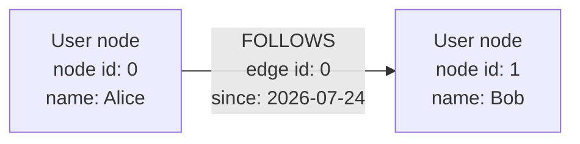
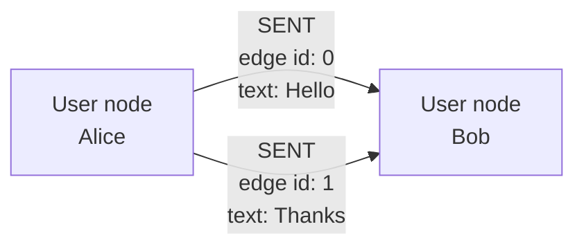
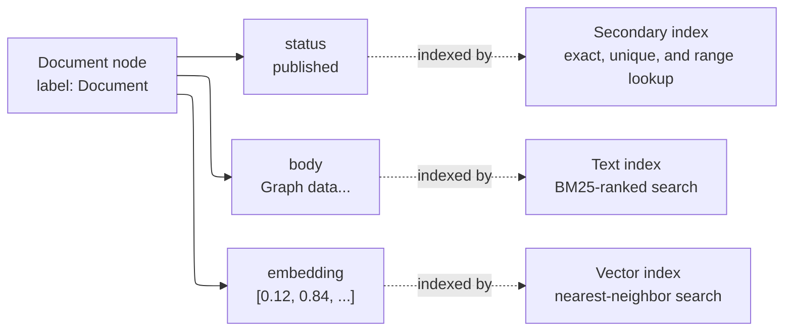

<Badge color="purple" size="sm">Concept</Badge>

HelixDB stores data as a labeled property graph. Nodes represent entities, directed
edges represent relationships, and both carry typed properties. Optional indexes make
selected properties efficient to filter, order, and search.

## Nodes, edges, and direction

Alice is the source of the `FOLLOWS` edge and Bob is its target. Direction belongs to
the relationship: traversing out from Alice reaches Bob, while traversing in from Bob
reaches Alice.

Nodes and edges are numbered from separate sequences, which is why the edge above has ID
`0` even though a node already holds ID `0`. An ID is only unique within its own space,
so always keep track of whether an ID refers to a node or an edge.

| Element | Meaning |
| --- | --- |
| Node | An entity such as a user, document, or product |
| Edge | A directed relationship between two nodes |
| Label | The single type or role of one node or edge |
| Property | Typed data stored on a node or edge |
| ID | The identity of one node or edge within its own ID space |

Each node and each edge carries exactly one label, assigned when it is created. There is
no multi-label set, so model a secondary role as a property or as a relationship to
another node rather than as an extra label.

## Properties

Nodes and edges can carry scalar values, arrays, and nested objects:

| Family | Values |
| --- | --- |
| Scalar | Null, boolean, integer, float, date-time, string, bytes |
| Collection | Typed arrays and heterogeneous arrays |
| Object | Nested maps of any of the above |

A nested value stays readable through a dotted path such as `metadata.score`, but only
top-level properties can be indexed. Promote a nested field to the top level when you
need to filter, order, or search on it.

## Multiple relationships

HelixDB is a multigraph: the same source and target can be connected by more than one
edge.

Both `SENT` edges connect Alice to Bob, but each has its own ID and properties. Use
separate edges when the relationships represent separate events or facts.

An edge can also connect a node to itself, which is useful for relationships such as
`MERGED_INTO` between records of the same kind.

## Indexes

An index is an optional access path over a node or edge label and a top-level property.
Its definition also contains family-specific settings such as uniqueness, sort
direction, text analysis, or vector dimensions and distance metric.

| Index | Use |
| --- | --- |
| Secondary | Equality, ordering, and range lookup, with optional uniqueness on node labels |
| Text | BM25-ranked search over strings and string arrays |
| Vector | Similarity search over fixed-dimension numeric arrays |

Indexes may target nodes or edges and are scoped by label and property. They do not
change the canonical graph data. Creating one starts an asynchronous backfill over
existing data; the index becomes visible only after validation and atomic activation.

See [Secondary indexes](/database/helix-db/query-guides/secondary-indexes),
[Text indexes](/database/helix-db/query-guides/text-indexes), and
[Vector indexes](/database/helix-db/query-guides/vector-indexes) for creation and
query examples.

## Model data clearly

- Use noun-like node labels such as `User`, `Document`, and `Product`.
- Use relationship labels such as `FOLLOWS`, `AUTHORED`, and `PURCHASED`.
- Store relationship-specific values on the edge.
- Use separate edges for distinct events between the same entities.
- Keep properties intended for indexing at the top level.

<Accordion title="Property and indexing rules">

- Node and edge IDs are unsigned 64-bit values from separate sequences that both start at
  zero.
- `$id` and `$label` expose identity and label in queries. `$label` cannot be assigned
  through an ordinary property map.
- A node label can be changed by a dedicated relabel operation, which also moves the
  node between label indexes. An edge label is fixed for the life of the edge.
- Current secondary, text, and vector indexes require top-level properties, and object
  and heterogeneous-array values cannot be indexed.
- Uniqueness is available on node equality indexes only; there is no unique edge index.

</Accordion>

## Next steps

<CardGroup cols={2}>
  <Card title="Query walkthrough" icon="rocket" href="/database/helix-db/core-concepts/overview">
    See this model in one query, operation by operation.
  </Card>
  <Card title="Writing data" icon="pen" href="/database/helix-db/query-guides/writing-data">
    Create nodes and directed relationships, then update or remove them.
  </Card>
  <Card title="Reading data" icon="database" href="/database/helix-db/query-guides/reading-data">
    Select graph data by ID, label, property, or previous result.
  </Card>
  <Card title="Traversals" icon="route" href="/database/helix-db/query-guides/traversals">
    Follow outgoing and incoming relationships through the graph.
  </Card>
  <Card title="Secondary indexes" icon="list" href="/database/helix-db/query-guides/secondary-indexes">
    Accelerate exact, unique, ordered, and range lookups.
  </Card>
  <Card title="Text indexes" icon="align-left" href="/database/helix-db/query-guides/text-indexes">
    Add BM25-ranked search to string properties.
  </Card>
  <Card title="Vector indexes" icon="vector-square" href="/database/helix-db/query-guides/vector-indexes">
    Rank numeric embeddings by distance.
  </Card>
</CardGroup>
