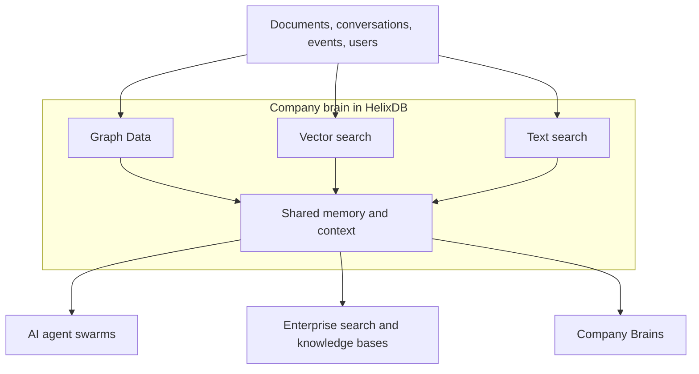

<Badge color="purple" size="sm">Concept</Badge>

HelixDB is a graph database built with native vector and full-text search built on object storage.
It is designed to store and search knowledge and context for applications where explicit structure, and contextual data both matter.

Keeping these retrieval models in one database lets an application work with connected entities, semantically similar content,
and exact terms without synchronizing separate graph, vector, and text stores.

We use object storage as the source of truth and NVMe and memory for caching.
This allows HelixDB to scale to large datasets while keeping the latency and cost low.

Our users are using HelixDB to build applications like enterprise company brains, large scale people search, and AI agent swarms.

Company knowledge arrives as documents, conversations, events, and people.

Everything in HelixDB is one labeled property graph. Nodes are your entities, directed
edges are the relationships between them, and both carry typed properties.

Search is not a second system bolted on top. A vector, text, or secondary index is an
access path over a property that already lives on a node or edge: the embedding on a
chunk, the body text of a document, the `status` field you filter by.

The graph stays the source of truth, so a semantic match and the relationships around it are the same data,
read in the same transaction, with nothing to synchronize between a graph store, a vector store, and a search cluster.

Because an index is scoped to a label and a property rather than to a special node type,
indexes work on edges too, so you can search and filter relationships, not just entities.

### What do you get?

- **ACID transactions** across graph, vector, and text data in a single transaction.
- **Object storage as the source of truth**, so storage scales independently of compute.
- **Full-text search** for exact terms and keyword relevance.
- **Vector search** with prefiltering and over 90% recall.
- **Equality filtering** on property values.
- **Range filtering** on ordered properties.
- **Search and filtering on both nodes and edges**, not just nodes.
- **Horizontal scaling** across multi-tenant and single-tenant deployments, with BYOC coming soon.

### Object Storage

Graph databases are a notoriously challenging database flavour to work with.
Most graph database providers must store all data on one machine on disk, and in the worst case, all in memory.
This leads to 2 problems; scaling and cost.
Given that everything has to fit either in memory or on disk, you are limited by how much data you can physically store without the cost becoming prohibitively large.
By storing all data on object storage, you can scale the storage layer separately to compute, meaning you can scale the amount of data stored far beyond the capacity of the infrastructure.
All this means is much lower costs for vastly more amounts of storage.

## Next steps

<Columns cols={3}>
  <Card title="Get Started" icon="rocket" href="/database/helix-db/start-here/quickstart" cta="Start building">
    Start a local instance and run the generated query.
  </Card>
  <Card title="Understand the data model" icon="diagram-project" href="/database/helix-db/core-concepts/data-model" cta="Explore the model">
    Learn how nodes, edges, properties, and indexes represent your data.
  </Card>
  <Card title="Plan a Cloud workload" icon="cloud" href="mailto:founders@helix-db.com" cta="Contact the founders">
    Discuss large-scale Helix Cloud workloads with the founding team.
  </Card>
</Columns>
