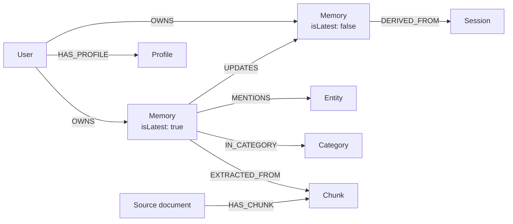
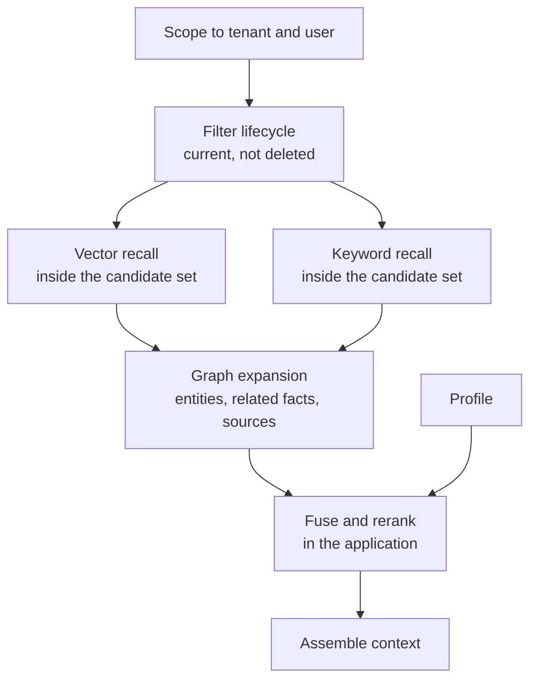

<div className="flex flex-wrap gap-2"><Badge color="purple" size="sm">Concept</Badge></div>

To build long-term memory for an AI agent, store extracted facts as versioned records
scoped to a user, link each one to its source, the entities it mentions, and the version
it replaced, and index the records for both semantic and exact recall. On the write
path, application workers extract candidate facts, compare them with existing memories,
and decide whether each one is new, a duplicate, an update, or an extension. On the read
path, the agent narrows to current memories the user may see, searches inside that set,
expands through relationships, and assembles a compact context for the model.

## What are the parts of an agent memory architecture?

A memory system splits into application workers that interpret content and a database
that stores, relates, and retrieves it.

| Component | Runs in | Responsibility |
| --- | --- | --- |
| Extractor | Application | Turns conversations and documents into candidate facts, usually with an LLM call |
| Embedder | Application | Computes vectors for memories and document chunks |
| Adjudicator | Application | Decides whether a candidate is new, a duplicate, an update, or an extension |
| Summarizer | Application | Maintains a profile of stable facts and current focus for each user |
| Sweeper | Application | Runs scheduled expiry and decay jobs |
| Retrieval service | Application | Runs searches, fuses and reranks results, and packs context |
| Memory store | Database | Holds records, relationships, and property, vector, and text indexes |

Keeping interpretation in the application lets you change models and prompts without
migrating storage. Expressing scope and lifecycle rules in the queries means every
worker gets the same answer about what is visible.

## What data model does agent memory need?

The model below is generic; adapt the names to your domain.



- **User** owns memories. In multi-tenant products every record also carries a tenant
  key, and team or project memory adds a scope key beyond the user.
- **Memory** is one atomic fact: its text, embedding, kind (fact, preference, episode,
  or procedure), salience, confidence, and lifecycle fields such as `createdAt`,
  `isLatest`, `validFrom`, `validTo`, `expiresAt`, and `deletedAt`.
- **Source document** and **chunk** hold raw context for citations and document search.
- **Entity** is a person, product, place, or project that memories mention.
- **Category** groups memories by topic.
- **Session** records the conversation a memory came from.
- **Profile** is the summarizer's output, loaded as always-on context.

Edges carry the meaning: ownership (`OWNS`), provenance (`EXTRACTED_FROM`,
`DERIVED_FROM`), versions (`UPDATES`, plus `EXTENDS` for enrichment), and associations
(`MENTIONS`, `IN_CATEGORY`). Keep lifecycle timestamps separate from real-world time. A
memory about a trip next month needs its own event date, while `validTo` only records
when the memory stopped being current.

## How does the write path work?

<Steps>
  <Step title="Extract with context">
    Give the extractor the current message, the previous assistant message, a short
    window of recent turns, related existing memories, and the current date. Short
    answers only make sense in context, so resolve them before deciding what to store.
    Ask for structured output: content, kind, confidence, entities, source, and scope.
  </Step>
  <Step title="Find deduplication candidates">
    Search the user's current memories for similar facts with vector search and for
    shared names and terms with keyword search. Check for an exact content match so
    repeated writes are idempotent.
  </Step>
  <Step title="Classify the relationship">
    Decide what the candidate means relative to what is stored. A similarity threshold
    alone cannot tell a restatement from a correction, so use rules or an LLM to
    adjudicate.
  </Step>
  <Step title="Write atomically">
    Write the new memory, its ownership and provenance edges, its entity and category
    links, and any invalidation of an older version together, so recall never sees a
    half-applied change. If a memory's text changes, re-embed it in the same write.
  </Step>
</Steps>

```text
Existing memory: The user's team deploys the billing service on Fridays.
Assistant:       Is that still the release schedule?
User:            no, we moved to Tuesdays
Candidate:       The user's team deploys the billing service on Tuesdays.
Decision:        update; the new memory UPDATES the Friday memory
```

| Decision | When it applies | What to write |
| --- | --- | --- |
| Duplicate | Same durable fact as a current memory | Reinforce the existing memory, for example its access count or salience |
| Update | Corrects or replaces an older fact | New memory with `isLatest` true; old memory gets `isLatest` false and a `validTo` time; an `UPDATES` edge from new to old |
| Extend | Adds detail without replacing anything | New memory with an `EXTENDS` edge to the existing one |
| New | No related memory exists | New memory with ownership and provenance edges |

## How should an agent forget?

Forgetting is a set of explicit writes plus filters on every read, not something that
happens on its own.

- **Supersession.** An updated fact gets `isLatest` false and a `validTo` time. History
  remains for audits and "what changed" questions.
- **Soft deletion.** Set `deletedAt` when a user removes a memory. Recall excludes it,
  and the change is reversible.
- **Expiry.** Time-bound facts, such as "the user is traveling this week", get an
  `expiresAt` time. A sweeper hides or removes them once it passes.
- **Decay.** A sweeper can hide episodic memories that are old, low in salience, and
  rarely recalled.
- **Hard deletion.** When a user request or policy requires physical removal, follow
  provenance edges to find every memory derived from the deleted source.

## How does the read path work?



1. **Scope.** Start from the tenant and user, or from the project or access-control
   boundary that decides visibility.
2. **Filter lifecycle.** Keep memories where `deletedAt` is empty, `isLatest` is true,
   `validTo` is empty, and `expiresAt` is empty or in the future.
3. **Recall inside the candidate set.** Run vector search for paraphrases and BM25
   keyword search for names, IDs, and error codes over only the scoped, current
   memories. Filtering after a global top-k search can leave too few eligible results,
   and it leaks data whenever a filter is missed.
4. **Expand.** From the top hits, follow edges to entities and other memories about them,
   to earlier versions when history matters, and to source chunks for citations. Keep
   traversal depth bounded.
5. **Fuse and rerank.** Merge the vector and keyword lists, for example with reciprocal
   rank fusion, then adjust by salience, recency, and relationship type.
6. **Assemble context.** Include the profile, the top memories with their sources, and
   supporting chunks, within a token budget. Leave out embeddings.

## What are common pitfalls?

- **Vector-only memory.** Similarity search misses exact identifiers, returns a fact and
  its correction side by side, and has no concept of ownership or recency.
- **No tenancy scope.** Recall that is not bounded by tenant and user can return another
  user's memories. Treating a missing user ID as "shared" is also risky, so mark shared
  memories explicitly.
- **No provenance.** Without links to sources, the agent cannot cite, you cannot debug a
  wrong memory, and deleting a source document leaves its derived facts behind.
- **Never forgetting.** Stale facts compete with current ones and context fills with
  noise.
- **Overwriting in place.** Editing a memory's text destroys the history needed to
  explain a change, and an edit without re-embedding leaves the vector describing the
  old fact.

## How HelixDB fits this architecture

HelixDB can serve as the memory store in this design. Users, memories, source
documents, chunks, entities, categories, sessions, and profiles are nodes in one labeled
property graph, and ownership, provenance, versions, and mentions are directed edges.

- Tenant scope, identity, and lifecycle fields are top-level properties with equality
  and range [secondary indexes](/database/helix-db/query-guides/secondary-indexes). Only
  top-level properties can be indexed, so keep filter fields out of nested objects.
- A [vector index](/database/helix-db/query-guides/vector-indexes) on memory and chunk
  embeddings serves deduplication and paraphrase recall, and a
  [text index](/database/helix-db/query-guides/text-indexes) ranks their text with BM25
  for exact recall. Both can be partitioned by tenant.
- [Prefiltered search](/database/helix-db/query-guides/prefiltering) ranks only the
  candidate set a traversal builds, so scope and lifecycle rules apply before ranking
  and nothing outside the set is returned.
- All entries in a write batch commit or roll back together, which keeps a new version,
  its edges, and the old version's invalidation consistent. See
  [guarantees](/database/helix-cloud/operate/guarantees).

The extractor, embedder, adjudicator, summarizer, and sweepers stay in the application.
The application computes embeddings and fuses vector and BM25 results, because HelixDB
has no built-in rank-fusion operator.

## Frequently asked questions

### How do you deduplicate agent memories?

Treat deduplication as read-then-write. Retrieve likely matches with vector and keyword
search over the user's current memories, check for an exact repeat, and let an
adjudicator choose between duplicate, update, extension, and new. Similarity thresholds
depend on the embedding model, so retune them whenever the model changes.

### Should an update overwrite the old memory?

Usually not. Writing a new version and marking the old one superseded keeps recall clean
while preserving history for audits, corrections, and questions about what changed.

### How do you handle shared memory for teams?

Add a scope key beyond the user, such as a project or workspace ID, and mark shared
memories explicitly. Build the candidate set from the scopes the requesting user belongs
to, so private and shared memories are combined only where access allows.

### Should the database run memory extraction?

In most architectures, no. Extraction, embedding, and summarization depend on models and
prompts that change often, so they run as application workers. The database stores the
results, enforces scope in queries, and retrieves them consistently.

## Related topics

<CardGroup cols={2}>
  <Card title="What is AI agent memory?" icon="brain" href="/learn/ai-memory/what-is-ai-agent-memory">
    Memory types, the memory lifecycle, and what a memory layer needs.
  </Card>
  <Card title="What is GraphRAG?" icon="share-nodes" href="/learn/ai-memory/what-is-graphrag">
    Retrieval that follows relationships between entities and sources.
  </Card>
  <Card title="Hybrid search" icon="magnifying-glass" href="/learn/full-text-search/hybrid-search">
    Combine vector similarity with BM25 keyword ranking.
  </Card>
  <Card title="Filtered vector search" icon="filter" href="/learn/vector-search/filtered-vector-search">
    Why search inside a candidate set instead of filtering afterward.
  </Card>
  <Card title="Prefiltered search" icon="vector-square" href="/database/helix-db/query-guides/prefiltering">
    Rank only the nodes a traversal reaches in a HelixDB query.
  </Card>
  <Card title="HelixDB data model" icon="diagram-project" href="/database/helix-db/core-concepts/data-model">
    Nodes, edges, typed properties, and indexes in HelixDB.
  </Card>
</CardGroup>
