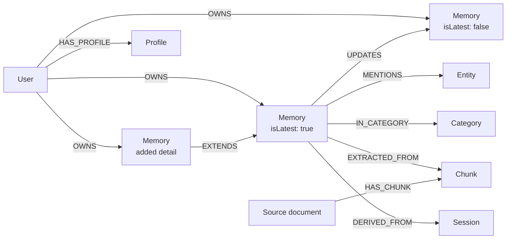
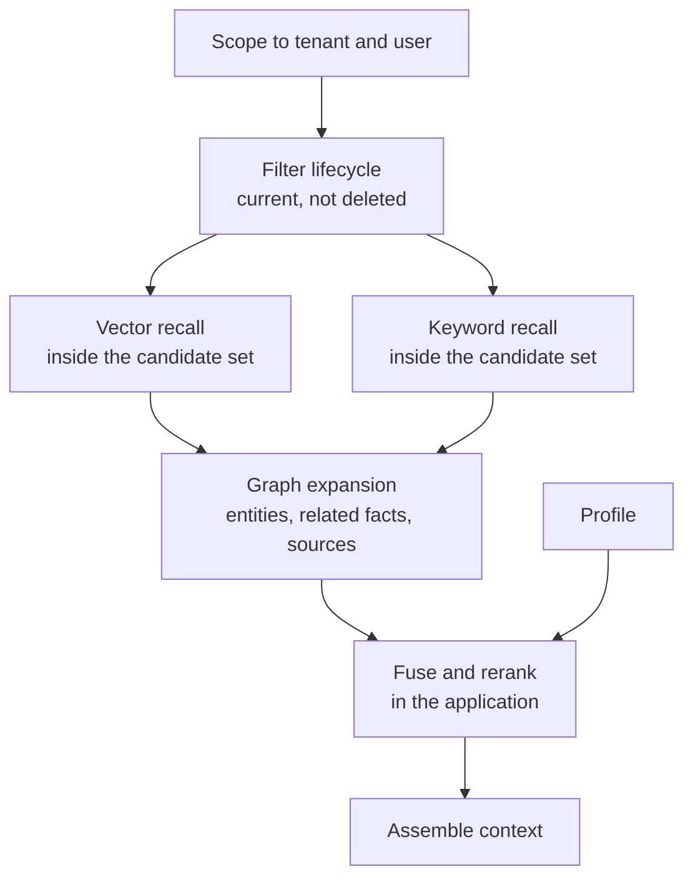

<div className="flex flex-wrap gap-2"><Badge color="purple" size="sm">Concept</Badge></div>

Long-term memory for an AI agent is the part of
[agent memory](/learn/ai-memory/what-is-ai-agent-memory) that persists across sessions:
a store of facts, preferences, and past events the agent can recall after a conversation
ends. To build it, store extracted facts as versioned, user-scoped records linked to
their sources, entities, and earlier versions, and index them for semantic and exact
recall. Writes catch duplicates and updates; reads search only current memories the user
may see, expand through relationships, and assemble a compact context for the model.

<div className="learn-objectives">
  <Card title="Learning objectives" icon="graduation-cap">
    After reading this article you will be able to:

    - Describe the components of an agent memory system and where each runs
    - Design a scoped, versioned memory data model
    - Explain how the write path deduplicates, updates, and forgets memories
    - Describe the read path from scoping to context assembly
  </Card>
</div>

## What are the parts of an agent memory architecture?

A memory system splits into application workers that interpret content and a database
that stores, relates, and retrieves it.

| Component | Runs in | Responsibility |
| --- | --- | --- |
| Extractor | Application | Turns conversations and documents into candidate facts, usually with an LLM call |
| Embedder | Application | Computes [vector embeddings](/learn/vector-search/what-are-vector-embeddings) for memories and document chunks |
| Adjudicator | Application | Decides whether a candidate is new, a duplicate, an update, or an extension |
| Summarizer | Application | Maintains each user's profile of stable facts and current focus |
| Sweeper | Application | Runs scheduled expiry and decay jobs |
| Retrieval service | Application | Runs searches, fuses and reranks results, and packs context |
| Memory store | Database | Holds records, relationships, and property, vector, and text indexes |

## What data model does agent memory need?

Agent memory needs atomic, user-scoped memory records with lifecycle fields, linked by
edges to their owner, sources, entities, categories, and the versions they replace.
Adapt the generic names below to your domain.



- **User** owns memories; in multi-tenant products every record also has a tenant key.
- **Memory** is one atomic fact: its text, embedding, kind (fact, preference, episode,
  or procedure), salience, confidence, and lifecycle fields such as `createdAt`,
  `isLatest`, `validFrom`, `validTo`, `expiresAt`, and `deletedAt`.
- **Source document** and **chunk** hold raw context for citations and document search.
- **Profile** is the summarizer's output, loaded as always-on context.

Edges carry ownership, provenance, versions (`UPDATES`, plus `EXTENDS` for enrichment),
and associations. Every memory, current or superseded, has its own provenance and
association edges; the diagram draws them once. Here `validFrom` and `validTo` record
when a memory was current in the store (system time, not the valid time of bitemporal
databases). Keep real-world dates, such as a trip date, in a property like `eventAt`.

## How does the memory write path work?

The write path extracts candidate facts in context, finds similar existing memories,
classifies each candidate as new, duplicate, update, or extension, and writes the result
atomically.

<Steps>
  <Step title="Extract with context">
    Give the extractor the current message, recent turns including the previous
    assistant message, related memories, and the current date, so short answers resolve
    in context. Ask for structured output: content, kind, confidence, entities, source,
    and scope.
  </Step>
  <Step title="Find deduplication candidates">
    Search the user's current memories with vector search for similar facts and keyword
    search for shared names. Check for an exact content match inside the write
    transaction, or use a scoped content hash as an idempotency key, so retried writes
    are idempotent.
  </Step>
  <Step title="Classify the relationship">
    A similarity threshold alone cannot tell a restatement from a correction, so
    adjudicate with rules or an LLM.
  </Step>
  <Step title="Write atomically">
    Write the new memory, its ownership and provenance edges, its entity and category
    links, and any invalidation of an older version together, so recall never sees a
    half-applied change. An update writes a new memory with its own embedding and never
    edits an existing memory's text.
  </Step>
</Steps>

```text
Existing memory: The user's team deploys the billing service on Fridays.
Assistant:       Is that still the release schedule?
User:            no, we moved to Tuesdays
Candidate:       The user's team deploys the billing service on Tuesdays.
Decision:        update; the new memory UPDATES the Friday memory
```

| Decision | When it applies | What to write |
| --- | --- | --- |
| Duplicate | Same durable fact as a current memory | Reinforce the existing memory, for example its access count or salience |
| Update | Corrects or replaces an older fact | New memory with `isLatest` true; old memory gets `isLatest` false and a `validTo` time; an `UPDATES` edge from new to old |
| Extend | Adds detail without replacing anything | New memory with an `EXTENDS` edge to the existing one |
| New | No related memory exists | New memory with ownership and provenance edges |

## How do you implement forgetting in agent memory?

Forgetting is a set of explicit writes plus filters on every read, not something that
happens on its own.

- **Supersession.** An updated fact gets `isLatest` false and a `validTo` time but stays
  available for audits and "what changed" questions.
- **Soft deletion.** Set `deletedAt` when a user removes a memory. Recall excludes it,
  and the change is reversible.
- **Expiry.** Time-bound facts, such as "the user is traveling this week", get an
  `expiresAt` time. A sweeper hides or removes them once it passes.
- **Decay.** A sweeper can hide episodic memories that are old, low in salience, and
  rarely recalled.
- **Hard deletion.** When a user or policy requires physical removal, follow provenance
  edges to every memory derived from the deleted source and delete its chunks too. Check
  earlier versions through `UPDATES` edges, which can hold the same data, and regenerate
  any profile built from removed memories.

## How does the memory read path work?

The read path filters to the user's current memories, runs vector and keyword recall
inside that set, expands through graph edges, fuses the results, and assembles context.



1. **Scope.** Start from the tenant and user, or from the project or access-control
   boundary that decides visibility.
2. **Filter lifecycle.** Keep memories where `deletedAt` is empty, `isLatest` is true,
   `validTo` is empty, and `expiresAt` is empty or in the future.
3. **Recall inside the candidate set.** Run vector search for paraphrases and
   [BM25](/learn/full-text-search/what-is-bm25) keyword search for names, IDs, and error
   codes over only the scoped, current memories. Filtering after a global top-k search
   can return too few results or leak data; see
   [filtered vector search](/learn/vector-search/filtered-vector-search).
4. **Expand.** From the top hits, follow edges to entities, related memories, and source
   chunks. Apply the same tenant, user, and lifecycle filters to every memory reached,
   include earlier versions only when the question asks for history, and keep traversal
   depth bounded.
5. **Fuse and rerank.** Merge the vector and keyword lists, for example with reciprocal
   rank fusion as in [hybrid search](/learn/full-text-search/hybrid-search), then adjust
   by salience, recency, and relationship type.
6. **Assemble context.** Include the profile, the top memories with their sources, and
   supporting chunks within a token budget, without embeddings.

## What are common pitfalls when building agent memory?

Common pitfalls are relying on vector search alone, leaving out tenancy scope or
provenance, and overwriting memories in place.

- **Vector-only memory.** Similarity search can miss or misrank exact identifiers such
  as IDs and error codes, can return a fact next to its correction, and has no concept
  of ownership or recency.
- **No tenancy scope.** Recall not bounded by tenant and user can return another user's
  memories. Mark shared memories explicitly instead of treating a missing user ID as
  shared.
- **No provenance.** Without links to sources, the agent cannot cite, you cannot debug a
  wrong memory, and deleting a source document leaves its derived facts behind.
- **Overwriting in place.** Editing a memory's text destroys the history needed to
  explain a change and, without re-embedding, leaves the vector describing the old fact.

## How does HelixDB fit into this architecture?

HelixDB can serve as the memory store in this design, holding these nodes and directed
edges in one [labeled property graph](/database/helix-db/core-concepts/data-model).

- Tenant scope, identity, and lifecycle fields are top-level properties with equality
  and range [secondary indexes](/database/helix-db/query-guides/secondary-indexes),
  because nested properties cannot be indexed.
- [Vector indexes](/database/helix-db/query-guides/vector-indexes) on the memory and
  chunk embedding properties, one per label, serve deduplication and paraphrase recall.
  [Text indexes](/database/helix-db/query-guides/text-indexes) on their text properties
  rank exact names, IDs, and rare tokens with BM25. Both can be partitioned by tenant.
- [Prefiltered search](/database/helix-db/query-guides/prefiltering) ranks only the
  candidate set a traversal builds, so scope and lifecycle rules apply before ranking
  and no search result falls outside the set. Graph expansion after the search needs
  the same filters.
- All entries in a write batch commit or roll back together, keeping a new version, its
  edges, and the old version's invalidation consistent. See
  [guarantees](/database/helix-cloud/operate/guarantees).

The application fuses vector and BM25 results, because HelixDB has no built-in rank
fusion.

## Frequently asked questions

### What happens when you change the embedding model?

Vectors from different models are not comparable, so re-embed every memory and chunk,
embed queries with the new model, and retune deduplication thresholds, which depend on
the model. See [vector embeddings](/learn/vector-search/what-are-vector-embeddings).

### How do you handle shared memory for teams?

Add a scope key beyond the user, such as a project or workspace ID, and mark shared
memories explicitly. Build the candidate set from every scope the requesting user can
access.

### Should the database run memory extraction?

In most architectures, no. Extraction, embedding, and summarization depend on models and
prompts that change often, so they run in the application, where you can change them
without migrating stored data.

## Related topics

<CardGroup cols={2}>
  <Card title="What is AI agent memory?" icon="brain" href="/learn/ai-memory/what-is-ai-agent-memory">
    Memory types, the memory lifecycle, and what a memory layer needs.
  </Card>
  <Card title="What is GraphRAG?" icon="share-nodes" href="/learn/ai-memory/what-is-graphrag">
    Retrieval that follows relationships between entities and sources.
  </Card>
  <Card title="What is hybrid search?" icon="code-merge" href="/learn/full-text-search/hybrid-search">
    Combine vector similarity with BM25 keyword ranking.
  </Card>
  <Card title="What is filtered vector search?" icon="filter" href="/learn/vector-search/filtered-vector-search">
    Why search inside a candidate set instead of filtering afterward.
  </Card>
  <Card title="What are vector embeddings?" icon="cubes" href="/learn/vector-search/what-are-vector-embeddings">
    How models turn content into vectors, and when to re-embed.
  </Card>
  <Card title="What is BM25?" icon="square-root-variable" href="/learn/full-text-search/what-is-bm25">
    The keyword ranking behind exact recall of names and IDs.
  </Card>
</CardGroup>
