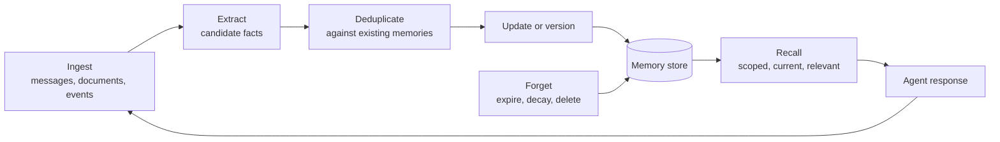

<Badge color="purple" size="sm">Concept</Badge>

AI agent memory is the system that lets an AI agent, an assistant that carries out tasks,
remember facts, past conversations, and routines across sessions. It works like a notebook
the agent keeps: the underlying model retains nothing between calls, so the agent writes
down what matters in a separate store and reads the relevant pages back, typically before
it replies. Without memory, a support assistant asks for your account details every time,
and a music assistant forgets that you skip live recordings. With it, the agent can pick
up where it left off, keep up with facts that change, and stop asking the same questions.

  <Card title="Learning objectives" icon="graduation-cap">
    After reading this article you will be able to:

    - Explain why a model's context window cannot serve as an agent's long-term memory
    - Describe the main types of agent memory, from working memory to the user profile
    - Outline how memories are captured, updated, forgotten, and recalled
    - Identify the storage and search features a memory layer needs
  </Card>

## Why is a context window not memory?

A context window is the text a model reads in a single call, and it is cleared when that
call ends. It can hold the conversation in progress, but it cannot remember last month.

Under the hood, the window is a maximum amount of text, measured in tokens (words or pieces
of words); in many models, the reply the model generates counts against the same limit. It
works like working memory: everything the model knows about the current task has to fit
inside it. Using it as long-term memory breaks down for several reasons:

- **It resets.** A new session starts empty unless something outside the model puts
  earlier information back.
- **It is bounded and typically priced per token.** Replaying every past conversation
  grows cost and latency with each turn, and eventually stops fitting.
- **It has no notion of truth over time.** If a user said one thing last month and the
  opposite today, a transcript contains both, and the model has to guess which is current.
- **It is not scoped.** Nothing in a raw prompt records who owns a fact, where it came
  from, or whether this user may see it.
- **More text is not always better context.** Models do not use every part of a long
  prompt equally well, so a focused set of relevant facts often produces better answers
  than a full history.

Larger context windows make short-term memory roomier, but they do not replace a system
that decides what to keep, what changed, and what to retrieve.

## What types of memory do AI agents use?

Agents use short-term memory for the task at hand and long-term memory for anything that
should survive to the next session. The terms are borrowed from cognitive psychology, the
study of how people think and remember.

| Type | Horizon | What it holds | Example |
| --- | --- | --- | --- |
| Working memory | One model call | The prompt: instructions, recent turns, retrieved context | The assembled context for the current reply |
| Conversation history | One session | Recent messages in the current conversation | The last few turns of a support chat |
| Episodic memory | Long-term | Specific past events, with when and where they happened | "The user reported a failed CSV export in last week's session" |
| Semantic memory | Long-term | Facts and preferences, independent of when they were learned | "The user prefers invoices as PDF attachments" |
| Procedural memory | Long-term | How to do things: learned workflows and rules | "For this account, check billing status before issuing a refund" |
| User profile | Long-term, derived | A condensed summary of stable facts and current focus | "Finance admin, moving the team to annual billing this quarter" |

The difference between **episodic and semantic memory** matters in practice. Episodes
answer "what happened"; semantic facts answer "what is true now." Agents often derive
semantic facts from episodes, for example inferring a preference from several
conversations, and keep a link back to those episodes as evidence.

The **user profile** is not a separate source of truth. It is a summary maintained from
long-term memories, so the agent can load broad context cheaply on every request.

  <Card title="Try HelixDB" icon="rocket" href="/database/helix-db/start-here/quickstart" cta="Get started">
    Store an agent's memories, their sources, and their embeddings in one open-source graph
    database, with vector and BM25 search over the same records.
  </Card>

## How does the memory lifecycle work?

Memory works as a loop. Each interaction can add, change, or remove memories, and each new
request reads from the result. The loop has six steps: ingest, extract, deduplicate,
update, forget, and recall.

1. **Ingest.** Collect raw input: conversation turns, uploaded documents, tool results, and
   application events.
2. **Extract.** Turn raw input into small, self-contained facts. A reply such as "next
   Tuesday" only means something together with the question before it, so the extractor
   needs recent conversation context and the current date.
3. **Deduplicate.** Compare each candidate with existing memories, both by meaning with
   [vector search](/learn/vector-search/what-is-vector-search) and by exact terms with
   [full-text search](/learn/full-text-search/what-is-full-text-search), so the same fact
   is not stored many times.
4. **Update and version.** When a fact changes, write a new version and mark the old one
   as superseded instead of overwriting it. History stays available for audits and for
   questions about what changed.
5. **Forget.** Expire time-bound facts, let low-value episodes decay, and delete what a
   user or policy asks to remove.
6. **Recall.** Retrieve the memories this user may see, that are still current, and that
   are relevant to the request, then assemble them into context. Recall can also follow
   links to related facts, much like [GraphRAG](/learn/ai-memory/what-is-graphrag).

The guide to
[building long-term memory](/learn/ai-memory/long-term-memory-for-ai-agents) turns each
step into a concrete architecture.

## What infrastructure does a memory layer need?

A memory layer has to know who owns each memory and how memories connect. It also has to
find them by meaning and by exact words, while skipping anything outdated or deleted.

| Requirement | Why it matters | Typical mechanism |
| --- | --- | --- |
| Identity and tenancy | Memories belong to a user, team, or organization and must never leak across them | Scope keys on every record, indexed filters, per-tenant indexes |
| Relationships | Facts connect to people, topics, sources, and earlier versions | [Graph](/learn/graph-databases/what-is-a-graph-database) edges that queries can traverse |
| Semantic recall | Users rephrase; "my flight" should find "the trip to the conference" | Vector search over [embeddings](/learn/vector-search/what-are-vector-embeddings) |
| Exact recall | Names, IDs, error codes, and rare terms blur in embeddings | Full-text search, typically ranked with [BM25](/learn/full-text-search/what-is-bm25) |
| Recency and lifecycle | Only current, undeleted, unexpired facts belong in context | Timestamps and flags with equality and range indexes |
| Provenance | The agent must cite sources, debug bad memories, and honor deletion of a source | Links from each memory to the messages or documents it came from |

Many teams assemble these from several systems, such as a relational store for records, a
vector store for embeddings, and a search engine for keywords. That works, but the
application then has to keep them consistent.

For example, a memory deleted in one system can still surface from another. A permission
filter applied after a similarity search can remove every result or, if it is forgotten,
leak one; see [filtered vector search](/learn/vector-search/filtered-vector-search). For
the trade-offs of combining these, see
[one database for graph, vector, and text](/learn/database-architecture/one-database-for-graph-vector-and-text).

## How does HelixDB support agent memory?

HelixDB is an open-source graph database with native vector search and BM25 full-text
search, so the requirements above can be met in one labeled
[property graph](/learn/graph-databases/what-is-a-property-graph):

- **Properties with indexes** hold tenant scope, identity, and lifecycle fields such as
  `isLatest`, `validTo`, `deletedAt`, and `expiresAt`. Equality and range
  [secondary indexes](/database/helix-db/query-guides/secondary-indexes) make them
  indexed filters.
- **Edges** record provenance, categories, entities, version updates, and associations.
- **[Vector search](/database/helix-db/query-guides/vector-indexes)** handles
  deduplication and paraphrase recall, and
  **[BM25](/database/helix-db/query-guides/text-indexes)** handles exact names, IDs, and
  rare tokens. Both index types can be
  [partitioned by tenant](/database/helix-cloud/operate/multi-tenancy#tenant-partitioned-search-indexes).
- **A profile node** holds stable user context that the agent loads on every request.

The recall pattern is to build the visible candidate set first with a graph traversal,
then run [prefiltered](/database/helix-db/query-guides/prefiltering) vector and BM25
search inside it, so a memory outside the set is never returned. Each request runs as one
ACID transaction, so the traversal and both searches read the same snapshot. The
application computes embeddings; HelixDB stores and indexes the vectors. HelixDB has no
built-in rank fusion or reranking, so the application fuses the vector and BM25 result
lists.

## Frequently asked questions

### How does an agent decide which memories to recall?

It narrows by scope first: only memories owned by or shared with the current user or team.
It then keeps only current memories, excluding anything deleted, superseded, or expired,
and ranks what remains by relevance with semantic and keyword search, as in
[hybrid search](/learn/full-text-search/hybrid-search). These filters should apply before
or during ranking, not after, and the agent keeps only a small budget of top results so
the context stays focused.

### Is agent memory the same as RAG?

They share retrieval techniques but differ in what they retrieve.
[Retrieval-augmented generation (RAG)](/learn/ai-memory/what-is-rag) typically reads from
a document collection that changes independently of the agent, such as a company wiki.
Memory is written by the agent from its own interactions, changes as facts are corrected,
and is scoped to a user or team. Many systems combine the two and link each memory to the
source passage it came from.

### Can a vector database alone serve as agent memory?

Not on its own. A [vector database](/learn/vector-search/what-is-a-vector-database) covers
semantic recall, and many also filter on metadata copied onto each vector, which can
handle ownership and lifecycle flags. That copy has to be kept in sync, and it cannot
represent provenance, versions, or links between entities as relationships; many vector
databases also lack keyword ranking for exact identifiers. A complete memory layer needs
properties, lifecycle filters, keyword search, and relationships alongside the vectors.

### What should an agent store in memory?

Store information that is likely to matter again: stable facts and preferences, notable
events, and workflows the agent has learned. Skip small talk, passing details, and
anything a user or policy says must not be kept. Each stored fact should be atomic and
self-contained, and should record its owner, its source, and when it was learned so it can
be superseded or expired later.

### How should an AI agent forget?

Many systems use soft deletion: mark a memory as deleted, superseded, or expired and
exclude it from every recall path, and reserve physical deletion for user requests and
retention policies. The guide to
[building long-term memory](/learn/ai-memory/long-term-memory-for-ai-agents) covers
expiry, decay, and deletion in detail.

## Related topics

<CardGroup cols={2}>
  <Card title="Building long-term memory" icon="brain" href="/learn/ai-memory/long-term-memory-for-ai-agents">
    Data model, write path, forgetting, and recall for agent memory.
  </Card>
  <Card title="What is RAG?" icon="book-open" href="/learn/ai-memory/what-is-rag">
    Ground a model's answers in data retrieved at query time.
  </Card>
  <Card title="What is GraphRAG?" icon="share-nodes" href="/learn/ai-memory/what-is-graphrag">
    Retrieval over entities and relationships, not only text chunks.
  </Card>
  <Card title="What is hybrid search?" icon="magnifying-glass" href="/learn/full-text-search/hybrid-search">
    Combine vector similarity with BM25 keyword ranking.
  </Card>
  <Card title="What is filtered vector search?" icon="filter" href="/learn/vector-search/filtered-vector-search">
    Restrict similarity search to the records a user may see.
  </Card>
  <Card title="What is a vector database?" icon="database" href="/learn/vector-search/what-is-a-vector-database">
    Store embeddings and find the nearest ones to a query.
  </Card>
</CardGroup>
