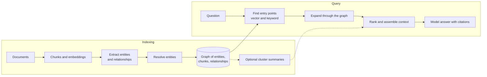

<Badge color="purple" size="sm">Concept</Badge>

GraphRAG is a way to find information for an AI model's answer by following links between
facts, not only by matching similar text. Think of it as asking a colleague who knows how
everything connects, such as which team owns which service, instead of searching a pile of
notes for passages that sound like your question. It builds on
[retrieval-augmented generation (RAG)](/learn/ai-memory/what-is-rag), where an application
looks up relevant text and hands it to the model, and helps most with questions that span
several documents, center on one customer or product, or ask about a whole collection.
The trade-off is extra setup: extracting who and what each document mentions and how they
relate, typically with model calls, then keeping that graph accurate.

  <Card title="Learning objectives" icon="graduation-cap">
    After reading this article you will be able to:

    - Explain how GraphRAG finds context through connected facts, not only similar passages
    - Recognize the kinds of questions where vector-only RAG falls short
    - Compare GraphRAG with vector RAG on indexing cost, freshness, and explainability
    - Decide when GraphRAG is worth its extra setup and upkeep
  </Card>

## Where does vector RAG fall short?

Vector RAG falls short when the answer depends on how facts in different passages
connect. It ranks each passage on its own, so it cannot see the chain that links them.

Standard vector RAG splits documents into chunks, turns each chunk into a
[vector embedding](/learn/vector-search/what-are-vector-embeddings) (a list of numbers
that captures its meaning), and uses
[vector search](/learn/vector-search/what-is-vector-search) to put the chunks most similar
to the question into the model's prompt. That works well when the answer sits in one or
two passages that read like the question. These four kinds of question are harder:

| Question type | Example | Why chunk similarity struggles |
| --- | --- | --- |
| Multi-hop | "Which customers were affected by incidents in services the payments team owns?" | The chain from team to service to incident to customer spans documents, and no single chunk resembles the whole question |
| Entity-centric | "What do we know about the mobile checkout feature?" | Facts are spread across many chunks and aliases; top-k returns a few similar passages and misses the rest |
| Global or summary | "What are the main themes in this quarter's support tickets?" | The answer depends on the whole collection, but retrieval sees only a small sample |
| Permission-bound | "Summarize the contracts this user can read" | Access often depends on a chain of relationships (user to group to folder to document) that flat metadata cannot express; filtering after top-k can drop every result, and skipping the filter leaks restricted text |

Chunking also strips context. A passage that says "it was rolled back" may not say what
"it" refers to.

## How does GraphRAG work?

GraphRAG builds a map of who and what your content mentions and how they relate, then uses
that map at question time to gather connected facts. In graph terms, things are nodes and
relationships are edges; see
[What is a graph database?](/learn/graph-databases/what-is-a-graph-database)

For example, a company wiki might mention the billing service on hundreds of pages.
GraphRAG turns those mentions into one billing-service node, linked to the team that owns
it, its past incidents, and every page that discusses it. The result is a
[knowledge graph](/learn/graph-databases/what-is-a-knowledge-graph) built from your own
documents.

Under the hood, common patterns include:

- **Entity and relationship extraction.** At indexing time, a model or a
  language-processing pipeline reads each chunk and lists its entities, such as people,
  products, services, and contracts, plus typed relationships between them. Each chunk
  links to the entities it mentions.
- **Entity resolution.** Mentions that refer to the same thing, such as "the billing
  service" and "billing-svc", are merged into one node so the facts about it connect.
- **Graph expansion from retrieved nodes.** Vector or
  [keyword search](/learn/full-text-search/what-is-full-text-search) finds entry points,
  and a bounded traversal (a walk along edges with a depth limit) collects neighboring
  entities, relationships, and the chunks that support them. This is sometimes called
  local search.
- **Graph-scoped retrieval.** A traversal defines the candidate set first, such as the
  documents linked to one customer or product area, and similarity search runs inside it.
  This is a form of [filtered vector search](/learn/vector-search/filtered-vector-search).
- **Community or cluster summaries.** A community detection algorithm splits the entity
  graph into groups of densely connected entities, and a model writes a summary of each
  group ahead of time. Questions about the whole collection are answered by combining the
  relevant summaries. This is sometimes called global search.

  <Card title="Try HelixDB" icon="rocket" href="/database/helix-db/start-here/quickstart" cta="Get started">
    Keep documents, entities, and relationships in one open-source graph database, and run
    vector search inside a graph traversal.
  </Card>

## How does GraphRAG compare with vector RAG?

Vector RAG finds passages that read like the question. GraphRAG also finds starting points
by similarity, then follows relationships to connected facts, at a higher cost to build and
maintain.

In practice, GraphRAG follows edges for multi-hop questions, gathers the facts linked to
one resolved entity, answers collection-wide questions from cluster summaries when they
are built, and can model permissions as edges that retrieval follows.

| Aspect | Vector RAG | GraphRAG |
| --- | --- | --- |
| Retrieval unit | Text chunks | Entities, relationships, chunks, and optional summaries |
| How context is found | Similarity to the question | Similarity for entry points, then traversal |
| Indexing cost | Chunk and embed | Also extraction (often model calls) and entity resolution |
| Content updates | Re-embed changed chunks | Also update entities, edges, and affected summaries |
| Explainability | Cites chunks | Cites chunks and the paths that connect them |

## What does GraphRAG cost?

GraphRAG costs more than vector RAG in three places: building the graph, keeping it
accurate and fresh, and keeping queries from sprawling.

- **Extraction cost.** With model-based extraction, every chunk goes through a model at
  indexing time, and changing the extraction prompt or model can mean reprocessing the
  whole collection.
- **Graph quality.** Extraction can miss relationships or invent ones that are not in the
  text. Entity resolution fails in both directions: duplicates split one entity's facts
  across several nodes, and over-merging combines different entities into one.
- **Freshness.** Entities and summaries are shared across documents, so an edit to one
  document can change nodes, edges, and summaries that other documents also rely on.
- **Consistency.** When the graph, vector index, and keyword index live in separate
  systems, the application must keep them in sync; see
  [one database for graph, vector, and text](/learn/database-architecture/one-database-for-graph-vector-and-text).
- **Query fan-out.** Highly connected entities can pull in large neighborhoods, so
  expansion needs bounds; the FAQ below covers hop limits.

Put simply, three habits keep these costs visible: constrain entity and relationship types
with a schema, keep an edge from every extracted fact back to its source chunk, and
evaluate against a fixed set of questions.

## When should you use GraphRAG?

Use GraphRAG when your questions are about connections: multi-hop questions, entity
profiles, dependency and impact analysis, or themes across a collection. For example, a
support team might ask which customers an outage affected, or a bank analyst how a flagged
account links to others.

It also fits when the domain already has structure, such as customers, products,
tickets, and contracts, or when access rules are relationships that retrieval must
respect.

Vector or [hybrid](/learn/full-text-search/hybrid-search) RAG is often enough when answers
live in single passages, as with FAQs and product documentation, or when content changes
faster than extraction can keep up. A practical path is to start with hybrid vector and
[BM25](/learn/full-text-search/what-is-bm25) search, collect the questions it answers
poorly, and add graph structure where those failures cluster.

## How do you implement GraphRAG?

Add graph extraction and graph-aware retrieval to a standard chunk-and-embed pipeline,
then check the result against vector-only retrieval.

<Steps>
  <Step title="Define the schema">
    Choose entity types, relationship types, and how documents and chunks are stored.
  </Step>
  <Step title="Index the content">
    Chunk documents, compute embeddings, and index chunk text for vector and keyword
    search.
  </Step>
  <Step title="Extract and resolve">
    Extract entities and relationships from each chunk, merge duplicate entities, and
    link each chunk to the entities it mentions.
  </Step>
  <Step title="Retrieve with the graph">
    Find entry points, traverse a bounded neighborhood, search within it, and fuse the
    results into context with citations.
  </Step>
  <Step title="Evaluate">
    Compare answers with vector-only retrieval on multi-hop, entity, and summary
    questions.
  </Step>
</Steps>

## How does HelixDB support GraphRAG?

HelixDB is a graph database with native vector search and BM25 full-text search, so
documents, chunks, entities, and relationships can live in one labeled
[property graph](/learn/graph-databases/what-is-a-property-graph). It is a multigraph,
meaning two entities can be connected by several labeled edges.
[Vector](/database/helix-db/query-guides/vector-indexes) and
[text](/database/helix-db/query-guides/text-indexes) indexes on chunk properties sit
beside the graph rather than in a separate system.

Retrieval can traverse first and then search within the traversal. With
[prefiltering](/database/helix-db/query-guides/prefiltering), the order is graph
traversal, exact candidate membership, ranking, then top k, and a result outside the
candidate set is never returned. A prefiltered search accepts up to 1,000,000 unique
candidates and returns at most 800 results.
[Traversals](/database/helix-db/query-guides/traversals) support bounded repeats and
shortest paths for expansion.

Each request is one ACID transaction over a committed snapshot, so the traversals, vector
searches, and text searches in a request read the same data. The application computes
embeddings, and HelixDB stores and indexes the vectors. HelixDB has no built-in rank
fusion or reranking, so the application combines the vector and BM25 results.

## Frequently asked questions

### How many hops should graph expansion follow?

Many systems start with one or two hops from each entry point. Each hop can multiply the
number of nodes reached, and highly connected entities can fill the context with loosely
related facts. Capping the neighbors followed per node and filtering by relationship type
keep expansion focused; raise the limits only when evaluation shows missed answers.

### Do I need a knowledge graph before using GraphRAG?

You need a graph, but it does not have to be built by hand. Many pipelines extract it from
documents with a model, and many domains already have structured relationships, such as
ticket links, product catalogs, or ownership records, that can seed it. See
[What is a knowledge graph?](/learn/graph-databases/what-is-a-knowledge-graph)

### How does GraphRAG relate to hybrid search?

They are complementary. Hybrid search, which combines vector and keyword ranking, can be
GraphRAG's first retrieval step for finding entry points, and GraphRAG adds traversal
from there.

### How is GraphRAG related to AI agent memory?

An agent memory store can be modeled as a graph of facts, entities, sources, and versions
scoped to one user. Recalling from it uses the same moves as GraphRAG: find relevant facts
by similarity and keywords, then expand through relationships. See
[What is AI agent memory?](/learn/ai-memory/what-is-ai-agent-memory)

## Related topics

<CardGroup cols={2}>
  <Card title="What is retrieval-augmented generation (RAG)?" icon="book-open" href="/learn/ai-memory/what-is-rag">
    The standard chunk, embed, retrieve, and generate pipeline.
  </Card>
  <Card title="What is a knowledge graph?" icon="share-nodes" href="/learn/graph-databases/what-is-a-knowledge-graph">
    Entities, relationships, and provenance for search and LLMs.
  </Card>
  <Card title="What is hybrid search?" icon="magnifying-glass" href="/learn/full-text-search/hybrid-search">
    Combine vector similarity with BM25 keyword ranking.
  </Card>
  <Card title="What is filtered vector search?" icon="filter" href="/learn/vector-search/filtered-vector-search">
    Rank only the candidates that pass a filter or traversal.
  </Card>
  <Card title="How do you build long-term memory for AI agents?" icon="brain" href="/learn/ai-memory/long-term-memory-for-ai-agents">
    Apply graph-plus-search retrieval to per-user agent memory.
  </Card>
  <Card title="Do you need separate graph, vector, and text databases?" icon="layer-group" href="/learn/database-architecture/one-database-for-graph-vector-and-text">
    Trade-offs of keeping all three access paths in one system.
  </Card>
  <Card title="Prefiltered search" icon="vector-square" href="/database/helix-db/query-guides/prefiltering">
    Rank only the nodes a traversal reaches in a HelixDB query.
  </Card>
  <Card title="Traversals" icon="route" href="/database/helix-db/query-guides/traversals">
    Follow outgoing and incoming relationships in a HelixDB query.
  </Card>
</CardGroup>
