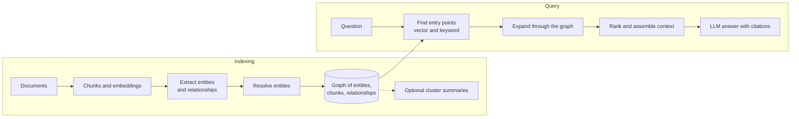

<Badge color="purple" size="sm">Concept</Badge>

GraphRAG is a form of retrieval-augmented generation (RAG) that retrieves context from a
graph of entities and relationships, usually alongside the source text, instead of only
from the text chunks most similar to the question. The graph lets the retriever follow
connections between facts, which helps with questions that span several documents,
center on one entity, or ask about a whole collection. The cost is an indexing step that
extracts entities and relationships from text, which takes model calls and ongoing work
to keep the graph accurate.

## How does RAG work?

Retrieval-augmented generation grounds a language model's answer in retrieved data
instead of relying only on what the model learned in training. In the common vector
form:

1. Split documents into chunks and compute an embedding for each chunk.
2. Store the embeddings in a vector index, often alongside a keyword index.
3. At query time, embed the question and retrieve the top-k most similar chunks.
4. Put those chunks in the prompt and ask the model to answer from them.

This works well when the answer sits in one or two passages that are worded like the
question.

## Where does vector RAG fall short?

Similarity search ranks each passage on its own. It has no view of how facts in
different passages connect.

| Question type | Example | Why chunk similarity struggles |
| --- | --- | --- |
| Multi-hop | "Which customers were affected by incidents in services the payments team owns?" | The chain from team to service to incident to customer spans documents, and no single chunk resembles the whole question |
| Entity-centric | "What do we know about the mobile checkout feature?" | Facts are spread across many chunks and aliases; top-k returns a few similar passages and misses the rest |
| Global or summary | "What are the main themes in this quarter's support tickets?" | The answer depends on the whole collection, but retrieval sees only a small sample |
| Permission-bound | "Summarize the contracts this user can read" | Access is a chain of relationships; filtering after top-k can drop every result or leak one |

Chunking also strips context. A passage that says "it was rolled back" may not say what
"it" refers to.

## How does GraphRAG work?

GraphRAG builds a graph from the same content and uses it at query time. Common
patterns include:

- **Entity and relationship extraction.** At indexing time, a model or NLP pipeline
  reads each chunk and emits entities, such as people, products, services, and
  contracts, plus typed relationships between them. Each chunk links to the entities it
  mentions.
- **Entity resolution.** Mentions that refer to the same thing, such as "the billing
  service" and "billing-svc", are merged into one node so the facts about it connect.
- **Graph expansion from retrieved nodes.** Vector or keyword search finds entry points,
  and a bounded traversal collects neighboring entities, relationships, and the chunks
  that support them. This is sometimes called local search.
- **Graph-scoped retrieval.** A traversal defines the candidate set first, such as the
  documents linked to one customer or product area, and similarity search runs inside
  it.
- **Community or cluster summaries.** A community detection algorithm partitions the
  entity graph into groups of densely connected entities, and a model writes a summary
  of each group ahead of time. Questions about the whole collection are answered by
  combining the relevant summaries. This is sometimes called global search.

## GraphRAG vs vector RAG

| Aspect | Vector RAG | GraphRAG |
| --- | --- | --- |
| Retrieval unit | Text chunks | Entities, relationships, chunks, and optional summaries |
| How context is found | Similarity to the question | Similarity for entry points, then traversal |
| Multi-hop questions | Only if one chunk covers the chain | Follows edges between facts |
| Entity-centric questions | Depends on wording matching | Gathers the facts linked to a resolved entity |
| Collection-wide questions | Sees a top-k sample | Uses cluster summaries when they are built |
| Indexing cost | Chunk and embed | Also extraction model calls and entity resolution |
| Content updates | Re-embed changed chunks | Also update entities, edges, and affected summaries |
| Explainability | Cites chunks | Cites chunks and the paths that connect them |
| Access control | Metadata filters | Permissions can be modeled as edges and traversed |

## When should you use GraphRAG?

GraphRAG pays off when questions are about connections: multi-hop questions, entity
profiles, dependency and impact analysis, or themes across a collection. It also fits
when the domain already has structure, such as customers, products, tickets, and
contracts, or when access rules are relationships that retrieval must respect.

Vector or hybrid RAG is often enough when answers live in single passages, as with FAQs
and product documentation, or when content changes faster than extraction can keep up. A
practical path is to start with hybrid vector and BM25 retrieval, collect the questions
it answers poorly, and add graph structure where those failures cluster.

## What does GraphRAG cost?

- **Extraction cost.** Every chunk goes through a model at indexing time, and changing
  the extraction prompt or model can mean reprocessing the whole collection.
- **Graph quality.** Extraction can miss relationships or invent ones that are not in
  the text. Entity resolution fails in both directions: duplicates split one entity's
  facts across several nodes, and over-merging combines different entities into one.
- **Freshness.** Updated documents require updating entities, edges, and any summaries
  that depend on them.
- **Consistency.** When the graph, vector index, and keyword index live in separate
  systems, the application must keep them in sync.
- **Query fan-out.** Highly connected entities can pull in large neighborhoods, so bound
  traversal depth and the number of neighbors followed.

Constraining entity and relationship types with a schema, keeping an edge from every
extracted fact back to its source chunk, and evaluating against a fixed question set
keep these costs visible.

## How do you implement GraphRAG?

<Steps>
  <Step title="Define the schema">
    Choose entity types, relationship types, and how documents and chunks are stored.
  </Step>
  <Step title="Index the content">
    Chunk documents, compute embeddings, and index chunk text for vector and keyword
    search.
  </Step>
  <Step title="Extract and resolve">
    Extract entities and relationships from each chunk, merge duplicate entities, and
    link each chunk to the entities it mentions.
  </Step>
  <Step title="Retrieve with the graph">
    Find entry points, traverse a bounded neighborhood, search within it, and fuse the
    results into context with citations.
  </Step>
  <Step title="Evaluate">
    Compare answers with vector-only retrieval on multi-hop, entity, and summary
    questions.
  </Step>
</Steps>

## How HelixDB supports GraphRAG

HelixDB is a graph database with native vector search and BM25 full-text search, so
documents, chunks, entities, and relationships can live in one labeled property graph.
It is a multigraph, so two entities can be connected by several typed relationships.
[Vector](/database/helix-db/query-guides/vector-indexes) and
[text](/database/helix-db/query-guides/text-indexes) indexes on chunk properties sit
beside the graph rather than in a separate system.

Retrieval can traverse first and then search within the traversal. With
[prefiltering](/database/helix-db/query-guides/prefiltering), the order is graph
traversal, exact candidate membership, ranking, then top k, and a result outside the
candidate set is never returned. A prefiltered search accepts up to 1,000,000 unique
candidates and returns at most 800 results.
[Traversals](/database/helix-db/query-guides/traversals) support bounded repeats and
shortest paths for expansion.

Each request is one ACID transaction over a committed snapshot, so the traversals,
vector searches, and text searches in a request read the same data. The application
runs extraction, computes embeddings, and fuses vector and BM25 results, because HelixDB
has no built-in rank-fusion operator.

## Frequently asked questions

### Is GraphRAG better than vector RAG?

It is better for different questions. GraphRAG helps with multi-hop, entity-centric,
and collection-wide questions, and it costs more to build and maintain. For
single-passage lookups, vector or hybrid retrieval is usually simpler and just as
accurate.

### Do I need a knowledge graph before using GraphRAG?

You need a graph, but it does not have to be built by hand. Many pipelines extract it
from documents with a model, and many domains already have structured relationships,
such as ticket links, product catalogs, or ownership records, that can seed it. See
[What is a knowledge graph?](/learn/graph-databases/what-is-a-knowledge-graph)

### How does GraphRAG relate to hybrid search?

They are complementary. Hybrid search combines vector and keyword ranking to find good
entry points, and GraphRAG adds traversal from those entry points. Many GraphRAG systems
use hybrid search as their first retrieval step.

### How is GraphRAG related to AI agent memory?

An agent memory store is often a graph of facts, entities, sources, and versions scoped
to one user. Recalling from it uses the same moves as GraphRAG: find relevant facts by
similarity and keywords, then expand through relationships. See
[What is AI agent memory?](/learn/ai-memory/what-is-ai-agent-memory)

## Related topics

<CardGroup cols={2}>
  <Card title="What is a knowledge graph?" icon="share-nodes" href="/learn/graph-databases/what-is-a-knowledge-graph">
    Entities, relationships, and provenance for search and LLMs.
  </Card>
  <Card title="Hybrid search" icon="magnifying-glass" href="/learn/full-text-search/hybrid-search">
    Combine vector similarity with BM25 keyword ranking.
  </Card>
  <Card title="Building long-term memory" icon="brain" href="/learn/ai-memory/long-term-memory-for-ai-agents">
    Apply graph-plus-search retrieval to per-user agent memory.
  </Card>
  <Card title="One database for graph, vector, and text" icon="layer-group" href="/learn/database-architecture/one-database-for-graph-vector-and-text">
    Trade-offs of keeping all three access paths in one system.
  </Card>
  <Card title="Prefiltered search" icon="vector-square" href="/database/helix-db/query-guides/prefiltering">
    Rank only the nodes a traversal reaches in a HelixDB query.
  </Card>
  <Card title="Traversals" icon="route" href="/database/helix-db/query-guides/traversals">
    Follow outgoing and incoming relationships in a HelixDB query.
  </Card>
</CardGroup>
