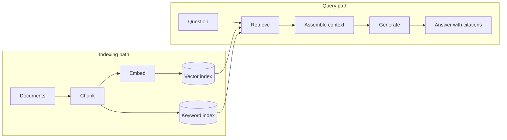

<Badge color="purple" size="sm">Concept</Badge>

Retrieval-augmented generation (RAG) is a technique where an application looks up relevant
documents and hands them to an AI model before it answers a question. Think of it as an
open-book exam: instead of answering from memory, the model gets the right pages in front
of it and answers from them. That means answers can use your private and recent content,
such as a company wiki or last week's support tickets, and point to their sources. The
catch is that an answer can only be as good as the search behind it, because the model
cannot use a passage that was never retrieved.

  <Card title="Learning objectives" icon="graduation-cap">
    After reading this article you will be able to:

    - Describe how a RAG system prepares content and answers questions
    - Compare RAG with fine-tuning and with long context windows
    - Spot the common reasons RAG gives wrong answers, and how to prevent them
    - Measure a RAG system on retrieval recall, groundedness, and citation accuracy
  </Card>

## How does RAG work?

RAG has two parts. The indexing path prepares your content for search, ahead of time and
again whenever it changes. The query path runs for every question: search the content,
pass the best matches to the model, and ask for an answer that cites them.

For example, an online store's chatbot might index its help articles ahead of time, then
answer a shopper's question about returns from the return-policy passages. Under the hood,
a typical pipeline has four steps on each path.

The indexing path:

1. **Ingest.** Load source documents, such as help articles, tickets, or contracts, and
   record details such as source, owner, and last-updated time.
2. **Chunk.** Split each document into passages, called chunks, that are small enough to
   retrieve precisely, typically along headings or paragraphs.
3. **Embed.** Turn each chunk into an
   [embedding](/learn/vector-search/what-are-vector-embeddings), a list of numbers that
   captures its meaning, using an embedding model.
4. **Index.** Store each chunk and its embedding in a
   [vector index](/learn/vector-search/what-is-a-vector-database), often alongside a
   [keyword index](/learn/full-text-search/what-is-full-text-search) over the chunk text,
   and keep a link back to the source document.

The query path:

1. **Retrieve.** Embed the question with the same model and fetch the top-k chunks (the k
   best matches), often with a keyword search as well.
2. **Assemble context.** Remove duplicates, then order and trim the chunks to fit the
   prompt, labeling each one with its source.
3. **Generate.** Send the question and the context to the model, with instructions to
   answer from the context and to say when the context does not contain the answer.
4. **Cite.** Return the answer with references to the source documents so a reader can
   check it.

Many systems also rewrite the question before searching, or rerank the candidates (sort
them again with a second, more precise scoring step) before assembling context.

## Which retrieval methods can RAG use?

RAG can use any search method that finds the right passages. Common choices:

- **[Vector search](/learn/vector-search/what-is-vector-search)** finds chunks whose
  meaning is close to the question, including paraphrases.
- **Keyword search** finds chunks that contain the question's exact terms, names, and
  IDs, typically ranked with [BM25](/learn/full-text-search/what-is-bm25), a standard
  formula for scoring keyword matches.
- **[Hybrid search](/learn/full-text-search/hybrid-search)** runs both and fuses the
  results into one ranking.
- **[Filtered search](/learn/vector-search/filtered-vector-search)** ranks only chunks
  that pass a condition, such as those the person asking may read.

Real questions often mix an idea with an identifier, such as "what changed in the refund
policy for plan B-7," so many production systems use hybrid search rather than vector
search alone. When answers depend on how facts connect across documents,
[GraphRAG](/learn/ai-memory/what-is-graphrag) adds search along a
[knowledge graph](/learn/graph-databases/what-is-a-knowledge-graph) of entities and
relationships.

  <Card title="Try HelixDB" icon="rocket" href="/database/helix-db/start-here/quickstart" cta="Get started">
    Keep documents, chunks, and embeddings in one open-source graph database, with vector
    and BM25 search over the same records.
  </Card>

## How does RAG compare with fine-tuning and long context windows?

RAG looks up a few relevant passages for each question. Fine-tuning trains the model
further on your data, changing its weights (the numbers it learned in training). A long
context window, the amount of text a model can read at once, lets you send the whole
document set with every question.

In other words, RAG is looking things up, fine-tuning is practicing ahead of time, and a
long context window is bringing all your notes to every exam.

| | RAG | Fine-tuning | Long context window |
| --- | --- | --- | --- |
| How knowledge reaches the model | Retrieved passages in the prompt | Training updates the model's weights | The whole document set in the prompt |
| Updating knowledge | Re-index changed documents | Train again on new data | Change what goes in the prompt |
| Citations | Points to retrieved sources | Not traceable to a source | Possible, if the model cites the prompt |
| Per-user access control | Filter what is retrieved | Impractical; one set of weights serves every user unless you train per-user models | Choose what goes in the prompt |
| Corpus size | Large; only the top k enters the prompt | Not limited by the prompt | Limited by the window size |
| Cost per question | Retrieval plus a short prompt | Low at query time; training cost upfront | Grows with every token sent |
| Good fit | Changing facts, private data, answers that need sources | Style, format, vocabulary, task behavior | Small, stable document sets |

The approaches combine: fine-tuning shapes how a model answers, and RAG supplies what it
answers from. A larger window lets RAG pass more chunks, but models often use facts buried
in a very long prompt less reliably, and every added token (a word or piece of a word) adds
cost and latency.

## Why does RAG return wrong answers?

Many wrong RAG answers start with search: the right passage was not retrieved, or the
wrong one was. Common causes and fixes:

- **Chunking loses context.** A chunk that says "it was rolled back" may not say what
  "it" refers to, so it neither matches the question nor informs the answer. Prefix each
  chunk with its document title and section heading; see
  [chunking for embeddings](/learn/vector-search/what-are-vector-embeddings#how-should-long-documents-be-chunked-for-embeddings).
- **Exact identifiers are missed.** Embeddings capture meaning and can blur product codes,
  error codes, and names. A support team searching tickets with vector search alone may
  miss the one chunk that names "E1042." Keyword search catches these; see
  [hybrid search](/learn/full-text-search/hybrid-search).
- **Duplicates crowd the context.** Copies and repeated boilerplate can fill the top k and
  push out other sources. Remove near-identical chunks after retrieval or fusion.
- **Stale or orphaned chunks.** When a document is edited or deleted but its old chunks
  stay in the index, the model answers from outdated text. Link each chunk to its source
  document so a changed or deleted document's chunks can be found and replaced. This is
  harder when the index lives apart from the source data; see
  [one database for graph, vector, and text](/learn/database-architecture/one-database-for-graph-vector-and-text).
- **Mixed embedding models.** Vectors from different models cannot be compared, so
  re-embed the whole collection when you change the embedding model.
- **Permission leaks.** If access rules run on only one of several search paths, results
  can include content the user cannot read; if they run after ranking, too few results can
  remain. Filter in every path, before ranking; see
  [filtered vector search](/learn/vector-search/filtered-vector-search).
- **Multi-hop questions.** When the answer is a chain of facts across documents, no single
  chunk resembles the question; see [GraphRAG](/learn/ai-memory/what-is-graphrag).

Sometimes search succeeds and the model still ignores or misreads the context. Evaluation
tells these two cases apart.

## How do you evaluate a RAG system?

Test search and answering separately, on a fixed set of real questions whose relevant
sources you already know. That way, when quality drops, you can see which stage caused it.

| Metric | Question it answers | How it is typically measured |
| --- | --- | --- |
| Retrieval recall | Did the relevant passages make it into the retrieved set? | Share of labeled relevant chunks found in the top k, averaged over questions |
| Groundedness | Is every claim in the answer supported by the context? | Human review or a model-graded check of each claim against the context |
| Citation accuracy | Do cited sources support the sentences that cite them? | Check each citation against the passage it points to |
| Answer correctness | Is the answer right? | Comparison with a reference answer |

Put simply, low recall points to chunking, the search method, or filters. High recall with
low groundedness points to the prompt or the model. Re-run the set whenever chunking, the
embedding model, or search settings change.

## How does HelixDB support RAG?

HelixDB is an open-source graph database with native vector search and BM25 full-text
search, so a RAG index can live in one labeled
[property graph](/learn/graph-databases/what-is-a-property-graph):

- **Documents and chunks as nodes.** Each chunk links to its source document with a
  directed edge, which gives every retrieved passage a path back to its source for
  citations. See the [data model](/database/helix-db/core-concepts/data-model).
- **Vector and text indexes on chunk properties.** A
  [vector index](/database/helix-db/query-guides/vector-indexes) on the embedding
  property and a [text index](/database/helix-db/query-guides/text-indexes) on the text
  property serve vector and BM25 search over the same records.
- **Search inside a candidate set.** With
  [prefiltering](/database/helix-db/query-guides/prefiltering), a graph traversal first
  defines the candidates, such as the chunks of documents a user can read, and vector and
  BM25 search rank only those chunks. A result outside the candidate set is never
  returned.
- **One transaction per request.** Each request is one ACID transaction over a committed
  snapshot, and a write batch commits or rolls back as a whole, so replacing a document's
  chunks in one batch applies completely or not at all.

The application computes embeddings, and HelixDB stores and indexes the vectors. HelixDB
has no built-in rank fusion or reranking, so the application fuses vector and BM25 results
and applies any reranking.

## Frequently asked questions

### Does RAG stop a model from hallucinating?

It reduces made-up answers, often called hallucinations, but does not eliminate them. The
model can still misread the context, combine passages incorrectly, or fall back on its
training data when search misses. Requiring citations and measuring groundedness keep the
remaining errors visible.

### Do you need a vector database for RAG?

You need a search index, not necessarily a dedicated vector database. RAG can run on
keyword search, vector search, or both, and the indexes can live in a separate store or
inside a database that also holds the source data. See
[What is a vector database?](/learn/vector-search/what-is-a-vector-database)

### How large should RAG chunks be?

There is no universal size. Smaller chunks match questions more precisely but carry less
context; larger chunks carry more context but dilute the embedding and use more of the
prompt. Many systems start with a few hundred tokens, split along headings or paragraphs,
and tune on an evaluation set.

## Related topics

<CardGroup cols={2}>
  <Card title="What is GraphRAG?" icon="share-nodes" href="/learn/ai-memory/what-is-graphrag">
    Retrieval that follows relationships between entities and documents.
  </Card>
  <Card title="What is hybrid search?" icon="magnifying-glass" href="/learn/full-text-search/hybrid-search">
    Combine BM25 and vector search to match exact terms and meaning.
  </Card>
  <Card title="What is a graph database?" icon="diagram-project" href="/learn/graph-databases/what-is-a-graph-database">
    Nodes, edges, and properties, and why stored relationships help AI retrieval.
  </Card>
  <Card title="What are vector embeddings?" icon="vector-square" href="/learn/vector-search/what-are-vector-embeddings">
    How text becomes vectors that can be compared by meaning.
  </Card>
  <Card title="What is filtered vector search?" icon="filter" href="/learn/vector-search/filtered-vector-search">
    Rank only the chunks a user is allowed to see.
  </Card>
  <Card title="What is AI agent memory?" icon="brain" href="/learn/ai-memory/what-is-ai-agent-memory">
    Per-user memory built on the same retrieval techniques.
  </Card>
</CardGroup>
