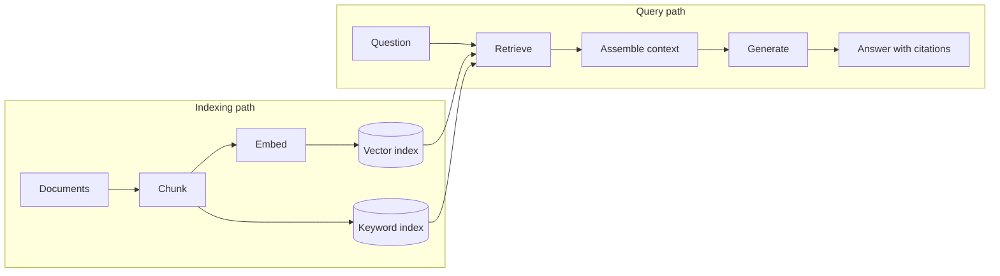

<Badge color="purple" size="sm">Concept</Badge>

Retrieval-augmented generation (RAG) is a technique that grounds a language model's
answer in data retrieved at query time: the application searches a knowledge source for
passages relevant to the question, adds them to the prompt, and asks the model to answer
from them. Because the facts come from retrieved data rather than only from training,
answers can reflect private and recent content and cite their sources. The quality of a
RAG answer is bounded by retrieval, because the model cannot use a passage that was
never retrieved.

  <Card title="Learning objectives" icon="graduation-cap">
    After reading this article you will be able to:

    - Describe how a RAG pipeline indexes content and answers questions
    - Compare RAG with fine-tuning and with long context windows
    - Diagnose common causes of wrong RAG answers and how to prevent them
    - Evaluate a RAG system on retrieval recall, groundedness, and citation accuracy
  </Card>

## How does RAG work?

A RAG system has two paths. The indexing path runs ahead of time, and again whenever
content changes, to prepare data for search. The query path runs for every question.

The indexing path:

1. **Ingest.** Load source documents, such as help articles, tickets, or contracts, and
   record metadata such as source, owner, and last-updated time.
2. **Chunk.** Split each document into passages small enough to retrieve precisely,
   typically along headings or paragraphs.
3. **Embed.** Compute an [embedding](/learn/vector-search/what-are-vector-embeddings)
   for each chunk with an embedding model.
4. **Index.** Store each chunk with its embedding in a vector index, often alongside a
   keyword index over the chunk text, and keep a link back to the source document.

The query path:

1. **Retrieve.** Embed the question with the same model and fetch the top-k most
   relevant chunks, often with a keyword search as well.
2. **Assemble context.** Deduplicate, order, and trim the chunks to fit the prompt, and
   label each one with its source.
3. **Generate.** Send the question and the context to the model, with instructions to
   answer from the context and to say when the context does not contain the answer.
4. **Cite.** Return the answer with references to the source documents so a reader can
   check it.

Many systems also rewrite the question before retrieval or rerank candidates before
assembling context.

## Which retrieval methods can RAG use?

RAG can retrieve with vector search, keyword search (BM25), a hybrid of the two, or any
of these restricted to a filtered candidate set.

| Method | What it retrieves | Learn more |
| --- | --- | --- |
| Vector search | Chunks whose meaning is close to the question, including paraphrases | [What is vector search?](/learn/vector-search/what-is-vector-search) |
| Keyword search (BM25) | Chunks that contain the question's exact terms, names, and IDs | [What is BM25?](/learn/full-text-search/what-is-bm25) |
| Hybrid search | Results from both methods, fused into one ranking | [What is hybrid search?](/learn/full-text-search/hybrid-search) |
| Filtered search | Only chunks that pass a condition, such as a tenant or permission | [What is filtered vector search?](/learn/vector-search/filtered-vector-search) |

User questions often mix a concept with an identifier, such as "what changed in the
refund policy for plan B-7," so many production systems use hybrid retrieval rather
than vector search alone. When answers depend on how facts connect across documents,
[GraphRAG](/learn/ai-memory/what-is-graphrag) adds retrieval along a graph of entities
and relationships.

## How does RAG compare with fine-tuning and long context windows?

RAG retrieves a few relevant passages into the prompt for each question, fine-tuning
changes the model's weights, and a long context window sends the whole document set
every time.

| | RAG | Fine-tuning | Long context window |
| --- | --- | --- | --- |
| How knowledge reaches the model | Retrieved passages in the prompt | Training updates the model's weights | The whole document set in the prompt |
| Updating knowledge | Re-index changed documents | Train again on new data | Change what goes in the prompt |
| Citations | Points to retrieved sources | Not traceable to a source | Possible, if the model cites the prompt |
| Per-user access control | Filter what is retrieved | Impractical; one set of weights serves every user unless you train per-user models | Choose what goes in the prompt |
| Corpus size | Large; only the top k enters the prompt | Not limited by the prompt | Limited by the window size |
| Cost per question | Retrieval plus a short prompt | Low at query time; training cost upfront | Grows with every token sent |
| Good fit | Changing facts, private data, answers that need sources | Style, format, vocabulary, task behavior | Small, stable document sets |

The approaches combine: fine-tuning shapes how a model answers, and RAG supplies what it
answers from. A larger window lets RAG pass more chunks, but models often use facts
buried in a very long prompt less reliably, and every added token adds cost and latency.

## Why does RAG return wrong answers?

Many wrong RAG answers trace back to retrieval: the right passage was not retrieved, or
the wrong one was. Common causes, and how to prevent them:

- **Chunking loses context.** A chunk that says "it was rolled back" may not say what
  "it" refers to, so it neither matches the question nor informs the answer. Prefix
  each chunk with its document title and section heading; see
  [chunking for embeddings](/learn/vector-search/what-are-vector-embeddings#how-should-long-documents-be-chunked-for-embeddings).
- **Exact identifiers are missed.** Embeddings capture meaning and can blur product
  codes, error codes, and names, so a vector-only retriever may skip the one chunk that
  names "E1042." Keyword search catches these; see
  [hybrid search](/learn/full-text-search/hybrid-search).
- **Duplicates crowd the context.** Copies and repeated boilerplate can fill the top k
  and push out other sources. Deduplicate near-identical chunks after retrieval or
  fusion.
- **Stale or orphaned chunks.** When a document is edited or deleted but its old chunks
  stay in the index, the model answers from outdated text. Link each chunk to its
  source document so a changed or deleted document's chunks can be found and replaced.
  This is harder when the index lives apart from the source data; see
  [one database for graph, vector, and text](/learn/database-architecture/one-database-for-graph-vector-and-text).
- **Mixed embedding models.** Vectors from different models are not comparable, so
  re-embed the whole collection when the embedding model changes.
- **Permission leaks.** If access rules run on only one of several retrieval paths,
  results can include content the user cannot read; if they run after ranking, too few
  results can remain. Filter in every path, before ranking; see
  [filtered vector search](/learn/vector-search/filtered-vector-search).
- **Multi-hop questions.** When the answer is a chain of facts across documents, no
  single chunk resembles the question; see [GraphRAG](/learn/ai-memory/what-is-graphrag).

Sometimes retrieval succeeds and the model still ignores or misreads the context.
Evaluation separates these two cases.

## How do you evaluate a RAG system?

Evaluate retrieval and generation separately, on a fixed set of real questions with
known relevant sources, so a regression can be traced to the stage that caused it.

| Metric | Question it answers | How it is typically measured |
| --- | --- | --- |
| Retrieval recall | Did the relevant passages make it into the retrieved set? | Share of labeled relevant chunks found in the top k, averaged over questions |
| Groundedness | Is every claim in the answer supported by the context? | Human review or a model-graded check of each claim against the context |
| Citation accuracy | Do cited sources support the sentences that cite them? | Check each citation against the passage it points to |
| Answer correctness | Is the answer right? | Comparison with a reference answer |

Low recall points to chunking, the retrieval method, or filters. High recall with low
groundedness points to the prompt or the model. Re-run the set whenever chunking, the
embedding model, or retrieval settings change.

## How does HelixDB support RAG?

HelixDB is an open-source graph database with native vector search and BM25 full-text
search, so a RAG index can live in one labeled property graph:

- **Documents and chunks as nodes.** Each chunk links to its source document with a
  directed edge, which gives every retrieved passage a provenance path for citations.
  See the [data model](/database/helix-db/core-concepts/data-model).
- **Vector and text indexes on chunk properties.** A
  [vector index](/database/helix-db/query-guides/vector-indexes) on the embedding
  property and a [text index](/database/helix-db/query-guides/text-indexes) on the text
  property serve vector and BM25 retrieval over the same records.
- **Retrieval inside a candidate set.** With
  [prefiltering](/database/helix-db/query-guides/prefiltering), a graph traversal first
  defines the candidates, such as the chunks of documents a user can read, and vector
  and BM25 search rank only those chunks. A result outside the candidate set is never
  returned.
- **One transaction per request.** Each request is one ACID transaction over a
  committed snapshot, and all entries in a write batch commit or roll back together, so
  a batch that replaces a document's chunks applies completely or not at all.

The application computes embeddings, and HelixDB stores and indexes the vectors.
HelixDB has no built-in rank fusion or reranking, so the application fuses vector and
BM25 results and applies any reranking.

## Frequently asked questions

### Does RAG stop a model from hallucinating?

It reduces unsupported answers but does not eliminate them. The model can still misread
the context, combine passages incorrectly, or fall back on training data when retrieval
misses. Requiring citations and measuring groundedness keep the remaining errors
visible.

### Do you need a vector database for RAG?

You need a retrieval index, not necessarily a dedicated vector database. RAG can run on
keyword search, vector search, or both, and the indexes can live in a separate store or
inside a database that also holds the source data. See
[What is a vector database?](/learn/vector-search/what-is-a-vector-database)

### How large should RAG chunks be?

There is no universal size. Smaller chunks match questions more precisely but carry
less context; larger chunks carry more context but dilute the embedding and use more of
the prompt. Many systems start with a few hundred tokens, split along headings or
paragraphs, and tune on an evaluation set.

## Related topics

<CardGroup cols={2}>
  <Card title="What is GraphRAG?" icon="share-nodes" href="/learn/ai-memory/what-is-graphrag">
    Retrieval that follows relationships between entities and documents.
  </Card>
  <Card title="What is hybrid search?" icon="magnifying-glass" href="/learn/full-text-search/hybrid-search">
    Combine BM25 and vector search to match exact terms and meaning.
  </Card>
  <Card title="What is a graph database?" icon="diagram-project" href="/learn/graph-databases/what-is-a-graph-database">
    Nodes, edges, and properties, and why stored relationships help AI retrieval.
  </Card>
  <Card title="What are vector embeddings?" icon="vector-square" href="/learn/vector-search/what-are-vector-embeddings">
    How text becomes vectors that can be compared by meaning.
  </Card>
  <Card title="What is filtered vector search?" icon="filter" href="/learn/vector-search/filtered-vector-search">
    Rank only the chunks a user is allowed to see.
  </Card>
  <Card title="What is AI agent memory?" icon="brain" href="/learn/ai-memory/what-is-ai-agent-memory">
    Per-user memory built on the same retrieval techniques.
  </Card>
</CardGroup>
