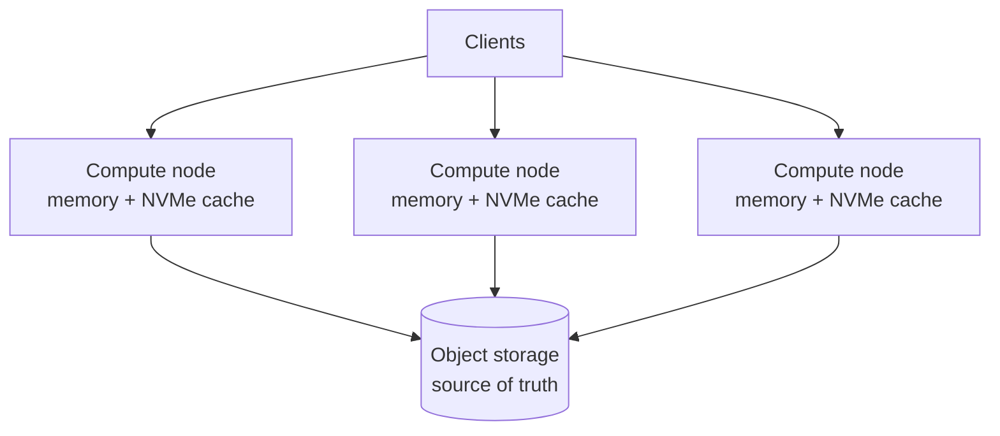

<Badge color="purple" size="sm">Concept</Badge>

A database on object storage keeps its data in an object store (a durable service for
files) and uses server memory and disks as cache. It works like a library with an
off-site warehouse: every book is stored safely there, and each reading room keeps
copies of the popular ones on its shelves. Because the servers do not own the data, you
can grow storage without adding servers, add servers when traffic grows, and lose a
server without losing saved data. The price is that reading something not yet in the
cache, or confirming a write, takes longer.

  <Card title="Learning objectives" icon="graduation-cap">
    After reading this article you will be able to:

    - Explain how a database keeps its data in object storage and uses disks as cache
    - Compare local-disk and object-storage databases on durability, scaling, and speed
    - Describe the trade-offs in cold reads, write latency, and caching
    - Recognize when object storage lowers cost and when it is a poor fit
  </Card>

## How do traditional databases store data?

Traditionally, each database server keeps its own data on its own disks, whether the
database is [relational](/learn/graph-databases/graph-vs-relational-database) or a
graph, and some systems keep the whole dataset in memory. Durability (surviving a crash)
comes from writing to that disk and copying it to other servers. This ties storage and
compute together:

- **Storing more data** means bigger disks or more memory per machine, or splitting
  the data into shards across more machines.
- **Serving more reads** means adding replicas, and each replica keeps its own copy of
  the data (or of its shard).
- **Replacing or adding a server** means copying data to it before it can serve
  traffic.

This works well while the dataset fits comfortably on a few machines. It gets
expensive when data grows faster than query load, because you pay for compute and fast
storage to hold rarely read data, such as years of listening history in a music app
when most queries touch recent weeks.

[Graph databases](/learn/graph-databases/what-is-a-graph-database) often feel this
sharply: many keep a large graph in memory or on local SSD for fast traversal, so the
cost of fast storage grows with the whole graph, and some limit its size to what one
machine can hold. Vector indexes such as [HNSW](/learn/vector-search/what-is-hnsw),
used by many [vector databases](/learn/vector-search/what-is-a-vector-database), are
also often kept in memory.

## How does a database on object storage work?

The object store, often a service that implements the S3 API, holds the permanent
copy of everything. Query servers keep the data they use most in memory and on local
disk.

- **Object storage is the source of truth.** Data files and index files, such as the
  structures behind [vector search](/learn/vector-search/what-is-vector-search) and
  [full-text search](/learn/full-text-search/what-is-full-text-search), live in the
  object store. The metadata that says which files make up the current version is
  typically stored there too, or in a separate strongly consistent metadata service.
- **Compute nodes are close to stateless.** They hold caches in memory and on local
  NVMe or SSD (fast local drives), and can be added, removed, or replaced without
  moving data.
- **Reads go through the cache hierarchy:** memory first, then local disk, then object
  storage on a miss.
- **Writes are batched and published atomically.** A writer typically uploads new
  immutable files (files never changed once written), then updates the metadata to make
  them part of the current version. Object stores typically do not support updating
  part of an object in place; an object is written or replaced as a whole, so many
  designs use log-structured or immutable-file layouts.

Under the hood, correctness depends on a few storage guarantees. Newly written objects
must be readable immediately (read-after-write consistency), so a reader that follows
new metadata finds the files it points to. The system also needs an atomic way to
advance the current version, such as a conditional write ("create only if absent" or
"replace only if unchanged") or a separate coordination service, so two writers cannot
both believe they committed the same version.

## How does an object-storage database compare with a local-disk database?

The difference is where the permanent copy lives. Because query servers do not own it,
storage and compute are separated, and each side can be sized, scaled, and replaced on
its own.

| | Local-disk database | Object-storage database |
| --- | --- | --- |
| Source of truth | Local disks on each server | The object store |
| Durability | Replication between servers | Provided by the object store |
| Scaling storage | Bigger machines or more shards | Grows independently of compute |
| Scaling reads | Replicas, each with its own data copy | More compute nodes sharing the same stored data |
| Losing a server | Data must be re-replicated | Only cache is lost |
| Read latency | Consistently local | Fast on cache hits, slower on misses |
| Write latency | Local disk plus replication | Typically at least one object-store round trip |

  <Card title="Try HelixDB" icon="rocket" href="/database/helix-db/start-here/quickstart" cta="Get started">
    Keep your graph, embeddings, and text in open-source HelixDB, which uses object
    storage as its source of truth and scales storage independently of compute.
  </Card>

## What are the tradeoffs of building a database on object storage?

In short, you give up some speed in exchange for storage that is typically cheaper per
byte and scales on its own.

- **Cold-read latency.** A cache miss pays an object-store round trip, much slower than
  local NVMe or memory, so latency depends on how much of the working set (the data
  queries touch most) the caches hold.
- **A write latency floor.** When the object store is the only durable tier, a commit
  is durable only after the object store acknowledges it. Batching many writes into
  one upload keeps throughput high, but a single write cannot finish faster than that
  round trip. Some designs acknowledge a commit once it reaches a write-ahead log (a
  durable record of changes) replicated across several servers, and upload it later;
  losing one server then still loses no committed data.
- **Caching becomes central.** Cache sizing, warming, and eviction policy decide
  latency, so many systems tune caching to the workload and warm caches after a
  restart.
- **Request-oriented pricing and access.** Object stores work best with fewer, larger
  requests, so data layout and batching matter more than on local disk.

## When does a database on object storage cost less at scale?

It usually costs less when the bulk of a large dataset is cold, meaning rarely read,
and a smaller working set serves most queries. Think of a chatbot that answers from
years of archived documents with [RAG](/learn/ai-memory/what-is-rag), or an agent's
[long-term memory](/learn/ai-memory/long-term-memory-for-ai-agents) of text and
[embeddings](/learn/vector-search/what-are-vector-embeddings) that keeps growing while
each question touches a small part. An object-storage design matches cost to that
shape:

- **Bulk data is priced at object-storage rates**, which are typically far lower per
  byte than provisioned SSD or memory, and the object store provides durability.
- **Compute is sized for the working set and the query load**, not for the total
  dataset.
- **Compute scales with demand without copying data.** New compute nodes share the
  same stored data and fill their caches as they serve queries, and nodes can be
  removed after a traffic spike because no data lives only on them.

Workloads with many small writes or frequent cache misses pay more in per-request
charges, which can offset the per-byte savings.

## When is object storage a poor fit?

A local-disk or in-memory database may be the better choice when every read, including
the first, needs guaranteed sub-millisecond latency; when individual writes need the
lowest possible commit latency; or when the dataset is small and stable enough that
one well-provisioned machine holds it comfortably.

## How does HelixDB use object storage?

HelixDB keeps a [property graph](/learn/graph-databases/what-is-a-property-graph),
vectors, and text in
[one database](/learn/database-architecture/one-database-for-graph-vector-and-text),
built on object storage:

- Object storage is the source of truth. NVMe or SSD and memory are caches, and
  storage scales independently of compute.
- The system can recover from full cache loss by reading object storage. Cache misses
  fall through to object storage, so caching affects latency, not results.
- Helix Cloud runs a gateway, a single writer process, and readers that scale
  automatically. The writer uses MVCC (multiversion concurrency control, which can keep
  several versions of a record), runs write transactions concurrently, and resolves
  conflicts at commit.
- Readers see new commits after a snapshot refresh. Reads served by the writer alone
  give read-after-write consistency.

Cold reads pay object-storage latency. See
[Architecture](/database/helix-cloud/start-here/architecture) for the read and write
paths and [Tradeoffs](/database/helix-cloud/operate/tradeoffs) for where the design
fits and where another system may fit better.

## Frequently asked questions

### What is the cheapest way to store a large graph?

At scale, it is usually to keep the full graph, such as a large
[knowledge graph](/learn/graph-databases/what-is-a-knowledge-graph), in object storage
and cache only the frequently traversed part. Keeping the whole graph in memory or on
provisioned SSD means paying fast-storage prices for data that is rarely read. The
object-storage approach trades that cost for slower traversals that touch uncached
data.

### Is a database on object storage slower?

It can be. Cache hits perform like a traditional database, but a miss pays
object-storage latency, and a commit typically waits for a durable object-store write.
Whether that matters depends on how well your working set fits in cache and how
latency-sensitive your writes are.

### Is this the same as a serverless database?

Not exactly, but they are related. Separating storage from compute is one of the main
things that lets serverless databases add and remove compute quickly, because no data
lives only on a server. A database can use object storage without being offered as a
serverless service.

## Related topics

<CardGroup cols={2}>
  <Card title="Graph, vector, and text in one database" icon="cubes" href="/learn/database-architecture/one-database-for-graph-vector-and-text">
    The hidden costs of stitching separate stores together.
  </Card>
  <Card title="What is a graph database?" icon="diagram-project" href="/learn/graph-databases/what-is-a-graph-database">
    Nodes, edges, traversals, and when a graph is the right model.
  </Card>
  <Card title="What is a vector database?" icon="database" href="/learn/vector-search/what-is-a-vector-database">
    Storage and indexing for embeddings, and where vector-only storage falls short.
  </Card>
  <Card title="Helix Cloud architecture" icon="cloud" href="/database/helix-cloud/start-here/architecture">
    The gateway, writer, readers, caches, and object storage.
  </Card>
  <Card title="Helix Cloud tradeoffs" icon="scale-balanced" href="/database/helix-cloud/operate/tradeoffs">
    What the architecture is optimized for, and where it is not.
  </Card>
</CardGroup>
