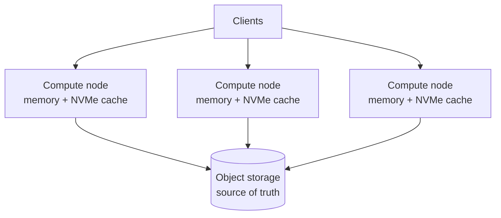

<Badge color="purple" size="sm">Concept</Badge>

A database built on object storage keeps its durable data in an object store, such as
a service that implements the S3 API, and treats the memory and local disks of its
servers as caches. This separates storage from compute: data can grow without adding
servers, compute can scale with query load, and losing a server loses only cache. The
cost is slower reads on a cache miss and a floor on write latency, so these systems
depend on good caching and batched writes.

## How do traditional databases store data?

In the traditional model, each database server owns its data on local disk, and some
systems keep the whole dataset in memory. Durability comes from writing to that disk
and replicating it to other servers' disks. This couples storage and compute:

- **Storing more data** means bigger disks or more memory per machine, or splitting
  the data into shards across more machines.
- **Serving more reads** means adding replicas, and each replica keeps its own full
  copy of the data.
- **Replacing or adding a server** means copying data to it before it can serve
  traffic.

This works well while the dataset fits comfortably on a few machines. It gets
expensive when data grows faster than query load, because you pay for compute and
fast storage to hold data that is rarely read. Graph databases feel this sharply: a
large graph is often kept in memory or on local SSD for fast traversal, so its size is
capped by the biggest machine you can afford.

## How does a database on object storage work?

- **Object storage is the source of truth.** Data files, index files, and the metadata
  that says which files make up the current version all live in the object store.
- **Compute nodes are close to stateless.** They hold caches in memory and on local
  NVMe or SSD, and can be added, removed, or replaced without moving data.
- **Reads go through the cache hierarchy:** memory first, then local disk, then object
  storage on a miss.
- **Writes are batched and published atomically.** A writer typically uploads new
  immutable files, then updates the metadata to make them part of the current version.
  Object stores generally favor writing whole objects over updating them in place, so
  many designs use log-structured or immutable-file layouts.

Correctness depends on guarantees from the object store. The system needs strongly
consistent reads, so a reader that follows new metadata finds the files it points to,
and it needs conditional writes, such as "create only if absent" or "replace only if
unchanged," or another coordination mechanism, so two writers cannot both believe
they committed the same version.

## What is separation of storage and compute?

| | Local-disk database | Object-storage database |
| --- | --- | --- |
| Source of truth | Local disks on each server | The object store |
| Durability | Replication between servers | Provided by the object store |
| Scaling storage | Bigger machines or more shards | Grows independently of compute |
| Scaling reads | Replicas, each with a full data copy | More compute nodes sharing one copy |
| Losing a server | Data must be re-replicated | Only cache is lost |
| Read latency | Consistently local | Fast on cache hits, slower on misses |
| Write latency | Local disk plus replication | At least one object-store round trip |

## What are the tradeoffs?

- **Cold-read latency.** A cache miss pays an object-store round trip, which is much
  slower than reading local NVMe or memory. Latency depends on how much of the working
  set the caches hold.
- **A write latency floor.** When the object store is the only durable tier, a commit
  is durable only after the object store acknowledges it. Batching many writes into
  one upload keeps throughput high, but a single write cannot finish faster than that
  round trip.
- **Caching becomes central.** Cache sizing, warming, and eviction policy decide
  latency, so good systems cache the right data for each workload and warm caches
  after a restart.
- **Request-oriented pricing and access.** Object stores work best with fewer, larger
  requests, so data layout and batching matter more than on local disk.

## Why does cost scale better?

The bulk of a large dataset is usually cold: most of the data is read rarely, and a
smaller working set serves most queries. An object-storage design matches cost to
that shape:

- **Bulk data is priced at object-storage rates**, which are typically far lower per
  byte than provisioned SSD or memory, and the object store provides durability.
- **Compute is sized for the working set and the query load**, not for the total
  dataset.
- **Read capacity scales without copying data.** New compute nodes share the same
  stored data and fill their caches as they serve queries.

This is also what makes serverless-style databases possible. Because no data lives
only on a server, compute can scale up for a traffic spike and back down afterward
without a long data migration.

## When is object storage a poor fit?

A local-disk or in-memory database may be the better choice when every read, including
the first, needs guaranteed sub-millisecond latency; when individual writes need
the lowest possible commit latency; or when the dataset is small and stable enough
that one well-provisioned machine holds it comfortably.

## How HelixDB uses object storage

HelixDB is built on object storage:

- Object storage is the source of truth. NVMe or SSD and memory are caches, and
  storage scales independently of compute.
- The system can recover from full cache loss by reading object storage. Cache misses
  fall through to object storage, so caching affects latency, not results.
- Helix Cloud runs a gateway, a single writer process, and readers that scale
  automatically. The writer uses MVCC, runs write transactions concurrently, and
  resolves conflicts at commit.
- Readers see new commits after a snapshot refresh. Reads served by the writer alone
  give read-after-write consistency.

The general tradeoffs still apply; for example, cold reads pay object-storage latency.
See [Architecture](/database/helix-cloud/start-here/architecture) for the read and
write paths and [Tradeoffs](/database/helix-cloud/operate/tradeoffs) for where the
design fits and where another system may fit better.

## Frequently asked questions

### What is the cheapest way to store a large graph?

Cost is driven by where the full graph lives. Keeping the whole graph in memory or on
provisioned SSD means paying fast-storage prices for data that is rarely read. Keeping
it in object storage and caching the frequently traversed part usually costs far less
at scale, at the price of slower traversals that touch uncached data.

### Is a database on object storage slower?

On cache hits, reads come from memory or local disk, as in a traditional database. On
cache misses, reads pay object-storage latency. Writes wait for a durable object-store
write. Whether that matters depends on how well your working set fits in cache and how
latency-sensitive each write is.

### What happens if a server fails?

In an object-storage design, a failed compute node loses only its cache and any
requests it was serving. A replacement reads the current version from object storage
and warms its cache as it serves queries, so there is no data to re-replicate before
it can start.

### Is this the same as a serverless database?

Not exactly, but they are related. Separating storage from compute is what lets
serverless databases add and remove compute quickly. A database can use object storage
without being offered as a serverless service.

## Related topics

<CardGroup cols={2}>
  <Card title="Graph, vector, and text in one database" icon="cubes" href="/learn/database-architecture/one-database-for-graph-vector-and-text">
    The hidden costs of stitching separate stores together.
  </Card>
  <Card title="What is a graph database?" icon="diagram-project" href="/learn/graph-databases/what-is-a-graph-database">
    Nodes, edges, traversals, and when a graph is the right model.
  </Card>
  <Card title="Helix Cloud architecture" icon="cloud" href="/database/helix-cloud/start-here/architecture">
    The gateway, writer, readers, caches, and object storage.
  </Card>
  <Card title="Helix Cloud tradeoffs" icon="scale-balanced" href="/database/helix-cloud/operate/tradeoffs">
    What the architecture is optimized for, and where it is not.
  </Card>
</CardGroup>
