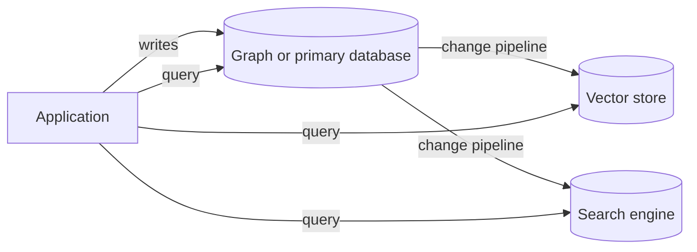

<Badge color="purple" size="sm">Concept</Badge>

Many applications do not need separate graph, vector, and text databases: one database
can hold all three when its vector and full-text indexes are access paths over the same
records the graph stores and are updated in the same transaction as those records. That
removes the sync pipelines and dual writes of separate stores, and lets one transaction
answer a question such as "find documents this user can read that match this query"
with graph and search results from the same snapshot. Separate systems still make sense
when search is a standalone product, when the workload is pure similarity search with
no relationships or filters, or when another system of record cannot move.

  <Card title="Learning objectives" icon="graduation-cap">
    After reading this article you will be able to:

    - Describe a stack of separate graph, vector, and search stores
    - Explain the costs of separate stores, from sync pipelines to permission drift
    - Compare separate stores with one database that indexes the same records
    - Recognize workloads where separate systems are the better choice
  </Card>

## What does a stack of separate stores look like?

A common architecture uses one system per access pattern: a primary or graph database
for entities and relationships, a vector store for embeddings, and a search engine for
keyword queries. Pipelines copy data between them, and application code queries each
one and merges the answers.

Each system can do its own job well. The cost is in the seams between them.

## What does it cost to run separate stores?

Separate stores cost the work of keeping several copies of the same data in agreement,
plus the work of running and joining several systems:

| Cost | What goes wrong |
| --- | --- |
| Sync pipelines | Change-data-capture jobs, queues, and re-embedding workers lag, fail, and need backfills and replays. |
| Dual writes | When the application writes to two systems directly, there is no transaction across them, so a partial failure leaves them disagreeing. |
| Consistency gaps | Search returns a document that was deleted, misses one that was just created, or ranks on a stale embedding. |
| Permission drift | Access rules copied into search indexes as metadata go stale, so revoking access in the source may not revoke it in search right away. |
| Multiple systems to operate | Each store has its own scaling, backups, upgrades, monitoring, security review, and on-call burden. |
| Cross-system joins | Application code fetches top results from one store, then looks up relationships in another, which adds round trips and custom merge logic. |

Permission drift deserves attention in
[retrieval-augmented generation (RAG)](/learn/ai-memory/what-is-rag). If the vector
store still returns a chunk from a document the user lost access to, the model can
quote it.

Cross-system joins also cause a subtle recall problem. A common workaround is to take
the top results from the vector store, then drop the ones the graph says the user
cannot see. If most of the top results are dropped, the user gets too few results even
though relevant, permitted documents exist further down. See
[filtered vector search](/learn/vector-search/filtered-vector-search).

## What changes with one transactional store?

When the database updates its vector and text indexes in the same transaction as the
records, several problems typically go away:

- **No copy to keep in sync.** The embedding and the text are properties of the record
  itself, so there is no second copy to replicate. If the application writes the new
  text and its recomputed embedding in the same transaction, the two cannot disagree.
- **One transaction, one snapshot.** Graph and search results within one request come
  from the same committed snapshot, so the graph neighborhood and the search hits
  agree.
- **Exact filtering before ranking.** If the database supports prefiltered search,
  search can run inside the set of records a traversal reaches, such as documents a
  user can read, instead of filtering a truncated result list afterward.
- **One system to operate, secure, and back up.**

The combined query also gets simpler. "Tickets from this customer's account that
mention this error code or describe a similar problem" becomes one request: traverse
from the customer to their tickets, then run keyword and vector search over just
those tickets. The two ranked lists still need to be combined, for example with
[reciprocal rank fusion](/learn/full-text-search/hybrid-search), in the database if it
supports fusion or in the application otherwise.

## When do separate systems make sense?

Separate systems make sense when a specialized need or an organizational constraint
outweighs the cost of the seams:

- **Search is its own product.** A large public search experience may need features
  that many multi-purpose databases do not offer, such as faceting, highlighting, typo
  tolerance, or custom language analysis.
- **The workload has no relationships or filters.** Pure similarity search over a very
  large embedding collection may be served well by a dedicated vector index.
- **An existing system of record cannot move.** If another database owns your
  transactions, you will be syncing data anyway, and the question becomes where the
  search and graph copies should live.
- **Workloads need strict isolation.** Different teams, scaling profiles, or failure
  domains can justify separate systems.
- **The job is analytics.** Large scans and aggregations over history typically belong
  in a data warehouse, not in an online graph or search store.

## How do you decide between one database and separate systems?

Choose one database when your queries mix relationships with similarity or keyword
relevance, access depends on relationships, and stale results would cause real
problems. Otherwise, separate systems may fit. These questions help you decide:

- Do your queries combine relationships with similarity or keyword relevance?
- Does access control depend on relationships, such as teams, shares, or ownership?
- How stale can search results be after a write or a permission change?
- Do you need exact identifiers as well as semantic matches?
- How many data systems can your team operate well?

## How does HelixDB keep graph, vector, and text together?

HelixDB stores data in one labeled property graph, treats vector and text indexes as
access paths over that graph, and runs traversals and searches in one ACID transaction
per request:

- **Indexes are access paths over the same data.** Secondary, vector, and text indexes
  are optional access paths over a label and a top-level property on nodes or edges,
  so relationships can be indexed and searched too.
- **One ACID transaction per request.** Each request runs over a committed snapshot
  with serializable snapshot isolation. Graph traversals, vector search, text search,
  and index lookups run in the same transaction, and all entries in a write batch
  commit or roll back together.
- **Prefiltered search.** Vector and BM25 search can run inside an exact,
  traversal-defined candidate set. The order is graph traversal, exact candidate
  membership, ranking, then top k, so a result outside the candidate set is never
  returned.
- **Freshness.** On Helix Cloud, readers see new commits after a snapshot refresh;
  writer-only reads give read-after-write. A newly created index backfills existing
  data asynchronously and becomes visible only after validation and atomic activation.
- **Application-side pieces.** The application computes embeddings and fuses vector
  and BM25 results. HelixDB has no built-in rank fusion or reranking.

See the [introduction](/database/helix-db/start-here/introduction), the
[data model](/database/helix-db/core-concepts/data-model),
[prefiltered search](/database/helix-db/query-guides/prefiltering), and
[guarantees](/database/helix-cloud/operate/guarantees).

## Frequently asked questions

### Can a graph database do vector search?

Some can. Graph databases differ: some include vector indexes natively, and others
rely on an external vector store. Check whether vector search can be restricted to
the results of a traversal and whether it runs in the same transaction as graph reads.

### Do I need a knowledge graph and a vector database for RAG?

You need both kinds of retrieval if your questions depend on relationships as well as
meaning, but not necessarily two databases. A graph database with vector and text
indexes can hold the knowledge graph and serve similarity search over the same
records. See [What is RAG?](/learn/ai-memory/what-is-rag) and
[What is GraphRAG?](/learn/ai-memory/what-is-graphrag).

### Does one database become a bottleneck?

It can if its architecture does not scale the part of the workload you stress. Look
at how it scales reads and storage, how writes are coordinated, and what isolation it
offers. See
[Databases on object storage](/learn/database-architecture/object-storage-databases)
for one approach.

### Can I still add a search engine later?

Yes. Starting with one store does not prevent adding a specialized system for a
specific need later. It means you add the seams only when a workload justifies them.

## Related topics

<CardGroup cols={2}>
  <Card title="What is RAG?" icon="book-open" href="/learn/ai-memory/what-is-rag">
    Grounding model answers in data retrieved at query time.
  </Card>
  <Card title="Filtered vector search" icon="filter" href="/learn/vector-search/filtered-vector-search">
    Pre-filtering, post-filtering, and returning the right top k.
  </Card>
  <Card title="Hybrid search" icon="code-merge" href="/learn/full-text-search/hybrid-search">
    Combining keyword and vector results with rank fusion.
  </Card>
  <Card title="What is a vector database?" icon="database" href="/learn/vector-search/what-is-a-vector-database">
    How vector stores index embeddings, and where they fall short.
  </Card>
  <Card title="What is a graph database?" icon="diagram-project" href="/learn/graph-databases/what-is-a-graph-database">
    Nodes, edges, and traversals for connected data.
  </Card>
  <Card title="Databases on object storage" icon="cloud" href="/learn/database-architecture/object-storage-databases">
    Separating storage from compute, and what it means for cost.
  </Card>
</CardGroup>
