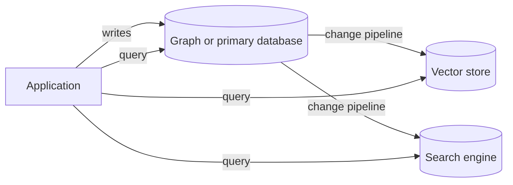

<Badge color="purple" size="sm">Concept</Badge>

Many applications do not need separate graph, vector, and text databases. An
application that needs relationships, semantic similarity, and keyword search can keep
all three in one database when its vector and full-text indexes are access paths over
the same records the graph stores. That removes the
sync pipelines, dual writes, and consistency gaps of separate stores, and lets one
transaction answer a question such as "find documents this user can read that match
this query." Separate specialized systems still make sense for some workloads,
covered below.

## What does a stitched-together stack look like?

A common architecture uses one system per access pattern: a primary or graph database
for entities and relationships, a vector store for embeddings, and a search engine for
keyword queries. Pipelines copy data between them, and application code queries each
one and merges the answers.

Each system can be excellent at its own job. The cost is in the seams between them.

## What does it cost to run separate stores?

| Cost | What goes wrong |
| --- | --- |
| Sync pipelines | Change-data-capture jobs, queues, and re-embedding workers lag, fail, and need backfills and replays. |
| Dual writes | When the application writes to two systems directly, there is no transaction across them, so a partial failure leaves them disagreeing. |
| Consistency gaps | Search returns a document that was deleted, misses one that was just created, or ranks on a stale embedding. |
| Permission drift | Access rules copied into search indexes as metadata go stale, so revoking access in the source may not revoke it in search right away. |
| Multiple systems to operate | Each store has its own scaling, backups, upgrades, monitoring, security review, and on-call burden. |
| Cross-system joins | Application code fetches top results from one store, then looks up relationships in another, which adds round trips and custom merge logic. |

Permission drift deserves attention in retrieval-augmented generation (RAG). If the
vector store still returns a chunk from a document the user lost access to, the model
can quote it.

Cross-system joins also cause a subtle ranking bug. A common workaround is to take the
top results from the vector store, then drop the ones the graph says the user cannot
see. If most of the top results are dropped, the user gets too few results even though
relevant, permitted documents exist further down. See
[filtered vector search](/learn/vector-search/filtered-vector-search).

## What changes with one transactional store?

When graph data, vector indexes, and text indexes live in one database over the same
records, several problems disappear rather than needing to be managed:

- **No copy to keep in sync.** The embedding and the text are properties of the record
  itself, so there is no pipeline to lag behind.
- **One transaction, one snapshot.** A query can traverse relationships and run
  searches against the same committed state, so the graph neighborhood and the search
  hits agree.
- **Exact filtering before ranking.** Search can run inside the set of records a
  traversal reaches, such as documents a user can read, instead of filtering a
  truncated result list afterward.
- **One system to operate, secure, and back up.**

The combined query also gets simpler. "Tickets from this customer's account that
mention this error code or describe a similar problem" becomes one request: traverse
from the customer to their tickets, then run keyword and vector search over just
those tickets.

## When do separate systems make sense?

A single database is not always the right answer. Separate systems are reasonable when:

- **Search is its own product.** A large public search experience may need features a
  multi-purpose database does not offer, such as faceting, highlighting, typo
  tolerance, or custom language analysis.
- **The workload has no relationships or filters.** Pure similarity search over a very
  large embedding collection may be served well by a dedicated vector index.
- **An existing system of record cannot move.** If another database owns your
  transactions, you will be syncing data anyway, and the question becomes where the
  search and graph copies should live.
- **Workloads need strict isolation.** Different teams, scaling profiles, or failure
  domains can justify separate systems.
- **The job is analytics.** Large scans and aggregations over history belong in a data
  warehouse, not in an online graph or search store.

## Questions to ask before choosing

- Do your queries combine relationships with similarity or keyword relevance?
- Does access control depend on relationships, such as teams, shares, or ownership?
- How stale can search results be after a write or a permission change?
- Do you need exact identifiers as well as semantic matches?
- How many data systems can your team operate well?

If your queries combine these kinds of retrieval, access depends on relationships, and
stale results would cause real problems, one store usually saves more work than it
costs.

## How HelixDB keeps graph, vector, and text together

HelixDB is a graph database with native vector search and BM25 full-text search:

- **Indexes are access paths over the same data.** Data lives in one labeled property
  graph. Secondary, vector, and text indexes are optional access paths over a label
  and a top-level property on nodes or edges, so relationships can be indexed and
  searched too.
- **One ACID transaction per request.** Each request runs over a committed snapshot
  with serializable snapshot isolation. Graph traversals, vector search, text search,
  and index lookups run in the same transaction, and all entries in a write batch
  commit or roll back together.
- **Prefiltered search.** Vector and BM25 search can run inside an exact,
  traversal-defined candidate set. The order is graph traversal, exact candidate
  membership, ranking, then top k, so a result outside the candidate set is never
  returned.
- **Application-side pieces.** The application computes embeddings and fuses vector
  and BM25 results.

See the [introduction](/database/helix-db/start-here/introduction), the
[data model](/database/helix-db/core-concepts/data-model),
[Prefiltered search](/database/helix-db/query-guides/prefiltering), and
[Guarantees](/database/helix-cloud/operate/guarantees).

## Frequently asked questions

### Can a graph database do vector search?

Some can. Graph databases differ: some include vector indexes natively, and others
rely on an external vector store. Check whether vector search can be restricted to
the results of a traversal and whether it runs in the same transaction as graph reads.

### Do I need a knowledge graph and a vector database for RAG?

You need both kinds of retrieval if your questions depend on relationships as well as
meaning, but not necessarily two databases. A graph database with vector and text
indexes can hold the knowledge graph and serve similarity search over the same
records. See [What is GraphRAG?](/learn/ai-memory/what-is-graphrag).

### Does one database become a bottleneck?

It can if its architecture does not scale the part of the workload you stress. Look
at how it scales reads and storage, how writes are coordinated, and what isolation it
offers. See
[Databases on object storage](/learn/database-architecture/object-storage-databases)
for one approach.

### Can I still add a search engine later?

Yes. Starting with one store does not prevent adding a specialized system for a
specific need later. It means you add the seams only when a workload justifies them.

## Related topics

<CardGroup cols={2}>
  <Card title="Hybrid search" icon="code-merge" href="/learn/full-text-search/hybrid-search">
    Combining keyword and vector results with rank fusion.
  </Card>
  <Card title="Filtered vector search" icon="filter" href="/learn/vector-search/filtered-vector-search">
    Pre-filtering, post-filtering, and returning the right top k.
  </Card>
  <Card title="What is a knowledge graph?" icon="brain" href="/learn/graph-databases/what-is-a-knowledge-graph">
    Entities, relationships, and provenance for search and LLMs.
  </Card>
  <Card title="Databases on object storage" icon="cloud" href="/learn/database-architecture/object-storage-databases">
    Separating storage from compute, and what it means for cost.
  </Card>
</CardGroup>
