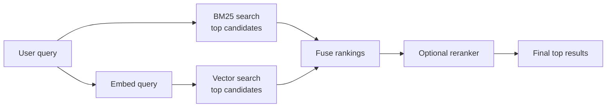

<div className="flex flex-wrap gap-2"><Badge color="purple" size="sm">Concept</Badge></div>

Hybrid search is a retrieval approach that runs a keyword search, typically BM25, and a
vector search for the same query, then merges the two ranked lists into one. Keyword
search catches exact names, IDs, and error codes; vector search catches paraphrases
and related concepts. Fusing them, often with reciprocal rank fusion, gives results
that hold up for both kinds of query.

## Keyword search vs vector search

The two methods fail in complementary ways, which is the whole case for combining them.

| | Keyword search (BM25) | Vector (semantic) search |
| --- | --- | --- |
| Matches on | The analyzed terms in the query | Meaning, via embeddings |
| Index | Inverted index | Approximate nearest neighbor index, such as HNSW or IVF |
| Handles well | "error E1042 on export," product SKUs, names | "why can't I sign in," paraphrases |
| Struggles with | Synonyms and different wording | Exact identifiers, rare tokens, new jargon |
| Needs a model | No | Yes, to embed documents and queries |
| Score | Unbounded relevance score | Distance or similarity between vectors |

A support-ticket search shows the gap. A user typing "E1042" needs the tickets that
contain that exact code, which an embedding may blur into generic "error" text. A user
typing "I can't log in after resetting my password" needs tickets about authentication
failures, even when they share few words with the query.

## How does hybrid search work?



<Steps>
  <Step title="Retrieve from both indexes">
    Run BM25 and vector search for the same query, usually in parallel. Retrieve more
    candidates from each than you plan to return, so good results from one list are
    not cut off before fusion.
  </Step>
  <Step title="Fuse the lists">
    Combine the two rankings into one with a fusion method such as reciprocal rank
    fusion.
  </Step>
  <Step title="Rerank, optionally">
    Score the fused top results with a slower, more accurate model, then return the
    final top results.
  </Step>
</Steps>

Apply filters, such as tenant or access control, before ranking in both searches. If
one list is filtered after ranking and the other is not, the fused result mixes two
different candidate sets. See
[filtered vector search](/learn/vector-search/filtered-vector-search).

## How do you combine BM25 and vector search results?

### Reciprocal rank fusion

Reciprocal rank fusion (RRF) ignores raw scores and uses only each document's rank in
each list:

```text
RRF(d) = sum over each result list L that contains d of

    1 / (k + rank_L(d))

rank starts at 1; k is a constant, commonly 60
```

The constant `k` dampens the advantage of the very top ranks. The value 60 comes from
the paper that introduced RRF and is a common convention, not a requirement. Suppose
BM25 returns A, B, C and vector search returns D, C, A:

| Document | BM25 rank | Vector rank | RRF score (k = 60) |
| --- | --- | --- | --- |
| A | 1 | 3 | 1/61 + 1/63 = 0.0323 |
| C | 3 | 2 | 1/63 + 1/62 = 0.0320 |
| D | none | 1 | 1/61 = 0.0164 |
| B | 2 | none | 1/62 = 0.0161 |

Documents that appear in both lists rise to the top. RRF needs no score normalization
and no training data, which makes it a robust default. Its limitation is that it
discards score magnitude: a document that is far better than the rest in one list gets
no extra credit. A weighted variant multiplies each list's terms by a weight to favor
one method.

### Weighted score blending

The other common approach normalizes each list's scores and blends them:

```text
hybrid(d) = w * norm(bm25(d)) + (1 - w) * norm(similarity(d))
```

Raw scores cannot be added directly because they are not on the same scale:

- BM25 scores are unbounded and shift with the query's terms and the collection's
  statistics.
- Vector scores depend on the embedding model and the metric. Some are distances,
  where lower is better, and some are similarities, where higher is better.
- Both distributions change from query to query, so a fixed threshold on either is
  unreliable.

Min-max or z-score normalization per query puts the scores on a common scale, and the
weight `w` is then tuned on labeled queries. This can beat RRF when tuned well, but it
is sensitive to outliers and to how many candidates each search returns.

### Reranking

A reranker, often a cross-encoder model or an LLM, reads the query and each candidate
together and produces a new relevance score. It is usually more accurate than either
first-stage search but far more expensive per document, so it runs only on the fused
top candidates.

## Hybrid search for RAG

Retrieval-augmented generation (RAG) answers are only as good as the context retrieved.
User questions to an assistant often mix a concept with an identifier, such as "what
changed in the refund policy for plan B-7," so pure vector retrieval can miss the one
chunk that names the identifier. Hybrid search reduces that risk. Three practices
matter in RAG pipelines:

- Enforce permissions before ranking, so retrieved context never includes content the
  user cannot read.
- Deduplicate near-identical chunks after fusion so they do not crowd out other
  sources.
- Keep a link from each chunk back to its source document for citations.

Structure helps too: [GraphRAG](/learn/ai-memory/what-is-graphrag) follows
relationships from the retrieved hits to related entities and documents.

## When is hybrid search worth it?

Hybrid search pays off when queries mix natural language with exact terms: support
tickets, product catalogs, code and logs, legal and policy documents, and agent memory.
It adds less when every query is conversational and the corpus has no identifiers, or
when every lookup is an exact key. Measure it: compare BM25 alone, vector alone, and
the fused result on a set of real queries with known relevant documents.

## How HelixDB supports hybrid search

HelixDB stores vector indexes and BM25 text indexes as access paths over properties of
the same nodes and edges, so both searches read the same records:

- One request is one ACID transaction over a committed snapshot. A single request can
  build a candidate set with a graph traversal, then run a prefiltered vector search
  and a prefiltered BM25 search over that same candidate set.
- Prefiltering guarantees that neither search returns a result outside the candidate
  set, such as documents the current user cannot read. Each prefiltered search
  returns at most 800 results.
- The application computes embeddings; HelixDB stores and indexes the vectors.
- HelixDB has no built-in rank-fusion operator. The application fuses the two result
  lists, for example with RRF, and applies any reranking.

See [Prefiltered search](/database/helix-db/query-guides/prefiltering),
[Vector indexes](/database/helix-db/query-guides/vector-indexes), and
[Text indexes](/database/helix-db/query-guides/text-indexes).

## Frequently asked questions

### Is hybrid search better than vector search?

On workloads that mix exact terms with natural language, it often improves recall of
exact terms without losing semantic matches, but it is not automatically better. It
adds a second index, a fusion step, and tuning. Evaluate it on your own queries before
adopting it.

### Should I use RRF or weighted scores?

Start with RRF. It needs no normalization or labeled data and is hard to get badly
wrong. Move to weighted blending only when you have labeled queries to tune the weight
and can measure an improvement.

### How many results should each search return before fusion?

More than the final number you need, because a document ranked modestly in both lists
can outrank one ranked highly in only one. The right depth depends on your corpus and
latency budget, so tune it along with the fusion method.

### Does hybrid search need two databases?

No. It needs a keyword index and a vector index over the same content. When both live
in one database, the two searches see the same data and the same filters. See
[Graph, vector, and text in one database](/learn/database-architecture/one-database-for-graph-vector-and-text).

## Related topics

<CardGroup cols={2}>
  <Card title="What is BM25?" icon="square-root-variable" href="/learn/full-text-search/what-is-bm25">
    The ranking function behind most keyword search, explained.
  </Card>
  <Card title="What is vector search?" icon="vector-square" href="/learn/vector-search/what-is-vector-search">
    Embeddings, nearest neighbors, and approximate search.
  </Card>
  <Card title="Filtered vector search" icon="filter" href="/learn/vector-search/filtered-vector-search">
    Pre-filtering, post-filtering, and returning the right top k.
  </Card>
  <Card title="Prefiltered search guide" icon="align-left" href="/database/helix-db/query-guides/prefiltering">
    Rank only the records a traversal reaches in HelixDB.
  </Card>
</CardGroup>
