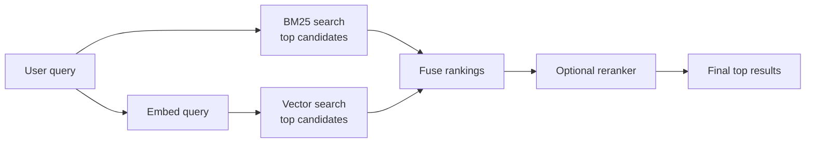

<div className="flex flex-wrap gap-2"><Badge color="purple" size="sm">Concept</Badge></div>

Hybrid search runs a keyword search and a meaning-based search (vector search) for the
same query, then merges the two result lists into one. Think of it as asking two
librarians at once: one finds every book that uses your exact words, the other finds
books about the same idea in different words, and you combine their shortlists. Keyword
search catches exact names, IDs, and error codes, while vector search catches
paraphrases. Together they hold up whether a shopper types a model number or
"comfortable shoes for standing all day."

<div className="learn-objectives">
  <Card title="Learning objectives" icon="graduation-cap">
    After reading this article you will be able to:

    - Explain why keyword search and vector search fail in complementary ways
    - Describe the hybrid pipeline: search both indexes, merge the lists, optionally rerank
    - Calculate reciprocal rank fusion scores and compare them with weighted blending
    - Recognize when hybrid search is worth its extra cost
  </Card>
</div>

## How do keyword search and vector search differ?

[Keyword search](/learn/full-text-search/what-is-full-text-search) matches the words
you typed, usually ranked with [BM25](/learn/full-text-search/what-is-bm25).
[Vector search](/learn/vector-search/what-is-vector-search) matches what you meant.
Each succeeds where the other fails, and that is the whole case for combining them.

| | Keyword search (BM25) | Vector (semantic) search |
| --- | --- | --- |
| Matches on | The analyzed terms in the query | Meaning, via [embeddings](/learn/vector-search/what-are-vector-embeddings) |
| Index | Inverted index (word to documents) | Approximate nearest neighbor index, such as [HNSW](/learn/vector-search/what-is-hnsw) or IVF (inverted file) |
| Handles well | "error E1042 on export," product codes, names | "why can't I sign in," paraphrases |
| Struggles with | Synonyms and different wording | Exact identifiers, rare tokens, new jargon |
| Needs a model | No | Yes, to embed documents and queries |
| Score | Relevance score with no fixed range | Distance or similarity between vectors |

A support-ticket search shows the gap. A user typing "E1042" needs the tickets that
contain that exact code, which an embedding may blur into generic "error" text. A user
typing "I can't log in after resetting my password" needs tickets about authentication
failures, even when they share few words with the query.

## How does hybrid search work?

Hybrid search asks both indexes the same question, merges the two ranked lists, and
optionally re-scores the top of the merged list before returning results.



<Steps>
  <Step title="Retrieve from both indexes">
    Run BM25 and vector search for the same query, usually in parallel. Embed the query
    with the same model that embedded the documents. Retrieve more candidates from each
    search than you plan to return, so good results from one list are not cut off
    before fusion.
  </Step>
  <Step title="Fuse the lists">
    Combine the two rankings into one with a fusion method such as reciprocal rank
    fusion.
  </Step>
  <Step title="Rerank, optionally">
    Score the fused top results with a slower, more accurate model, then return the
    final top results.
  </Step>
</Steps>

Apply the same filters, such as tenant (one customer's data in a shared system) or
access control, to both searches, ideally before ranking. Filtering after ranking can
leave a list with fewer than k results, or none, which skews fusion toward the other
list. Skipping the filter on either list can return records the user should not see.
[Filtered vector search](/learn/vector-search/filtered-vector-search) covers why.

<div className="learn-cta">
  <Card title="Try HelixDB" icon="rocket" href="/database/helix-db/start-here/quickstart" cta="Get started">
    Run prefiltered vector search and BM25 search over the same graph records, in one
    transaction, with open-source HelixDB.
  </Card>
</div>

## How do you combine BM25 and vector search results?

Put simply, you either merge by each document's position in each list, usually with
reciprocal rank fusion (RRF), or rescale both sets of scores and blend them with a
weight. Either can be followed by a reranker that rescores the fused top candidates.

### Reciprocal rank fusion

Reciprocal rank fusion ignores raw scores and uses only each document's rank in each
list. A document earns credit for sitting near the top of any list, and more credit for
appearing in several:

```text
RRF(d) = sum over each result list L that contains d of

    1 / (k + rank_L(d))

rank starts at 1; k is a constant, commonly 60
```

The constant `k` dampens the advantage of the very top ranks. The value 60 comes from
the paper that introduced RRF and is a common convention, not a requirement. Suppose
BM25 returns A, B, C and vector search returns D, C, A:

| Document | BM25 rank | Vector rank | RRF score (k = 60) |
| --- | --- | --- | --- |
| A | 1 | 3 | 1/61 + 1/63 = 0.0323 |
| C | 3 | 2 | 1/63 + 1/62 = 0.0320 |
| D | none | 1 | 1/61 = 0.0164 |
| B | 2 | none | 1/62 = 0.0161 |

In this example, documents that appear in both lists rise to the top. In general, RRF
rewards agreement between lists, but a high rank in one list can still outscore low
ranks in both. RRF needs no score normalization and no training data, which makes it a
robust default. Its limitation is that it discards score magnitude: a document that is
far better than the rest in one list gets no extra credit. A weighted variant
multiplies each list's terms by a weight to favor one method.

### Weighted score blending

The other common approach normalizes each list's scores and blends them:

```text
hybrid(d) = w * norm(bm25(d)) + (1 - w) * norm(similarity(d))
```

A document found by only one search has no score in the other list, so that missing
score is typically set to 0 or to the list's lowest normalized score.

Raw scores cannot be added directly because they are not on the same scale:

- BM25 scores have no fixed range and shift with the query's terms and the
  collection's statistics.
- Vector scores depend on the embedding model and the
  [distance metric](/learn/vector-search/vector-distance-metrics). Some are distances,
  where lower is better, and some are similarities, where higher is better.
- Both distributions change from query to query, so a fixed threshold on either is
  unreliable.

Min-max or z-score normalization per query puts the scores on a common scale, and
the weight `w` is then tuned on labeled queries (test searches with known right
answers). This can beat RRF when tuned well, but it is sensitive to outliers and to how
many candidates each search returns.

### Reranking

A reranker, often a cross-encoder model (one that reads the query and a document
together) or a large language model (LLM), produces a new relevance score for each
candidate. It is usually more accurate than either first-stage search but far more
expensive per document, so it runs only on the fused top candidates.

## Why does hybrid search matter for RAG?

A chatbot that answers from documents is only as good as the passages it retrieves.
In [retrieval-augmented generation (RAG)](/learn/ai-memory/what-is-rag), many
questions mix a concept with an identifier, and vector retrieval alone can miss the
one chunk that names it. Adding BM25 reduces that risk.

For example, in "what changed in the refund policy for plan B-7," BM25 finds the
chunks that contain "B-7" even when their embeddings are not the closest to the
question. For following relationships from retrieved hits, see
[GraphRAG](/learn/ai-memory/what-is-graphrag).

## When is hybrid search worth it?

Hybrid search pays off when queries mix natural language with exact terms: support
tickets, product catalogs, code and logs, legal and policy documents, and
[AI agent memory](/learn/ai-memory/what-is-ai-agent-memory). It adds less when every
query is conversational and the corpus has no identifiers, or when every lookup is an
exact key.

The cost is a second index to build and keep current, a query embedding per request,
and a fusion step to tune. Measure whether it pays for itself: compare BM25 alone,
vector alone, and the fused result on a set of real queries with known relevant
documents.

## How does HelixDB support hybrid search?

In HelixDB, vector and BM25 text indexes are optional access paths over a label and a
top-level property, on nodes or edges of its
[property graph](/learn/graph-databases/what-is-a-property-graph). When you define both
on the same label, both searches rank records of that label:

- One request is one ACID transaction over a committed snapshot. A single request can
  build a candidate set with a
  [graph traversal](/learn/graph-databases/what-is-a-graph-database), then run a
  prefiltered vector search and a prefiltered BM25 search over that same candidate set.
- Prefiltering guarantees that neither search returns a result outside the candidate
  set, such as documents the current user cannot read. Each prefiltered search
  returns at most 800 results. Prefiltered BM25 takes its term statistics from the
  full tenant partition, not only from the candidate set.
- Vector results are ordered by distance, closest first, then ID. BM25 results are
  ordered by score, then ID. These orders give the ranks that rank-based fusion uses.
- The application computes embeddings; HelixDB stores and indexes the vectors.
- HelixDB has no built-in rank-fusion operator. The application fuses the two result
  lists, for example with RRF, and applies any reranking.

See [Prefiltered search](/database/helix-db/query-guides/prefiltering),
[Vector indexes](/database/helix-db/query-guides/vector-indexes), and
[Text indexes](/database/helix-db/query-guides/text-indexes).

## Frequently asked questions

### Is hybrid search better than vector search?

On workloads that mix exact terms with natural language, it often improves recall of
exact terms while keeping most semantic matches, but it is not automatically better.
Fusion reorders the combined list, so some hits that only vector search found can fall
below the cutoff.

### Can hybrid search combine more than two searches?

Yes. RRF sums over any number of ranked lists, so one query can fuse, for example,
BM25 over titles, BM25 over body text, and vector search. Weighted blending also
extends to more lists, but each list needs its own normalization and weight, which
means more tuning.

### How many results should each search return before fusion?

More than the final number you need, because a document ranked modestly in both lists
can outrank one ranked highly in only one. The right depth depends on your corpus and
latency budget, so tune it along with the fusion method.

### Does hybrid search need two databases?

No. It needs a keyword index and a vector index over the same content, not necessarily
a search engine plus a separate
[vector database](/learn/vector-search/what-is-a-vector-database). When both indexes
live in one database, the two searches can read the same snapshot of the data and
apply the same filters, for example within one transaction. See
[Do you need separate graph, vector, and text databases?](/learn/database-architecture/one-database-for-graph-vector-and-text)

## Related topics

<CardGroup cols={2}>
  <Card title="What is BM25?" icon="square-root-variable" href="/learn/full-text-search/what-is-bm25">
    The ranking function behind most keyword search, explained.
  </Card>
  <Card title="What is vector search?" icon="vector-square" href="/learn/vector-search/what-is-vector-search">
    Nearest neighbors, approximate search, and recall.
  </Card>
  <Card title="What are vector embeddings?" icon="cubes" href="/learn/vector-search/what-are-vector-embeddings">
    How models turn text and other inputs into comparable vectors.
  </Card>
  <Card title="What is retrieval-augmented generation (RAG)?" icon="book" href="/learn/ai-memory/what-is-rag">
    Grounding model answers in retrieved context.
  </Card>
  <Card title="What is filtered vector search?" icon="filter" href="/learn/vector-search/filtered-vector-search">
    Pre-filtering, post-filtering, and returning the right top k.
  </Card>
  <Card title="Prefiltered search guide" icon="align-left" href="/database/helix-db/query-guides/prefiltering">
    Rank only the records a traversal reaches in HelixDB.
  </Card>
</CardGroup>
