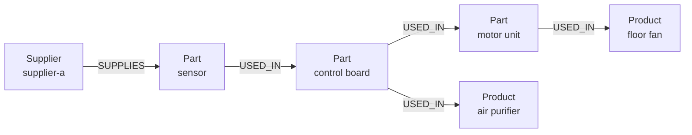

<div className="flex flex-wrap gap-2"><Badge color="purple" size="sm">Concept</Badge></div>

A relational database keeps data in tables and connects rows by matching IDs when you
query; a graph database stores the connections themselves as edges. It is the difference
between looking up a name in a second list every time and following a line already drawn
between two names on a map. Relational databases are typically the better choice for
tabular records, totals, and reports. Graph databases suit questions that follow
connections across many steps, and many applications use both.

<div className="learn-objectives">
  <Card title="Learning objectives" icon="graduation-cap">
    After reading this article you will be able to:

    - Compare how relational and graph databases store relationships
    - Explain how joins and traversals handle questions that span many steps
    - Choose a graph database, a relational database, or both for a given workload
    - Describe which relational ideas carry over to HelixDB
  </Card>
</div>

## How do the two models compare side by side?

The main difference is where relationships live. A relational database keeps them as
matching key values in rows and rebuilds them with a join each time you ask. A
[graph database](/learn/graph-databases/what-is-a-graph-database) stores them as edges
that queries follow directly.

| | Relational database | Graph database |
| --- | --- | --- |
| Data model | Tables of rows and columns | Nodes and edges, each with properties |
| Relationships | Foreign keys, rebuilt with joins at query time | Edges stored as data and followed directly |
| Schema | Defined up front; changes usually need a migration | Typically flexible: labels and properties can vary, with optional constraints |
| Query style | SQL: tables, joins, filters, and projections | Pattern matching or step-by-step traversal (GQL, openCypher, Gremlin) or typed APIs |
| Multi-hop queries | Repeated self-joins or recursive common table expressions | Traversals, including variable-length and repeated paths |
| Aggregation and reporting | A core strength, with mature optimizers and BI tooling | Supported, but usually secondary to traversal |
| Transactions | Typically ACID | Many systems are ACID; guarantees vary by system |

A foreign key is a column that holds the key of a related row, often in another table,
and a join is the query step that matches those keys. The graph column describes the
[labeled property graph](/learn/graph-databases/what-is-a-property-graph) model. RDF, the
other common graph model, stores data as subject-predicate-object triples instead; see
[property graph vs RDF](/learn/graph-databases/property-graph-vs-rdf).

In practice, the biggest difference shows up when the answer is several relationships
away.

## Why do multi-hop queries differ between joins and traversals?

A multi-hop query is one whose answer is several relationships away, such as "friends of
my friends" in a social app. In a relational database, each hop is another join. In a
graph database, each hop is one step along stored edges.

Under the hood, a join takes the rows found so far, looks up matching keys in another
table, usually through an index, and builds a new intermediate result. That result grows
with each hop when relationships fan out. A fixed number of hops means a fixed number of
joins. An unknown number of hops, such as "all parts inside this assembly, however deeply
nested," needs a recursive query that repeats the join until no new rows appear.

In a graph database, many systems store a node's edges with the node, so the work per
hop tracks the number of relationships actually followed. Graph query languages
typically express variable depth directly, with a variable-length pattern or a repeat
step, instead of a recursive query you structure by hand.

<div className="learn-cta">
  <Card title="Try HelixDB" icon="rocket" href="/database/helix-db/start-here/quickstart" cta="Get started">
    Run multi-hop graph traversals, vector search, and BM25 search in one ACID transaction with open-source HelixDB.
  </Card>
</div>

## What does a multi-hop query look like in SQL and in a graph?

In SQL, a question of unknown depth becomes a recursive query that repeats a join until
it runs out of new rows. In a graph, it is a traversal that follows the same kind of edge
over and over.

Picture a manufacturer whose supplier cannot ship. The supplier's parts go into
sub-assemblies, which go into larger assemblies, which eventually go into finished
products. The question is: which products depend, directly or indirectly, on this
supplier? Nobody knows the depth in advance.

### The relational version

A typical relational schema uses four tables:

| Table | Columns |
| --- | --- |
| `supplier_parts` | `supplier_id`, `part_id` |
| `part_usage` | `part_id`, `used_in_part_id` |
| `product_parts` | `product_id`, `part_id` |
| `products` | `product_id`, `name` |

A product can contain several parts or assemblies, so `product_parts` links each product
to the parts that go directly into it. The query needs a recursive common table
expression (a named subquery that refers to itself). It walks `part_usage` upward until
it finds no new parts, then joins the result through `product_parts` to `products`:

```sql
WITH RECURSIVE affected(part_id) AS (
  SELECT part_id
  FROM supplier_parts
  WHERE supplier_id = 'supplier-a'
  UNION
  SELECT pu.used_in_part_id
  FROM part_usage AS pu
  JOIN affected AS a ON pu.part_id = a.part_id
)
SELECT DISTINCT p.product_id, p.name
FROM affected AS a
JOIN product_parts AS pp ON pp.part_id = a.part_id
JOIN products AS p ON p.product_id = pp.product_id;
```

In systems that allow `UNION` in recursive queries, it removes duplicate rows, which
also stops the recursion if the usage data contains a cycle. Systems that allow only
`UNION ALL` typically need an explicit depth limit or cycle check instead.

### The graph version

In a graph, the same data is a set of nodes and edges:



The traversal reads as a description of that picture:

```text
start   at the Supplier node "supplier-a"
out     follow SUPPLIES edges to the parts it provides
repeat  follow USED_IN edges to every assembly that contains those parts
keep    only nodes labeled Product
dedup   return each product once
```

Both versions return the same products. The difference is in how the work is written
and run. The SQL version builds a working table and joins it back against `part_usage`
on every round. The graph version reads each part's outgoing `USED_IN` edges directly.

For shallow questions over well-indexed tables, the relational version performs well.
As depth, branching, and the number of relationship types grow, the graph version
typically stays simpler to write, and each hop reads stored adjacency rather than
probing an index for every row in the working table.

## When should you use a graph database instead of a relational database?

A graph database is usually the better fit when:

- Questions routinely span several hops or an unknown depth, such as dependency chains,
  org charts, or bill-of-materials lookups.
- You need to filter on relationship details at each step of a path, such as when a
  purchase happened or how confident an extracted fact is.
- The kinds of relationships change often, so adding a new one should not require a
  schema migration.
- You need path questions: how two entities are connected, or the shortest route
  between them, as when a bank traces money between accounts.
- The data feeds AI retrieval, such as [GraphRAG](/learn/ai-memory/what-is-graphrag)
  or [agent memory](/learn/ai-memory/what-is-ai-agent-memory) over a
  [knowledge graph](/learn/graph-databases/what-is-a-knowledge-graph), that combines
  connected facts with [vector search](/learn/vector-search/what-is-vector-search) or
  [full-text search](/learn/full-text-search/what-is-full-text-search).

## When is a relational database the better choice?

A relational database is usually the better fit when:

- The data is naturally tabular, such as orders, invoices, and ledger entries.
- The main workload is aggregation, reporting, and ad hoc analysis across many rows.
- Relationships are few, stable, and one or two joins deep.
- Strict schema constraints across tables, such as foreign keys and check constraints,
  are central to correctness.
- Your team, reporting tools, and pipelines already depend on SQL.

Relational databases are mature, widely understood, and well supported. A graph database
is worth choosing when relationship queries are central, not incidental.

## Can you use a graph database and a relational database together?

Yes, and many systems do. A common pattern keeps transactional records, such as orders
and payments, in a relational database and keeps a graph of the relationship-heavy
parts, such as users, permissions, and entities, for traversal and for
[retrieval in AI applications](/learn/ai-memory/what-is-rag).

The cost is keeping the two in sync: each change must reach both stores, and reads that
span them are not covered by a single transaction. The same trade-off applies to
separate search stores; see
[one database for graph, vector, and text](/learn/database-architecture/one-database-for-graph-vector-and-text).

## How does HelixDB compare to a relational database?

HelixDB is a graph database, not a relational one. Its data is one labeled property
graph of nodes and directed edges with typed properties. You build queries with typed
SDKs in Rust, TypeScript, Go, and Python, or as raw JSON, rather than writing SQL.
Several relational ideas carry over:

- **Indexes.** Secondary indexes provide equality, unique equality (node labels only),
  and ascending or descending range lookups, on nodes or edges. See
  [secondary indexes](/database/helix-db/query-guides/secondary-indexes).
- **Transactions.** Each request is one ACID transaction over a committed snapshot with
  serializable snapshot isolation, and conflicting writes are detected at commit. All
  entries in a write batch commit or roll back together. See
  [guarantees](/database/helix-cloud/operate/guarantees).
- **Aggregates.** Queries can compute aggregates over their results.

For multi-hop questions, HelixDB provides traversals, bounded repeats, and shortest path;
see [traversals](/database/helix-db/query-guides/traversals). Repeats are bounded, so a
variable-depth question like the supplier example is written with a maximum depth.
Vector and [BM25](/learn/full-text-search/what-is-bm25) search run in the same
transaction as those traversals, and can be
[limited to a traversal's results](/learn/vector-search/filtered-vector-search).

## Frequently asked questions

### Is a graph database faster than a relational database?

It depends on the query. For multi-hop traversals over connected data, a graph database
typically does less work per hop. For scans, aggregations, and simple lookups, a
relational database is often as fast or faster. Measure your own queries on your own
data.

### Can a relational database store graph data?

Yes. An edge table with source and target columns represents a graph, and recursive
queries can traverse it. This works well for shallow or occasional traversals, and gets
harder to write and tune as depth, branching, and relationship types grow. SQL/PGQ,
part of the SQL standard, adds property graph pattern queries over relational tables.

### Do graph databases support ACID transactions?

Many do, though isolation levels and transaction scope vary between systems. ACID means
a transaction is all-or-nothing, consistent, isolated, and durable. Check whether reads,
writes, and any search indexes are covered by the same transaction.

### Do graph databases have a schema?

Many graph databases use labels and typed properties without requiring a fixed schema,
and some let you add constraints such as uniqueness. This flexibility helps when data
evolves, but define constraints wherever integrity matters.

## Related topics

<CardGroup cols={2}>
  <Card title="What is a graph database?" icon="diagram-project" href="/learn/graph-databases/what-is-a-graph-database">
    Nodes, edges, traversals, and when a graph is the right model.
  </Card>
  <Card title="What is a property graph?" icon="tags" href="/learn/graph-databases/what-is-a-property-graph">
    Labels and typed properties on nodes and edges.
  </Card>
  <Card title="What is the difference between a property graph and RDF?" icon="code-compare" href="/learn/graph-databases/property-graph-vs-rdf">
    Labeled nodes and edges compared with subject-predicate-object triples.
  </Card>
  <Card title="Do you need separate graph, vector, and text databases?" icon="cubes" href="/learn/database-architecture/one-database-for-graph-vector-and-text">
    The hidden costs of stitching separate stores together.
  </Card>
</CardGroup>
