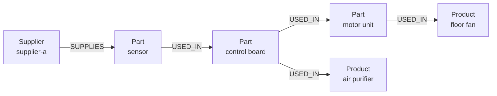

<div className="flex flex-wrap gap-2"><Badge color="purple" size="sm">Concept</Badge></div>

A relational database stores data as rows in tables and rebuilds relationships at query
time by joining tables on keys, while a graph database stores relationships directly as
edges between nodes and answers queries by following them. Relational databases are
typically the better choice for tabular records, aggregation, and reporting. Graph
databases are typically the better choice when questions follow connections across many
hops, such as friends of friends, dependency chains, or fraud rings. Many applications
use both.

## How do graph and relational databases differ?

| | Relational database | Graph database |
| --- | --- | --- |
| Data model | Tables of rows and columns | Nodes and edges, each with properties |
| Relationships | Foreign keys, rebuilt with joins at query time | Edges stored as data and followed directly |
| Schema | Defined up front; changes usually need a migration | Typically flexible: labels and properties can vary, with optional constraints |
| Query style | SQL: tables, joins, filters, and projections | Pattern matching or step-by-step traversal (GQL, openCypher, Gremlin) or typed APIs |
| Multi-hop queries | Repeated self-joins or recursive common table expressions | Traversals, including variable-length and repeated paths |
| Aggregation and reporting | A core strength, with mature optimizers and BI tooling | Supported, but usually secondary to traversal |
| Transactions | Typically ACID | Many systems are ACID; guarantees vary by system |

The biggest practical difference is how each model handles a question whose answer is
several relationships away.

## Why are multi-hop queries different?

In a relational database, each hop is a join: the database takes the rows it has so
far, looks up matching keys in another table, usually through an index, and produces a
larger intermediate result. A fixed number of hops means a fixed number of joins. An
unknown number of hops, such as "all parts inside this assembly, however deeply
nested," needs a recursive query that repeats the join until no new rows appear.

In a graph database, each hop reads the edges attached to the current nodes. Many graph
databases store those edges with each node, so the work per hop tracks the number of
relationships actually followed. Variable-depth paths are part of the query language
rather than a special construct.

## Example: which products does a supplier affect?

Suppose a supplier cannot ship. Its parts go into sub-assemblies, which go into larger
assemblies, which eventually go into finished products. The question is: which
products depend, directly or indirectly, on this supplier? The depth is not known in
advance.

### The relational version

A typical relational schema uses three tables:

| Table | Columns |
| --- | --- |
| `supplier_parts` | `supplier_id`, `part_id` |
| `part_usage` | `part_id`, `used_in_part_id` |
| `products` | `product_id`, `name`, `part_id` |

Each product row points at its top-level assembly through `part_id`. The query needs a
recursive common table expression that walks `part_usage` upward until it finds no new
parts, then joins the result to `products`:

```sql
WITH RECURSIVE affected(part_id) AS (
  SELECT part_id
  FROM supplier_parts
  WHERE supplier_id = 'supplier-a'
  UNION
  SELECT pu.used_in_part_id
  FROM part_usage AS pu
  JOIN affected AS a ON pu.part_id = a.part_id
)
SELECT DISTINCT p.product_id, p.name
FROM products AS p
JOIN affected AS a ON p.part_id = a.part_id;
```

`UNION` removes duplicate rows, which also stops the recursion if the usage data
contains a cycle.

### The graph version

In a graph, the same data is a set of nodes and edges:



The traversal reads as a description of that picture:

```text
start   at the Supplier node "supplier-a"
out     follow SUPPLIES edges to the parts it provides
repeat  follow USED_IN edges to every assembly that contains those parts
keep    only nodes labeled Product
dedup   return each product once
```

Both versions return the same products. The difference is in how the work is expressed
and executed. The SQL version builds a working table and joins it back against
`part_usage` on every iteration. The graph version reads each part's outgoing `USED_IN`
edges directly. For shallow questions over well-indexed tables, the relational version
performs well. As depth, branching, and the number of relationship types grow, the graph
version typically stays simpler to write and its cost tracks the edges it touches.

## When should you use a graph database instead of a relational database?

A graph database is usually the better fit when:

- Questions routinely span several hops or an unknown depth, such as dependency chains,
  org hierarchies, or bill-of-materials lookups.
- Relationships carry their own data, such as when a purchase happened or how confident
  an extracted fact is.
- The kinds of relationships change often, so adding a new relationship type should not
  require a schema migration.
- You need path questions: how two entities are connected, or the shortest route
  between them.
- The data feeds AI retrieval that combines connected facts with semantic or keyword
  search.

## When is a relational database the better choice?

A relational database is usually the better fit when:

- The data is naturally tabular, such as orders, invoices, and ledger entries.
- The main workload is aggregation, reporting, and ad hoc analysis across many rows.
- Relationships are few, stable, and one or two joins deep.
- Strict schema constraints across tables, such as foreign keys and check constraints,
  are central to correctness.
- Your team, BI tools, and pipelines already depend on SQL.

Relational databases are mature, widely understood, and well supported. Choosing a
graph database is worth it when relationship queries are central, not incidental.

## Can you use a graph database and a relational database together?

Yes, and many systems do. A common pattern keeps transactional records in a relational
database and maintains a graph of the relationship-heavy parts, such as users,
permissions, and entities, for traversal and retrieval. The cost is keeping the two in
sync: each change must reach both stores, and reads that span them are not covered by a
single transaction.

## How HelixDB compares to a relational database

HelixDB is a graph database, not a relational one. Its data is one labeled property
graph of nodes and directed edges with typed properties, and queries are built with
typed SDKs in Rust, TypeScript, Go, and Python, or as raw JSON, rather than written in
SQL. Several relational ideas carry over:

- **Indexes.** Secondary indexes provide equality, unique equality (node labels only),
  and ascending or descending range lookups, on nodes or edges. See
  [Secondary indexes](/database/helix-db/query-guides/secondary-indexes).
- **Transactions.** Each request is one ACID transaction over a committed snapshot with
  serializable snapshot isolation, and all entries in a write batch commit or roll back
  together. See [Guarantees](/database/helix-cloud/operate/guarantees).
- **Aggregates.** Count, sum, min, max, mean, and group count.

For multi-hop questions, HelixDB provides traversals over outgoing, incoming, or both
directions, bounded repeats, and shortest path; see
[Traversals](/database/helix-db/query-guides/traversals). Vector and BM25 search run in
the same transaction as those traversals.

## Frequently asked questions

### Is a graph database faster than a relational database?

It depends on the query. For multi-hop traversals over connected data, a graph database
typically does less work per hop. For scans, aggregations, and simple lookups, a
relational database is often as fast or faster. Measure your own queries on your own
data.

### Can a relational database store graph data?

Yes. An edge table with source and target columns represents a graph, and recursive
queries can traverse it. This works well for shallow or occasional traversals, and gets
harder to write and tune as depth, branching, and relationship types grow.

### Do graph databases support ACID transactions?

Many do, though isolation levels and transaction scope vary between systems. Check
whether reads, writes, and any search indexes are covered by the same transaction.

### Do graph databases have a schema?

Many graph databases use labels and typed properties without requiring a fixed schema,
and some let you add constraints such as uniqueness. This flexibility helps when data
evolves, but define constraints wherever integrity matters.

### Should I move from SQL to a graph database?

Usually only part of the workload. Move the relationship-heavy queries that are awkward
as joins, and keep reporting and tabular records where SQL serves them well.

## Related topics

<CardGroup cols={2}>
  <Card title="What is a graph database?" icon="diagram-project" href="/learn/graph-databases/what-is-a-graph-database">
    Nodes, edges, traversals, and when a graph is the right model.
  </Card>
  <Card title="What is a property graph?" icon="tags" href="/learn/graph-databases/what-is-a-property-graph">
    Labels and properties on nodes and edges, compared with RDF.
  </Card>
  <Card title="Graph, vector, and text in one database" icon="cubes" href="/learn/database-architecture/one-database-for-graph-vector-and-text">
    The hidden costs of stitching separate stores together.
  </Card>
  <Card title="Traversals" icon="route" href="/database/helix-db/query-guides/traversals">
    Follow outgoing and incoming relationships in a HelixDB query.
  </Card>
</CardGroup>
