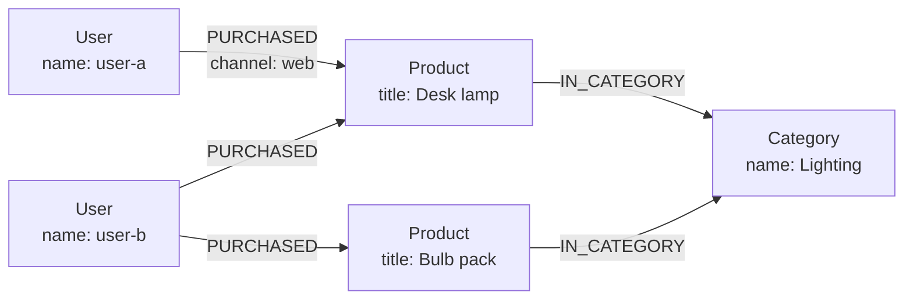

<div className="flex flex-wrap gap-2"><Badge color="purple" size="sm">Concept</Badge></div>

A graph database is a database that stores data as nodes (entities), edges
(relationships between entities), and properties (values on both), and answers queries
by following those relationships. Because connections are stored as data rather than
rebuilt from matching keys at query time, questions about how things relate, such as
who knows whom, what depends on what, or which accounts share a device, are direct to
express and typically efficient to run. Graph databases are used for recommendations,
fraud detection, knowledge graphs, access control, network topology, and retrieving
context for AI applications.

<div className="learn-objectives">
  <Card title="Learning objectives" icon="graduation-cap">
    After reading this article you will be able to:

    - Define a graph database and its building blocks: nodes, edges, properties, and labels
    - Explain how a graph database follows stored relationships instead of joining tables
    - Compare the main graph query languages: GQL, openCypher, Gremlin, and SPARQL
    - Recognize when a graph database fits a workload and when another database fits better
  </Card>
</div>

## How does a graph database work?

A graph database stores entities as nodes and relationships as edges, and answers a query
by starting at matching nodes and following edges to related nodes. Its data is organized
around three building blocks.

| Element | What it represents | Example |
| --- | --- | --- |
| Node | An entity | A user, a product, a support ticket |
| Edge | A named, usually directed relationship between two nodes | A user `PURCHASED` a product |
| Property | A key-value pair stored on a node or an edge | `name` on a user, `channel` on a purchase |

Many graph databases also give every node and edge a label, or type, such as `User` or
`PURCHASED`. Labels group similar elements and scope queries and indexes.



The starting nodes are often found through an index on a property, and the query then
walks edges to reach related nodes. "Products bought by people who bought this lamp" is
a walk from the lamp to its buyers, then from each buyer to their other purchases.

### Following relationships instead of joining tables

In a relational database, a relationship is typically stored as a foreign key and
rebuilt at query time with a join, which looks up matching keys in an index or scans a
table. A graph database stores the adjacency itself. Some systems keep direct references
from each node to its neighboring edges and nodes, an approach called index-free
adjacency. Others keep each node's edges in an adjacency list keyed by node ID.

Either way, moving from a node to its neighbors reads stored adjacency instead of
matching keys in a join. The cost of a traversal depends mainly on the number of
relationships the query touches, and typically grows at most logarithmically with total
data size, so multi-hop questions such as friends of friends stay practical at query
time.

## What query languages do graph databases use?

Graph databases typically use GQL (the ISO standard), openCypher, or Gremlin for property
graphs, and SPARQL for RDF data. These languages describe patterns of connected nodes and
edges rather than tables and joins.

| Language | Style | Data model |
| --- | --- | --- |
| GQL (ISO/IEC 39075) | Declarative pattern matching; the ISO standard graph query language | Property graph |
| openCypher | Declarative pattern matching with ASCII-art patterns | Property graph |
| Gremlin | Step-by-step traversal written as a chain of operations | Property graph |
| SPARQL | Declarative matching of triple patterns; a W3C standard | RDF |

In openCypher, a query reads like a sketch of the graph; GQL uses very similar pattern
syntax. This openCypher query finds other products bought by buyers of the desk lamp.
The `WHERE` clause excludes the lamp itself, which the pattern could otherwise match
again when a buyer has more than one `PURCHASED` edge to it:

```text
MATCH (lamp:Product {title: "Desk lamp"})<-[:PURCHASED]-(buyer:User)-[:PURCHASED]->(other:Product)
WHERE other <> lamp
RETURN DISTINCT other.title
```

SPARQL queries a different data model, RDF triples; see
[Property graph vs RDF](/learn/graph-databases/property-graph-vs-rdf) for how the two
models differ. Some databases skip a text language and expose typed APIs or SDK builders
instead, so queries are assembled and type-checked in application code.

## When should you use a graph database?

A graph database fits when relationships are the point of the question: queries follow
connections across several hops, the shape of those connections varies, or the
relationships carry their own data. Common graph database use cases:

| Use case | What the graph holds | Typical question |
| --- | --- | --- |
| Recommendations | Users, items, and interactions | What did similar users engage with next? |
| Fraud rings | Accounts, devices, cards, and addresses | Which accounts share a device or payment method with a flagged account? |
| Knowledge graphs | Entities and typed facts about them | What do we know about this product, and where did each fact come from? |
| Identity and access | Users, groups, roles, and resources | Can this user read this document through any group membership? |
| Network and IT topology | Services, hosts, links, and dependencies | What fails downstream if this service goes down? |
| AI context and agent memory | Documents, chunks, entities, conversations, and memories | What does the agent know about this customer, and from which source? |

## How are graph databases used for AI and RAG?

In AI applications, a graph adds what isolated passages lack: relationships between
entities, provenance back to source documents, newer versions, and the permissions that
decide what a user may see. In retrieval-augmented generation (RAG), which grounds a
language model's answer in data retrieved at query time, vector or keyword search finds
the entry points and the graph supplies this surrounding context; see
[What is RAG?](/learn/ai-memory/what-is-rag). The same structure underpins agent memory,
where facts, their sources, and their changes over time are stored as connected records.
See
[What is GraphRAG?](/learn/ai-memory/what-is-graphrag) and
[What is AI agent memory?](/learn/ai-memory/what-is-ai-agent-memory).

## When is a graph database not the right tool?

A graph database is not a general replacement for other databases. Consider another
option when:

- **The workload is mostly aggregation and reporting.** Sums, group-bys, and scans over
  every row of a large table are the strength of relational and columnar analytics
  systems.
- **Relationships are shallow and fixed.** If queries go one join deep and the schema
  rarely changes, a relational database handles them well with mature tooling.
- **Access is simple key-value lookup.** Fetching a record by its ID does not need
  traversal.
- **Your tooling depends on SQL.** Existing BI tools and SQL skills can outweigh the
  modeling benefits.

For a side-by-side comparison, see
[Graph database vs relational database](/learn/graph-databases/graph-vs-relational-database).

## How do you choose a graph database?

Choose a graph database by comparing its data model, query interface, transaction
guarantees, built-in search, storage architecture, and license and deployment options:

- **Data model:** a labeled property graph or RDF triples. See
  [What is a property graph?](/learn/graph-databases/what-is-a-property-graph) and
  [Property graph vs RDF](/learn/graph-databases/property-graph-vs-rdf).
- **Query interface:** a text language such as GQL, openCypher, Gremlin, or SPARQL, or
  typed APIs in your application language.
- **Transactions:** whether reads and writes are ACID and at which isolation level.
- **Search:** whether vector and full-text search live in the same system and
  transaction, or in separate stores you keep in sync.
- **Storage architecture:** whether data must fit on one machine, or storage scales
  separately from compute.
- **License and deployment:** open source or proprietary, managed or self-hosted, server
  or embedded.

## How does HelixDB work as a graph database?

HelixDB is an open-source (Apache 2.0) graph database with native vector search and BM25
full-text search, built on object storage. Its data model is one labeled property graph:
nodes are entities, directed edges are relationships, and each has exactly one label and
typed properties.

- **Typed SDKs and raw JSON.** Queries are built with typed SDKs in Rust, TypeScript, Go,
  and Python, or written as raw JSON. Each produces a JSON operation tree sent to
  `POST /v2/query`, with no query deployment step.
- **Graph operations.** Traversals over outgoing, incoming, or both directions, bounded
  repeats, branches, shortest path, projections, and aggregates.
- **One transaction per request.** Each request is one ACID transaction, and graph
  traversals, vector search, text search, and index lookups run inside it.

See the [data model](/database/helix-db/core-concepts/data-model) and
[traversals](/database/helix-db/query-guides/traversals) guides, or
[why graph, vector, and text belong in one database](/learn/database-architecture/one-database-for-graph-vector-and-text).

## Frequently asked questions

### Are graph databases ACID?

Many are, but guarantees vary by system. Transactional graph databases typically make
each transaction atomic and durable, while the isolation level ranges from read
committed to snapshot or serializable isolation, and some distributed systems relax
guarantees across partitions. HelixDB runs each request as one ACID transaction with
serializable snapshot isolation.

### Is a knowledge graph the same as a graph database?

No. A knowledge graph is a body of data: entities and facts organized by a shared
schema. A graph database is software for storing and querying graph data. Knowledge
graphs are often stored in graph databases; see
[What is a knowledge graph?](/learn/graph-databases/what-is-a-knowledge-graph).

### Do graph databases use SQL?

Usually not as their primary language. SQL does have a standard extension for property
graph queries, SQL/PGQ, added in SQL:2023. It lets a relational database define a
property graph over existing tables and query it with graph pattern matching inside a
SQL statement, and some relational systems implement it.

### Is there an open-source graph database?

Yes. Many graph databases are available under open-source licenses, with different data
models, query languages, and storage designs. HelixDB is open source under the Apache 2.0
license and includes vector and full-text search in the same database.

### Does a graph database replace vector search in AI applications?

No. A graph adds structure alongside semantic search, such as entity relationships,
provenance, versions, and permissions, but it does not find passages by meaning. Many
AI systems combine a graph with vector and full-text search to retrieve both similar
content and the facts connected to it. See
[Hybrid search](/learn/full-text-search/hybrid-search).

## Related topics

<CardGroup cols={2}>
  <Card title="Graph vs relational databases" icon="table" href="/learn/graph-databases/graph-vs-relational-database">
    How multi-hop questions differ from joins, and when each model fits.
  </Card>
  <Card title="What is a property graph?" icon="tags" href="/learn/graph-databases/what-is-a-property-graph">
    Labels and properties on nodes and edges, and how to model them.
  </Card>
  <Card title="Property graph vs RDF" icon="scale-balanced" href="/learn/graph-databases/property-graph-vs-rdf">
    How labeled property graphs and RDF triples model the same facts.
  </Card>
  <Card title="What is a knowledge graph?" icon="brain" href="/learn/graph-databases/what-is-a-knowledge-graph">
    Entities, relationships, and provenance for search and LLMs.
  </Card>
  <Card title="What is GraphRAG?" icon="share-nodes" href="/learn/ai-memory/what-is-graphrag">
    Retrieval that follows relationships, compared with vector RAG.
  </Card>
  <Card title="What is RAG?" icon="magnifying-glass" href="/learn/ai-memory/what-is-rag">
    Grounding a model's answer in data retrieved at query time.
  </Card>
  <Card title="HelixDB data model" icon="diagram-project" href="/database/helix-db/core-concepts/data-model">
    How HelixDB represents nodes, edges, properties, and indexes.
  </Card>
  <Card title="Traversals" icon="route" href="/database/helix-db/query-guides/traversals">
    Follow outgoing and incoming relationships in a HelixDB query.
  </Card>
</CardGroup>
