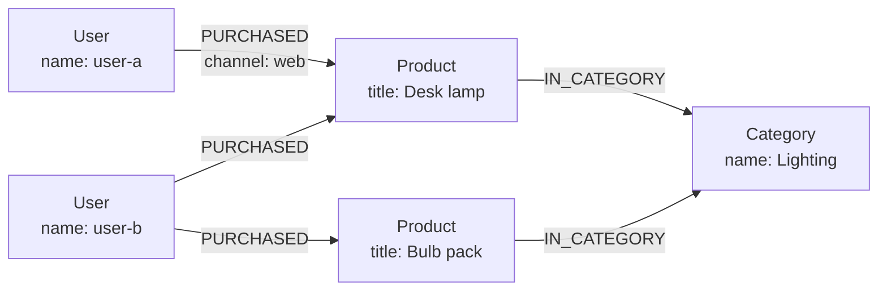

<div className="flex flex-wrap gap-2"><Badge color="purple" size="sm">Concept</Badge></div>

A graph database stores data as nodes (things like people or products) and edges (the
connections between them), and answers questions by following those connections. It
works like a subway map: instead of looking up every station in a separate list, you
trace the lines from one stop to the next. Because the connections are stored as data
rather than rebuilt each time you ask, questions such as who knows whom, what depends on
what, or which bank accounts share a phone are direct to express and typically fast to
run. That is why graph databases power recommendations, fraud detection, knowledge
graphs, access control, and the context AI applications retrieve before they answer.

<div className="learn-objectives">
  <Card title="Learning objectives" icon="graduation-cap">
    After reading this article you will be able to:

    - Explain what a graph database is, using nodes, edges, properties, and labels
    - Describe how a graph database follows stored connections instead of joining tables
    - Name the main graph query languages and what each one looks like
    - Tell when a graph database fits a workload and when another database fits better
  </Card>
</div>

## How does a graph database work?

A graph database keeps each thing as a node and each connection as an edge. To answer a
question, it finds one or more starting nodes and walks along their edges to related
nodes.

Its data is built from three pieces:

| Element | What it represents | Example |
| --- | --- | --- |
| Node | An entity, meaning a thing you store data about | A user, a product, a support ticket |
| Edge | A named, usually directed relationship between two nodes | A user `PURCHASED` a product |
| Property | A key-value pair stored on a node or an edge | `name` on a user, `channel` on a purchase |

Many graph databases also give every node and edge a label, or type, such as `User` or
`PURCHASED`. Labels group similar elements, so a query or an index can target one kind
at a time. A graph built this way is called a
[labeled property graph](/learn/graph-databases/what-is-a-property-graph).



For example, an online store wants to show "customers who bought this lamp also
bought." The database finds the lamp, often through an index on its title, then walks
from the lamp to its buyers and from each buyer to their other purchases.

### How is following an edge different from a join?

In a relational database, which stores data in tables, a connection is usually a shared
ID, and the database matches those IDs every time you ask, a step called a join. A graph
database stores the connection itself, so moving to a neighbor reads what is already
there. See
[graph vs relational databases](/learn/graph-databases/graph-vs-relational-database) for
a side-by-side comparison.

Under the hood, a join looks up matching keys in an index or scans a table. A graph
database stores adjacency, meaning which nodes are next to which. Some systems keep
direct references from each node to its edges and neighbors, called index-free
adjacency; others keep each node's edges in an adjacency list keyed by node ID.

Either way, the cost of a traversal (a walk along edges) depends mainly on how many
relationships the query touches. It typically grows at most logarithmically, that is,
very slowly, with total data size, so multi-hop questions such as friends of friends
stay practical at query time.

## What query languages do graph databases use?

Graph query languages describe patterns of connected nodes and edges instead of tables
and joins. The main ones are:

- **GQL** (ISO/IEC 39075): the ISO standard, declarative pattern matching over property
  graphs.
- **openCypher:** declarative pattern matching over property graphs, written with
  ASCII-art patterns.
- **Gremlin:** step-by-step traversals over property graphs, written as chains of
  operations.
- **SPARQL:** the W3C standard for matching triple patterns in RDF data.

In openCypher, a query reads like a sketch of the graph, and GQL uses very similar
pattern syntax. This query finds other products bought by buyers of the desk lamp. The
`WHERE` clause excludes the lamp itself, which the pattern could otherwise match again
when a buyer has more than one `PURCHASED` edge to it:

```text
MATCH (lamp:Product {title: "Desk lamp"})<-[:PURCHASED]-(buyer:User)-[:PURCHASED]->(other:Product)
WHERE other <> lamp
RETURN DISTINCT other.title
```

SPARQL works on a different data model, RDF, which stores facts as three-part
statements called triples. See
[property graph vs RDF](/learn/graph-databases/property-graph-vs-rdf) for how the two
models differ. Some databases skip a text language and offer typed APIs or SDK builders
instead, so queries are assembled and type-checked in application code.

<div className="learn-cta">
  <Card title="Try HelixDB" icon="rocket" href="/database/helix-db/start-here/quickstart" cta="Get started">
    Store your graph, embeddings, and text in one open-source database, and run vector search inside a graph traversal.
  </Card>
</div>

## When should you use a graph database?

Use a graph database when relationships are the point of the question: queries follow
connections across several hops, the shape of those connections varies, or the
connections carry their own data. Common use cases include:

| Use case | What the graph holds | Typical question |
| --- | --- | --- |
| Recommendations for an online store | Shoppers, products, and purchases | What did similar shoppers buy next? |
| Fraud checks at a bank | Accounts, devices, cards, and addresses | Which accounts share a device or card with a flagged account? |
| [Knowledge graphs](/learn/graph-databases/what-is-a-knowledge-graph) | Entities and typed facts about them | What do we know about this product, and where did each fact come from? |
| Access control for a company wiki | Users, groups, roles, and pages | Can this user read this page through any group membership? |
| IT and network topology | Services, hosts, links, and dependencies | What fails downstream if this service goes down? |
| AI context and [agent memory](/learn/ai-memory/what-is-ai-agent-memory) | Documents, chunks, entities, conversations, and memories | What does the assistant know about this customer, and from which source? |

## How are graph databases used for AI and RAG?

A graph gives an AI application the context a lone passage of text lacks: how entities
relate, which document a fact came from, which version is newest, and which permissions
decide what a user may see.

For example, a support chatbot answers from a company's documents using
[retrieval-augmented generation (RAG)](/learn/ai-memory/what-is-rag), which grounds a
language model's answer in data fetched at query time.
[Vector search](/learn/vector-search/what-is-vector-search) finds passages by meaning
and [full-text search](/learn/full-text-search/what-is-full-text-search) finds exact
words. The graph then adds the product a passage covers, the newer guide that replaces
it, and whether this user may read it. This approach is often called
[GraphRAG](/learn/ai-memory/what-is-graphrag).

The same structure underpins
[long-term memory for AI agents](/learn/ai-memory/long-term-memory-for-ai-agents), where
facts, their sources, and their changes over time are stored as connected records.

## When is a graph database not the right tool?

A graph database is not a general replacement for other databases. Consider another
option when:

- **The work is mostly totals and reports.** Sums, group-bys, and scans over every row
  of a large table are the strength of relational and columnar analytics systems.
- **Relationships are shallow and fixed.** If queries go one join deep and the schema
  rarely changes, a relational database handles them well with mature tooling.
- **Access is a simple key-value lookup.** Fetching a record by its ID does not need a
  traversal.
- **Your tooling depends on SQL.** Existing reporting tools and SQL skills can outweigh
  the modeling benefits.

## How do you choose a graph database?

Compare candidates on these points:

- **Data model:** a labeled property graph or RDF triples.
- **Query interface:** a text language such as GQL, openCypher, Gremlin, or SPARQL, or
  typed APIs in your application language.
- **Transactions:** whether reads and writes are ACID (all-or-nothing, consistent,
  isolated, and durable) and at which isolation level.
- **Search:** whether vector and full-text search live in the same system and
  transaction, or in separate stores you keep in sync. See
  [one database for graph, vector, and text](/learn/database-architecture/one-database-for-graph-vector-and-text).
- **Storage design:** whether data must fit on one machine, or storage scales separately
  from compute, as in
  [databases built on object storage](/learn/database-architecture/object-storage-databases).
- **License and deployment:** open source or proprietary, managed or self-hosted, server
  or embedded.

## How does HelixDB work as a graph database?

HelixDB is an open-source (Apache 2.0) graph database with native vector search and
[BM25](/learn/full-text-search/what-is-bm25) full-text search, built on object storage.
Its data model is one labeled property graph: nodes are entities, directed edges are
relationships, and each has exactly one label and typed properties.

- **Typed SDKs and raw JSON.** You build queries with typed SDKs in Rust, TypeScript, Go,
  and Python, or write them as raw JSON. Each produces a JSON operation tree sent to
  `POST /v2/query`, with no query deployment step.
- **Graph operations.** Traversals, bounded repeats, branches, shortest path,
  projections, and aggregates.
- **One transaction per request.** Each request is one ACID transaction, and graph
  traversals, vector search, text search, and index lookups run inside it.

To try it, see the [data model](/database/helix-db/core-concepts/data-model) and
[traversals](/database/helix-db/query-guides/traversals) guides.

## Frequently asked questions

### Are graph databases ACID?

Many are, but guarantees vary by system. Transactional graph databases typically make
each transaction atomic and durable, while the isolation level, meaning how much
concurrent transactions can see of each other, ranges from read committed to snapshot or
serializable isolation. Some distributed systems relax guarantees across partitions.
HelixDB runs each request as one ACID transaction with serializable snapshot isolation:
the request reads one committed snapshot, and conflicting writes are detected at commit.

### Is a knowledge graph the same as a graph database?

No. A knowledge graph is a body of data: entities and facts organized by a shared
schema. A graph database is software for storing and querying graph data. Knowledge
graphs are often stored in graph databases.

### Do graph databases use SQL?

Usually not as their main language. SQL does have a standard extension for property
graph queries, SQL/PGQ, added in SQL:2023. It lets a relational database define a
property graph over existing tables and query it with graph pattern matching inside a
SQL statement, and some relational systems implement it.

### Is there an open-source graph database?

Yes. Many graph databases are available under open-source licenses, with different data
models, query languages, and storage designs. HelixDB is open source under the Apache 2.0
license and includes vector and full-text search in the same database.

### Does a graph database replace vector search in AI applications?

No. A graph adds structure, such as entity relationships, sources, versions, and
permissions, but it does not find passages by meaning. Many AI systems combine a graph
with vector and full-text search to retrieve both similar content and the facts
connected to it. See [hybrid search](/learn/full-text-search/hybrid-search).

## Related topics

<CardGroup cols={2}>
  <Card title="Graph vs relational databases" icon="table" href="/learn/graph-databases/graph-vs-relational-database">
    How multi-hop questions differ from joins, and when each model fits.
  </Card>
  <Card title="What is a property graph?" icon="tags" href="/learn/graph-databases/what-is-a-property-graph">
    Labels and properties on nodes and edges, and how to model them.
  </Card>
  <Card title="Property graph vs RDF" icon="scale-balanced" href="/learn/graph-databases/property-graph-vs-rdf">
    How labeled property graphs and RDF triples model the same facts.
  </Card>
  <Card title="What is a knowledge graph?" icon="brain" href="/learn/graph-databases/what-is-a-knowledge-graph">
    Entities, relationships, and provenance for search and LLMs.
  </Card>
  <Card title="What is GraphRAG?" icon="share-nodes" href="/learn/ai-memory/what-is-graphrag">
    Retrieval that follows relationships, compared with vector RAG.
  </Card>
  <Card title="What is RAG?" icon="magnifying-glass" href="/learn/ai-memory/what-is-rag">
    Grounding a model's answer in data retrieved at query time.
  </Card>
  <Card title="HelixDB data model" icon="diagram-project" href="/database/helix-db/core-concepts/data-model">
    How HelixDB represents nodes, edges, properties, and indexes.
  </Card>
  <Card title="Traversals" icon="route" href="/database/helix-db/query-guides/traversals">
    Follow outgoing and incoming relationships in a HelixDB query.
  </Card>
</CardGroup>
