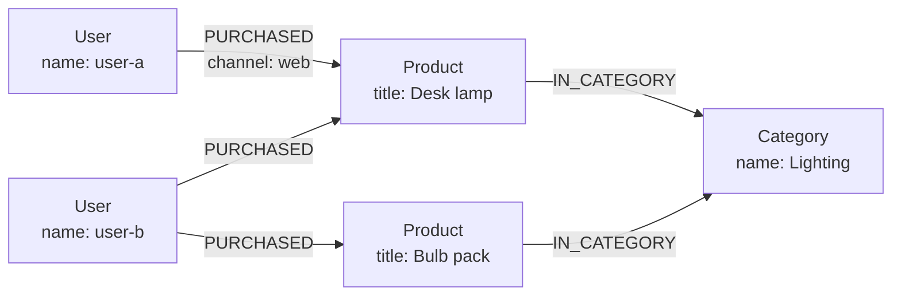

<div className="flex flex-wrap gap-2"><Badge color="purple" size="sm">Concept</Badge></div>

A graph database is a database that stores data as nodes (entities), edges
(relationships between entities), and properties (values on both), and answers queries
by following those relationships. Because connections are stored as data rather than
rebuilt from matching keys at query time, questions about how things relate, such as
who knows whom, what depends on what, or which accounts share a device, are direct to
express and typically efficient to run. Graph databases are used for recommendations,
fraud detection, knowledge graphs, access control, network topology, and retrieving
context for AI applications.

## How does a graph database work?

A graph database organizes data around three building blocks.

| Element | What it represents | Example |
| --- | --- | --- |
| Node | An entity | A user, a product, a support ticket |
| Edge | A named, usually directed relationship between two nodes | A user `PURCHASED` a product |
| Property | A key-value pair stored on a node or an edge | `name` on a user, `channel` on a purchase |

Many graph databases also give every node and edge a label, or type, such as `User` or
`PURCHASED`. Labels group similar elements and scope queries and indexes.



A query usually starts from one or more nodes, often found through an index on a
property, and then walks edges to reach related nodes. "Products bought by people who
bought this lamp" is a walk from the lamp to its buyers, then from each buyer to their
other purchases.

### Following relationships instead of joining tables

In a relational database, a relationship is typically stored as a foreign key and
rebuilt at query time with a join, which looks up matching keys in an index or scans a
table. Many graph databases instead store each node's relationships with the node, or in
an adjacency structure keyed by node, so moving from a node to its neighbors is a direct
lookup. This idea is often called index-free adjacency.

As a result, the cost of a traversal tends to grow with the number of relationships
the query touches rather than with the total size of the data, which keeps multi-hop
questions such as friends of friends practical at query time. Implementations differ,
and some systems use indexes internally, but the principle holds: relationships are
stored, not computed.

## What query languages do graph databases use?

Graph query languages describe patterns of connected nodes and edges rather than tables
and joins.

| Language | Style | Data model |
| --- | --- | --- |
| GQL (ISO/IEC 39075) | Declarative pattern matching; the ISO standard graph query language | Property graph |
| openCypher | Declarative pattern matching with ASCII-art patterns | Property graph |
| Gremlin | Step-by-step traversal written as a chain of operations | Property graph |
| SPARQL | Declarative matching of triple patterns; a W3C standard | RDF |

In the declarative style, a query reads like a sketch of the graph. This pattern finds
other products bought by buyers of the desk lamp:

```text
MATCH (lamp:Product {title: "Desk lamp"})<-[:PURCHASED]-(buyer:User)-[:PURCHASED]->(other:Product)
RETURN DISTINCT other.title
```

Some databases skip a text language and expose typed APIs or SDK builders instead, so
queries are assembled and type-checked in application code.

## When should you use a graph database?

A graph database fits when relationships are the point of the question: queries follow
connections across several hops, the shape of those connections varies, or the
relationships carry their own data. Common graph database use cases:

| Use case | What the graph holds | Typical question |
| --- | --- | --- |
| Recommendations | Users, items, and interactions | What did similar users engage with next? |
| Fraud rings | Accounts, devices, cards, and addresses | Which accounts share a device or payment method with a flagged account? |
| Knowledge graphs | Entities and typed facts about them | What do we know about this product, and where did each fact come from? |
| Identity and access | Users, groups, roles, and resources | Can this user read this document through any group membership? |
| Network and IT topology | Services, hosts, links, and dependencies | What fails downstream if this service goes down? |
| AI context and agent memory | Documents, chunks, entities, conversations, and memories | What does the agent know about this customer, and from which source? |

## Graph databases for AI and RAG

Retrieval-augmented generation (RAG) gives a language model relevant context before it
answers. Vector search finds passages whose meaning is close to the question, but it
returns isolated chunks. It does not know that a ticket belongs to a customer, that one
document supersedes another, or that a user may only see certain folders.

A graph adds that structure. An application can find entry points with vector or keyword
search, follow edges to related entities, source documents, and newer versions, and
limit everything to what the requesting user is allowed to see. The same pattern
underpins agent memory, where facts, their sources, and how they change over time are
stored as connected records. See [What is GraphRAG?](/learn/ai-memory/what-is-graphrag)
and [What is AI agent memory?](/learn/ai-memory/what-is-ai-agent-memory).

## When is a graph database not the right tool?

A graph database is not a general replacement for other databases. Consider another
option when:

- **The workload is mostly aggregation and reporting.** Sums, group-bys, and scans over
  every row of a large table are the strength of relational and columnar analytics
  systems.
- **Relationships are shallow and fixed.** If queries go one join deep and the schema
  rarely changes, a relational database handles them well with mature tooling.
- **Access is simple key-value lookup.** Fetching a record by its ID does not need
  traversal.
- **Your tooling depends on SQL.** Existing BI tools and SQL skills can outweigh the
  modeling benefits.

For a side-by-side comparison, see
[Graph database vs relational database](/learn/graph-databases/graph-vs-relational-database).

## How do you choose a graph database?

Graph databases, including open-source ones, differ in ways that matter early:

- **Data model:** a labeled property graph or RDF triples. See
  [What is a property graph?](/learn/graph-databases/what-is-a-property-graph).
- **Query interface:** a text language such as GQL, openCypher, Gremlin, or SPARQL, or
  typed APIs in your application language.
- **Transactions:** whether reads and writes are ACID and at which isolation level.
- **Search:** whether vector and full-text search live in the same system and
  transaction, or in separate stores you keep in sync.
- **Storage architecture:** whether data must fit on one machine, or storage scales
  separately from compute.
- **License and deployment:** open source or proprietary, managed or self-hosted, server
  or embedded.

## How HelixDB works as a graph database

HelixDB is an open-source (Apache 2.0) graph database with native vector search and BM25
full-text search, built on object storage. Its data model is one labeled property graph:
nodes are entities, directed edges are relationships, and each has exactly one label and
typed properties.

- **Typed SDK builders instead of a text query language.** Queries are built with typed
  SDKs in Rust, TypeScript, Go, and Python, or written as raw JSON. Each produces a JSON
  operation tree sent to `POST /v2/query`, with no query deployment step.
- **Graph operations.** Traversals over outgoing, incoming, or both directions, bounded
  repeats, branches, shortest path, projections, and aggregates.
- **Search on the same data.** Vector and text indexes are access paths over properties
  on nodes or edges, so graph traversals, vector search, and BM25 search run in the same
  ACID transaction.
- **Object storage as the source of truth.** NVMe/SSD and memory act as caches, so
  storage scales independently of compute.

HelixDB runs as a managed service (Helix Cloud), as a local server in a Docker
container, or embedded in-process. Read the
[introduction](/database/helix-db/start-here/introduction), the
[data model](/database/helix-db/core-concepts/data-model), and
[traversals](/database/helix-db/query-guides/traversals) to go further, or see
[why graph, vector, and text belong in one database](/learn/database-architecture/one-database-for-graph-vector-and-text).

## Frequently asked questions

### What is the difference between a graph database and a relational database?

A relational database stores rows in tables and joins them on keys at query time. A
graph database stores relationships as edges and follows them. Relational databases are
typically stronger for tabular records and reporting, and graph databases for questions
that span many connected hops. See
[Graph vs relational](/learn/graph-databases/graph-vs-relational-database).

### Is a knowledge graph the same as a graph database?

No. A knowledge graph is a body of data: entities and facts organized by a shared
schema. A graph database is software for storing and querying graph data. Knowledge
graphs are often stored in graph databases; see
[What is a knowledge graph?](/learn/graph-databases/what-is-a-knowledge-graph).

### Do graph databases use SQL?

Usually not as their primary language. Many use graph query languages such as GQL,
openCypher, Gremlin, or SPARQL, and some expose typed APIs instead. SQL also has a
standard extension for property graph queries, SQL/PGQ, which some relational systems
implement.

### Is there an open-source graph database?

Yes. Many graph databases are available under open-source licenses, with different data
models, query languages, and storage designs. HelixDB is open source under the Apache 2.0
license and includes vector and full-text search in the same database.

### Are graph databases good for AI applications?

They help when an AI application needs structure alongside semantic search: entity
relationships, provenance, versions, and permissions. Many AI systems combine a graph
with vector and full-text search to retrieve both similar content and the facts
connected to it. See [Hybrid search](/learn/full-text-search/hybrid-search).

## Related topics

<CardGroup cols={2}>
  <Card title="Graph vs relational databases" icon="table" href="/learn/graph-databases/graph-vs-relational-database">
    How multi-hop questions differ from joins, and when each model fits.
  </Card>
  <Card title="What is a property graph?" icon="tags" href="/learn/graph-databases/what-is-a-property-graph">
    Labels and properties on nodes and edges, compared with RDF.
  </Card>
  <Card title="What is a knowledge graph?" icon="brain" href="/learn/graph-databases/what-is-a-knowledge-graph">
    Entities, relationships, and provenance for search and LLMs.
  </Card>
  <Card title="What is GraphRAG?" icon="share-nodes" href="/learn/ai-memory/what-is-graphrag">
    Retrieval that follows relationships, compared with vector RAG.
  </Card>
  <Card title="HelixDB data model" icon="diagram-project" href="/database/helix-db/core-concepts/data-model">
    How HelixDB represents nodes, edges, properties, and indexes.
  </Card>
  <Card title="Traversals" icon="route" href="/database/helix-db/query-guides/traversals">
    Follow outgoing and incoming relationships in a HelixDB query.
  </Card>
</CardGroup>
