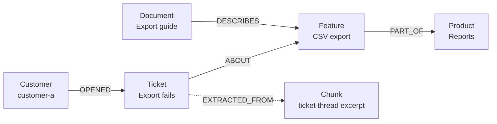

<Badge color="purple" size="sm">Concept</Badge>

A knowledge graph is a structured collection of facts about entities, such as people,
products, documents, and concepts, and the typed relationships between them, organized
by a shared schema often called an ontology. Each fact links two entities through a
named relationship and can record where it came from, so software can answer questions
by following connections and cite its sources. Knowledge graphs are commonly stored in
graph databases and are used to ground search, recommendations, and large language
model (LLM) applications in connected, verifiable facts.

## What is in a knowledge graph?

| Part | What it is | Example |
| --- | --- | --- |
| Entity | A distinct thing the graph knows about | A customer, a product, a feature, a support ticket |
| Relationship | A typed, directed connection between two entities | A ticket is `ABOUT` a feature |
| Attribute | A value that describes an entity or relationship | A product's `releaseStage`, a relationship's `confidence` |
| Ontology or schema | The allowed entity types, relationship types, and attributes | "A `Ticket` can be `ABOUT` a `Feature`, not a `Customer`" |
| Provenance | Where each fact came from and when | The document chunk a relationship was extracted from |

The ontology is what separates a knowledge graph from an arbitrary set of links. It
fixes what kinds of things exist and how they may relate, so facts from different
sources land in the same shape and queries mean the same thing everywhere.

## Knowledge graph vs graph database

A knowledge graph is data with agreed meaning. A graph database is software that stores
and queries graph-shaped data. The two are often used together but are not the same.

| | Knowledge graph | Graph database |
| --- | --- | --- |
| What it is | A body of facts organized by an ontology | A storage and query engine |
| Main concern | Meaning, consistency, and provenance of facts | Storage, indexing, transactions, and traversal |
| Can exist without the other? | Yes, for example as RDF files or relational tables | Yes, for example holding a network topology or social graph |

A knowledge graph can be stored as a property graph or as RDF triples. See
[What is a property graph?](/learn/graph-databases/what-is-a-property-graph) for how the
two models differ.

## How do you build a knowledge graph?

<Steps>
  <Step title="Define the ontology">
    List the entity types, relationship types, and required attributes your questions
    need. Start small; a focused schema is easier to extract into and to query.
  </Step>
  <Step title="Collect sources">
    Structured records such as account and product tables map to entities almost
    directly. Unstructured sources such as documents, tickets, and conversations need
    extraction.
  </Step>
  <Step title="Extract entities and relationships">
    For unstructured text, the application runs an extraction pipeline: split each
    document into chunks, ask an LLM or another extraction model to return the entities
    and relationships it finds in a fixed format that matches the ontology, and reject
    output that does not validate against the schema.
  </Step>
  <Step title="Resolve entities">
    Decide when two mentions refer to the same thing. One ticket says "the billing
    page" and another says "the invoices screen"; both may mean one feature. Typical
    techniques combine exact identifiers, normalized names, embedding similarity to find
    candidates, and rules or review to confirm a merge.
  </Step>
  <Step title="Record provenance">
    Link each extracted fact to the chunk and document it came from, with the extraction
    time and a confidence value. Provenance supports citations, audits, and later
    corrections.
  </Step>
  <Step title="Load, index, and query">
    Write entities, relationships, and provenance together, and add indexes for the
    lookups and searches your application runs.
  </Step>
</Steps>

## How do you keep a knowledge graph fresh?

Sources change, so a knowledge graph needs a maintenance loop, not a one-time load.

- **Ingest incrementally.** Track which facts came from which source, and re-extract
  only the documents that changed.
- **Supersede rather than overwrite.** Mark outdated facts with validity fields such as
  `validTo` or `isLatest`, and link a new version to the one it replaces, so history
  stays queryable.
- **Retract by source.** When a document is deleted or corrected, provenance tells you
  exactly which facts to remove or re-check.
- **Re-run entity resolution.** New mentions can reveal that two existing entities are
  the same, or that one entity should be split.

## Knowledge graphs for LLMs and RAG

Retrieval-augmented generation (RAG) supplies an LLM with context before it answers.
Retrieval based only on vector similarity returns passages that resemble the question,
which works for lookups but struggles with questions such as "which customers reported
problems with features in the Reports product?" The answer is spread across entities
and relationships, not contained in one passage.

A knowledge graph gives retrieval that structure. A typical flow:

1. Find entry points with vector or keyword search over entity names and chunks.
2. Expand through relationships to the connected entities the question needs.
3. Restrict the results to what the requesting user may see.
4. Assemble context from the facts and their provenance, so the answer can cite sources.

This combination is often called GraphRAG; see
[What is GraphRAG?](/learn/ai-memory/what-is-graphrag). LLM-extracted facts can be
wrong, so keep confidence values and provenance, and let downstream prompts treat
low-confidence facts accordingly.

## How HelixDB stores a knowledge graph

HelixDB stores data as one labeled property graph, which maps directly onto a knowledge
graph:

- **Entities and relationships.** Entities are nodes and relationships are directed
  edges, each with exactly one label and typed properties. Because HelixDB is a
  multigraph, two sources asserting the same relationship can be kept as separate edges
  with their own properties.
- **Embeddings and text on the same nodes.** Store an embedding and a text field on an
  entity or chunk node, then add a
  [vector index](/database/helix-db/query-guides/vector-indexes) and a
  [text index](/database/helix-db/query-guides/text-indexes) for similarity and BM25
  search. The application computes the embeddings; HelixDB stores and indexes them.
- **Provenance edges.** Connect facts and entities to their source chunks and documents
  with edges that carry properties such as confidence or extraction time. Indexes can
  target edge properties as well as node properties.
- **Identity and freshness.** Unique equality indexes on node labels suit canonical
  identifiers, and equality or range indexes on fields such as `isLatest` or `validTo`
  keep lookups scoped to current facts.
- **Scoped retrieval.** Vector and BM25 search can be
  [prefiltered](/database/helix-db/query-guides/prefiltering) to a traversal-defined
  candidate set, such as documents a user can read.

All entries in a write batch commit or roll back together, so an entity, its
relationships, and their provenance are written as one unit. Start with the
[data model](/database/helix-db/core-concepts/data-model).

## Frequently asked questions

### What is the difference between a knowledge graph and an ontology?

The ontology is the schema: the types of entities and relationships and the rules that
govern them. The knowledge graph is the data that follows that schema. One ontology can
describe many knowledge graphs.

### Do you need RDF to build a knowledge graph?

No. RDF is one standard way to represent a knowledge graph, and it suits publishing and
integrating data across organizations. A labeled property graph works as well and is
common for application-facing knowledge graphs.

### Can an LLM build a knowledge graph automatically?

An LLM can extract candidate entities and relationships from text at scale, but the
output needs validation against the ontology, entity resolution, and provenance. Treat
extraction as one stage of a pipeline the application controls.

### How is a knowledge graph different from a vector database?

A vector database retrieves items by similarity of embeddings. A knowledge graph
represents explicit, typed facts and how they connect. Many AI applications use both:
vectors to find relevant starting points, and the graph to follow facts from there. See
[What is a vector database?](/learn/vector-search/what-is-a-vector-database).

## Related topics

<CardGroup cols={2}>
  <Card title="What is a graph database?" icon="diagram-project" href="/learn/graph-databases/what-is-a-graph-database">
    Nodes, edges, traversals, and when a graph is the right model.
  </Card>
  <Card title="What is GraphRAG?" icon="share-nodes" href="/learn/ai-memory/what-is-graphrag">
    Retrieval that follows relationships, compared with vector RAG.
  </Card>
  <Card title="What is AI agent memory?" icon="memory" href="/learn/ai-memory/what-is-ai-agent-memory">
    Working, episodic, and semantic memory for LLM agents.
  </Card>
  <Card title="Prefiltering in HelixDB" icon="filter" href="/database/helix-db/query-guides/prefiltering">
    Run vector and BM25 search inside a traversal-defined candidate set.
  </Card>
</CardGroup>
