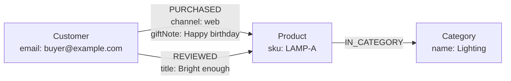

<div className="flex flex-wrap gap-2"><Badge color="purple" size="sm">Concept</Badge></div>

A property graph, often called a labeled property graph (LPG), is a graph data model in
which data is stored as nodes and edges, where each node and edge has a label that names
its type and a set of key-value properties that hold its data. Edges typically connect
one source node to one target node in a fixed direction and carry their own properties,
so a relationship such as "purchased, through the web store, with a gift note" is a
single record. The property graph model is used by many graph databases and by the GQL
and openCypher query languages.

## What are the parts of a property graph?

| Part | What it is | Example |
| --- | --- | --- |
| Node | An entity | A customer, an order, a product |
| Label | The type of a node or edge | `Customer`, `PURCHASED` |
| Property | A named, typed value on a node or edge | `email` on a customer, `channel` on a purchase |
| Edge | A directed relationship from a source node to a target node | Customer `PURCHASED` product |
| Edge property | Data that belongs to the relationship itself | `channel`, `giftNote`, `purchasedAt` |
| Identity | An identifier for each node and edge, typically assigned by the database | Used to address an element directly |



Label rules vary by system. Depending on the database, a node may have zero, one, or
several labels, while an edge usually has exactly one type. Edges are usually directed;
some models, including GQL, also allow undirected edges. Direction records meaning, not
reachability: a query can typically follow an edge forward or backward.

## What is a multigraph?

A multigraph allows more than one edge between the same pair of nodes. Property graphs
are typically multigraphs, which matters because many real relationships repeat. A
customer who buys the same product twice has two `PURCHASED` edges, each with its own
date and channel, rather than one edge that has to summarize both.

Many property graph systems also allow self-loops, edges whose source and target are the
same node, for relationships such as a function that calls itself in a code graph or a
web page that links to itself.

## How do you model data as a property graph?

A few rules of thumb cover most designs:

- **Nouns become nodes.** Customers, products, documents, and tickets.
- **Verbs become edges.** `PURCHASED`, `AUTHORED`, `REPORTED`, `MEMBER_OF`.
- **Facts about a relationship go on the edge.** When it happened, through which
  channel, with what confidence.
- **Promote a relationship to a node when it needs its own relationships.** An order
  that has line items, a payment, and a shipment is better as an `Order` node than as a
  single edge between customer and product.
- **Promote a property to a node when you traverse through it.** If you often ask
  "what else is in this category?", make `Category` a node rather than a string
  property.

## Property graph vs RDF

RDF (Resource Description Framework) is the other widely used graph model. It
represents everything as triples of subject, predicate, and object, and identifies
resources with IRIs, globally unique identifiers written as web-style addresses.

| | Labeled property graph | RDF |
| --- | --- | --- |
| Basic unit | Nodes and edges, each with properties | Triples: subject, predicate, object |
| Identity | Typically IDs assigned by the database | IRIs that are globally unique |
| Types | Labels on nodes and edges | `rdf:type` statements that point to classes |
| Attributes | Key-value properties on nodes and edges | More triples whose object is a literal value |
| Data about a relationship | Edge properties, built in | An intermediate node, reification, or an extension such as RDF-star |
| Repeated relationships | Separate edges between the same nodes | A graph is a set of triples, so each distinct triple appears once |
| Schema | Often optional or system-specific | RDFS and OWL vocabularies, with SHACL for validation |
| Query language | GQL, openCypher, Gremlin | SPARQL |
| Standards body | ISO for GQL | W3C |

Here is one purchase with data on the relationship, first as a property graph:

```text
(:Customer {email: "buyer@example.com"})
  -[:PURCHASED {channel: "web", giftNote: "Happy birthday"}]->
(:Product {sku: "LAMP-A"})
```

and then in RDF, using Turtle syntax with prefix declarations omitted, where the
purchase becomes its own resource so it can hold the channel and note:

```text
ex:customerA  a  ex:Customer ;
    ex:email  "buyer@example.com" .

ex:productA  a  ex:Product ;
    ex:sku  "LAMP-A" .

ex:purchaseA  a  ex:Purchase ;
    ex:buyer     ex:customerA ;
    ex:item      ex:productA ;
    ex:channel   "web" ;
    ex:giftNote  "Happy birthday" .
```

Neither form is wrong. The property graph keeps the relationship compact and makes
traversal the natural operation. RDF makes every statement addressable with global
identifiers, which pays off when data from many sources must merge cleanly.

## When should you use a property graph or RDF?

A labeled property graph usually fits when:

- The graph backs an application, and developers query it directly.
- Relationships carry data, repeat, or change often.
- Queries are traversal-heavy: paths, neighborhoods, and multi-hop filters.

RDF usually fits when:

- You publish or consume linked data that other organizations will reference.
- Data from many independent sources must merge on shared global identifiers.
- You rely on standard vocabularies, formal ontologies, or OWL-based inference.

The models can be converted. Mapping RDF to a property graph typically turns resources
into nodes, literal-valued predicates into properties, and resource-valued predicates
into edges, with conventions for anything that does not map one-to-one.

## How HelixDB implements the property graph model

HelixDB stores all data as one labeled property graph:

- **Exactly one label** on every node and edge. Model a secondary role as a property or
  as a relationship to another node rather than as an extra label.
- **Typed properties** on nodes and edges: null, boolean, integer, float, date-time,
  string, bytes, arrays, and nested objects.
- **Directed edges in a multigraph.** Several edges can connect the same pair of nodes,
  and an edge can connect a node to itself.
- **Separate ID spaces.** Node and edge IDs come from separate 64-bit sequences, so an ID
  is unique only within its own space.
- **Indexable top-level properties.** Only top-level properties can be indexed, so keep
  a field you filter or search on at the top level.
- **Indexes on nodes or edges.** Secondary indexes for equality, unique equality (node
  labels only), and range lookups; BM25 text indexes; and vector indexes can all target
  edge labels as well as node labels.

Queries are built with typed SDKs in Rust, TypeScript, Go, and Python. See the
[data model](/database/helix-db/core-concepts/data-model) and
[traversals](/database/helix-db/query-guides/traversals).

## Frequently asked questions

### What does "labeled" mean in labeled property graph?

It means every node and edge carries a label that names its type, such as `Customer` or
`PURCHASED`. Labels group elements so queries and indexes can target one kind of node or
relationship at a time.

### Can an edge have properties?

Yes. Edge properties are a defining feature of the property graph model. They hold data
that belongs to the relationship, such as when it started, its weight, or its source.

### Is a property graph the same as a knowledge graph?

No. A property graph is a data model; a knowledge graph is a body of facts organized by
an ontology. A knowledge graph can be stored as a property graph or as RDF. See
[What is a knowledge graph?](/learn/graph-databases/what-is-a-knowledge-graph).

### Which query languages work with property graphs?

GQL (ISO/IEC 39075) is the ISO standard. openCypher and Gremlin are widely used, and
SQL/PGQ adds property graph queries to SQL. Some databases, including HelixDB, use typed
SDK builders instead of a text language.

## Related topics

<CardGroup cols={2}>
  <Card title="What is a graph database?" icon="diagram-project" href="/learn/graph-databases/what-is-a-graph-database">
    Nodes, edges, traversals, and when a graph is the right model.
  </Card>
  <Card title="What is a knowledge graph?" icon="brain" href="/learn/graph-databases/what-is-a-knowledge-graph">
    Entities, relationships, and provenance for search and LLMs.
  </Card>
  <Card title="HelixDB data model" icon="book" href="/database/helix-db/core-concepts/data-model">
    Labels, properties, multigraph edges, and indexes in HelixDB.
  </Card>
  <Card title="Secondary indexes" icon="list" href="/database/helix-db/query-guides/secondary-indexes">
    Equality, unique, and range lookups on nodes and edges.
  </Card>
</CardGroup>
