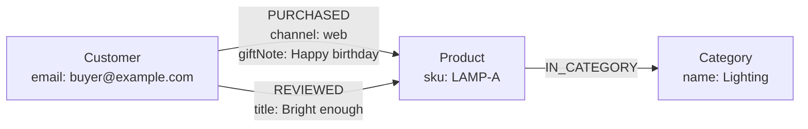

<Badge color="purple" size="sm">Concept</Badge>

A property graph, often called a labeled property graph (LPG), is a graph data model in
which data is stored as nodes and edges, where nodes and edges carry labels that name
their type and a set of key-value properties that hold their data. Edges typically
connect one source node to one target node in a fixed direction and carry their own
properties, so a relationship such as "purchased, through the web store, with a gift
note" is a single record. The property graph model is used by many graph databases and
by the GQL and openCypher query languages.

  <Card title="Learning objectives" icon="graduation-cap">
    After reading this article you will be able to:

    - Describe the parts of a property graph and how they fit together
    - Explain why property graphs typically allow repeated edges between the same nodes
    - Apply rules of thumb to decide what becomes a node, an edge, or a property
    - Describe how HelixDB implements the labeled property graph model
  </Card>

## What are the parts of a property graph?

A property graph is built from nodes and edges, plus the labels, properties, and
identifiers attached to each of them.

| Part | What it is | Example |
| --- | --- | --- |
| Node | An entity | A customer, an order, a product |
| Label | The type of a node or edge | `Customer`, `PURCHASED` |
| Property | A named, typed value on a node or edge | `email` on a customer, `channel` on a purchase |
| Edge | A directed relationship from a source node to a target node | Customer `PURCHASED` product |
| Edge property | Data that belongs to the relationship itself | `channel`, `giftNote`, `purchasedAt` |
| Identity | An identifier for each node and edge, typically assigned by the database | Used to address an element directly |

Labels and properties do different jobs. A label says what kind of thing an element is
and is shared by every element of that kind, while properties hold the values that make
one element different from another. Because properties live on the element itself, a
customer node carries its own email and a purchase edge carries its own channel, with no
separate attribute table. Identity is separate from both: two customers with the same
name are still two nodes with two IDs.

Label rules vary by system. Depending on the database, a node may have zero, one, or
several labels, while an edge usually has exactly one type. Edges are usually directed;
some models, including GQL, also allow undirected edges. Direction records meaning, not
reachability: a query can typically follow an edge forward or backward.

## Can a property graph have more than one edge between the same nodes?

Yes. Property graphs are typically multigraphs, which means they allow more than one
edge between the same pair of nodes. This matters because many real relationships
repeat. A customer who buys the same product twice has two `PURCHASED` edges, each with
its own date and channel, rather than one edge that has to summarize both.

Many property graph systems also allow self-loops, edges whose source and target are the
same node, for relationships such as a function that calls itself in a code graph or a
web page that links to itself.

## How do you model data as a property graph?

Model entities (nouns) as nodes, relationships (verbs) as edges, and facts about either
as properties, then check the model against the traversals the application needs. A few
rules of thumb cover most designs:

- **Nouns become nodes.** Customers, products, documents, and tickets.
- **Verbs become edges.** `PURCHASED`, `AUTHORED`, `REPORTED`, `MEMBER_OF`.
- **Facts about a relationship go on the edge.** When it happened, through which
  channel, with what confidence.
- **Promote a relationship to a node when it needs its own relationships.** An order
  that has line items, a payment, and a shipment is better as an `Order` node than as a
  single edge between customer and product.
- **Promote a property to a node when you traverse through it.** If you often ask
  "what else is in this category?", make `Category` a node rather than a string
  property.
- **Store references as edges, not as ID properties.** A `customerId` property on an
  order records the link, but a query has to look the ID up instead of following an
  edge.

Start from the questions the application will ask. Write down the traversals you expect,
such as "products bought by customers who reviewed this product", and check that each
step follows an edge rather than matching a string. A model that answers its main
questions with a few hops and a filter or two is usually a good one. When a query has
to join nodes by matching property values, such as comparing a `customerId` string, a
missing edge is often the cause; when it scans many nodes to filter on one property, an
index is usually the fix.

## How is a property graph different from RDF?

A property graph stores labeled nodes and edges that carry their own properties, while
RDF (Resource Description Framework), another widely used graph model, stores every fact
as a subject-predicate-object triple and identifies resources with IRIs, globally unique
web-style identifiers. Because a triple has no place for attributes of the relationship
itself, data about a relationship needs an intermediate node, reification, or an
extension such as RDF-star. A property graph usually fits application data with
traversal-heavy queries, while RDF fits linked data that must merge across sources on
shared identifiers. For a side-by-side comparison, one fact modeled both ways, and how
to map one model to the other, see
[property graph vs RDF](/learn/graph-databases/property-graph-vs-rdf).

## How does HelixDB implement the property graph model?

HelixDB stores all data as one labeled property graph:

- **Exactly one label** on every node and edge. Model a secondary role as a property or
  as a relationship to another node rather than as an extra label.
- **Typed properties** on nodes and edges: null, boolean, integer, float, date-time,
  string, bytes, arrays, and nested objects.
- **Directed edges in a multigraph.** Several edges can connect the same pair of nodes,
  and an edge can connect a node to itself.
- **Separate ID spaces.** Node and edge IDs come from separate 64-bit sequences, so an
  ID is unique only within its own space.
- **Indexable top-level properties.** Only top-level properties can be indexed, so keep
  a field you index at the top level rather than inside a nested object.
- **Indexes on nodes or edges.** Equality, range, BM25 text, and vector indexes can
  target edge labels as well as node labels; unique equality indexes are available on
  node labels only.

Queries are built with typed SDKs in Rust, TypeScript, Go, and Python, or written as raw
JSON, and are sent as a JSON operation tree to `POST /v2/query`. See the
[data model](/database/helix-db/core-concepts/data-model) and
[traversals](/database/helix-db/query-guides/traversals).

## Frequently asked questions

### What does "labeled" mean in labeled property graph?

It means nodes and edges carry labels that name their type, such as `Customer` or
`PURCHASED`. Labels are how elements are typed: they group elements so queries and
indexes can target one kind of node or relationship at a time. How many labels an
element can have varies by system.

### Can an edge have properties?

Yes. Edge properties are a defining feature of the property graph model. They hold data
that belongs to the relationship, such as when it started, its weight, or its source.

### Is a property graph the same as a knowledge graph?

No. A property graph is a data model; a knowledge graph is a body of facts about
entities and their relationships, typically organized by a schema or ontology. A
knowledge graph can be stored as a property graph or as RDF. See
[What is a knowledge graph?](/learn/graph-databases/what-is-a-knowledge-graph).

### Which query languages work with property graphs?

GQL (ISO/IEC 39075) is the standalone ISO property graph query language, and SQL/PGQ
(ISO/IEC 9075-16) is the ISO extension that adds property graph queries to SQL.
openCypher and Gremlin are also widely used. Some databases, including HelixDB, use
typed SDK builders instead of a text language.

## Related topics

<CardGroup cols={2}>
  <Card title="What is a graph database?" icon="diagram-project" href="/learn/graph-databases/what-is-a-graph-database">
    Nodes, edges, traversals, and when a graph is the right model.
  </Card>
  <Card title="Property graph vs RDF" icon="scale-balanced" href="/learn/graph-databases/property-graph-vs-rdf">
    Triples, IRIs, edge properties, and when each graph model fits.
  </Card>
  <Card title="What is a knowledge graph?" icon="brain" href="/learn/graph-databases/what-is-a-knowledge-graph">
    Entities, relationships, and provenance for search and LLMs.
  </Card>
  <Card title="Graph vs relational database" icon="table" href="/learn/graph-databases/graph-vs-relational-database">
    How graphs and tables store relationships, and when each fits.
  </Card>
  <Card title="HelixDB data model" icon="book" href="/database/helix-db/core-concepts/data-model">
    Labels, properties, multigraph edges, and indexes in HelixDB.
  </Card>
  <Card title="Secondary indexes" icon="list" href="/database/helix-db/query-guides/secondary-indexes">
    Equality and range lookups on nodes and edges, plus unique lookups on nodes.
  </Card>
</CardGroup>
