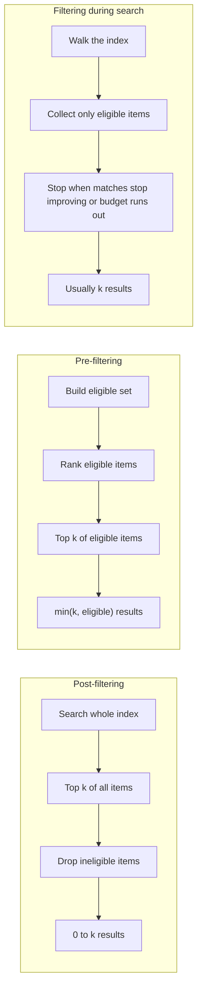

<Badge color="purple" size="sm">Concept</Badge>

Filtered vector search is nearest neighbor search restricted to the items that satisfy a
condition, such as a tenant ID, a date range, or "documents this user can read." The
correct answer is the `k` closest items among those that pass the filter. Systems apply
the filter after ranking (post-filtering), before ranking (pre-filtering), or during
search, and that choice decides whether a query returns the true top k, fewer than
k results, or nothing at all.

  <Card title="Learning objectives" icon="graduation-cap">
    After reading this article you will be able to:

    - Explain why ANN indexes make filtering hard and why selectivity matters
    - Compare post-filtering, pre-filtering, and filtering during search
    - Diagnose why a filtered vector search returns fewer than k results
    - Distinguish ranking approximation from membership errors in permission filters
  </Card>

## Why is filtering hard for vector indexes?

Filtering is hard because an approximate nearest neighbor (ANN) index is organized by
vector proximity, not by metadata, so eligible items are scattered through it and no
single structure both knows which items pass and ranks them by distance. A secondary
index can list every document in a tenant, but it cannot rank them by distance; a vector
index can rank by distance, but it does not know which items pass. Filtered search has
to combine the two.

The key quantity is **selectivity**: the fraction of the collection that passes the
filter. Naive approaches work when most items pass and break down when few do, which
is often the case for per-user permissions.

## What is post-filtering?

Post-filtering runs an ordinary top-k vector search over the whole index, then removes
results that fail the filter. It is simple and works with any vector store.

The flaw is that the filter runs after `k` is spent. Removed results are not replaced,
so a query that asks for 10 can return 3, or 0. If eligibility is unrelated to distance
from the query and the filter passes 2% of the collection, on average only 2% of the top
k survive. Requesting a much larger k, called overfetching, only partly helps, as the
worked example below shows.

## What is pre-filtering?

Pre-filtering first computes the set of eligible items, from a metadata index, an
access control list, or a graph traversal, and then ranks only that set. It returns k
results whenever at least k items qualify, and every result passes the filter.

The cost moves to the candidate set: small sets can be ranked exactly and cheaply,
while large sets typically need index-assisted ranking.

## What is filtering during search?

Filtering during search, sometimes called in-filtering, applies the filter while walking
the index. In a graph-based index such as [HNSW](/learn/vector-search/what-is-hnsw), the
search may pass through non-matching nodes to navigate but only collects matching ones,
and keeps searching until its list of best matches stops improving or it exhausts its
search budget.

This works well at moderate selectivity. When very few items pass, matching items can
be far apart in the graph, the search must visit many nodes, and recall can drop. Many
implementations detect highly selective filters and fall back to exact search over the
filtered set.

## How do post-filtering, pre-filtering, and filtering during search compare?

Post-filtering is simplest but can return fewer than k results, pre-filtering returns the
top k among eligible items at the cost of building the candidate set, and filtering
during search usually returns k but degrades on very selective filters.

| | Post-filtering | Pre-filtering | Filtering during search |
| --- | --- | --- | --- |
| Order | Rank, then filter | Filter, then rank | Filter while ranking |
| Results returned | 0 to k, often fewer than k | k, unless fewer items qualify | Usually k; can degrade on very selective filters |
| True top k among eligible items? | Only if enough survive, and up to ranking approximation | Yes, up to ranking approximation | Approximately |
| Weak spot | Selective filters | Very large candidate sets | Very selective filters |
| Filter expressiveness | Anything the application can check | Anything that produces a set | Usually per-item metadata |

## What happens when a user can read only 20 of 1,000 documents?

Post-filtering with k = 10 returns 0.2 readable documents on average and usually none,
while pre-filtering returns the 10 closest readable documents every time. In this
example, a knowledge base holds 1,000 documents, a user can read 20 of them, and the
application wants the 10 closest readable documents (k = 10).

**Post-filtering** retrieves the 10 nearest of all 1,000. If readable documents are no
more likely than others to be near the query, each result has a 2% chance of being
readable, so the query returns 0.2 readable documents on average, and most queries
return none. The user's relevant documents are outranked by documents they cannot
open.

**Pre-filtering** builds the set of 20 readable documents, ranks those 20, and returns
the closest 10. Every query returns 10 results, all readable, and they are the true top
10 among what the user can see.

| Approach | Search scope | Readable results returned |
| --- | --- | --- |
| Post-filter, k = 10 | All 1,000 | 0.2 on average |
| Post-filter, k = 100 | All 1,000 | 2 on average |
| Post-filter, k = 500 | All 1,000 | 10 on average, not guaranteed |
| Pre-filter, k = 10 | 20 readable | 10, every time |

To expect 10 survivors, post-filtering has to fetch half the collection.

## Why does my filtered vector search return fewer than k results?

The most common cause is a filter that runs after ranking and removes results that are
never replaced. The full list of causes:

1. **The filter runs after ranking.** Ineligible items consumed the top k. Filter
   before or during the search instead.
2. **Fewer than k items pass the filter.** Then fewer than k results is correct.
3. **Filtering during search ran out of budget.** On a very selective filter, raise
   the search budget or rank the filtered set exactly.
4. **A cap or threshold applied.** Many systems limit the maximum k or drop results
   below a similarity threshold.
5. **Some items have no vector yet.** Records that were never embedded, or not yet
   indexed, cannot be returned.

## Which errors can filtered vector search tolerate?

Filtered vector search can tolerate approximate ranking but not membership errors: a
slightly less relevant result is acceptable, a result that fails the filter is not.

- **Ranking approximation.** An ANN index can miss one of the true k nearest eligible
  items and return a slightly farther eligible item in its place. The cost is slightly
  lower relevance, measured as recall.
- **Membership error.** A result that fails the filter. For a permission filter, that
  is a data leak, and no rate of it is acceptable.

The rule is approximate ranking, exact membership.

## How does filtered vector search enforce permissions in RAG?

Filtered vector search enforces permissions by restricting retrieval to documents the
user can read, before ranking and before generation. In
[retrieval-augmented generation (RAG)](/learn/ai-memory/what-is-rag), anything the
retriever returns can end up in the model's answer, and a language model cannot be
relied on to withhold it.

- **Enforce permissions in the retrieval query**, not in prompt instructions.
- **Filter before ranking**, so authorized users still get complete results.
- **Evaluate permissions against current data.** Copying access lists into vector
  metadata creates a second copy that can lag behind revocations.
- **Keep permissions in their natural shape.** "User is a member of a group that can
  read a folder that contains a document" is a chain of relationships. Flattening it
  onto every vector means rewriting many vectors when one membership changes.

## How does HelixDB filter vector search?

HelixDB uses traversal-scoped prefiltering. A graph traversal defines an exact
candidate set, such as the documents reachable from a user through membership and
sharing edges, and vector search ranks only that set.

- Every prefiltered search runs in the same order: graph traversal, exact candidate
  membership, ranking, top k.
- A result outside the candidate set is never returned.
- Each request is one ACID transaction over a committed snapshot, and the graph
  traversal and the vector search run in that same transaction.
- BM25 full-text search supports the same prefiltering, with BM25 statistics taken from
  the full tenant partition.
- Vector and text indexes can be partitioned by tenant, with a separate index per tenant
  value.
- A search accepts up to 1,000,000 unique candidates and returns at most 800 results.

See [prefiltered search](/database/helix-db/query-guides/prefiltering) for working
queries, [vector indexes](/database/helix-db/query-guides/vector-indexes) for index
options, and [multi-tenancy](/database/helix-cloud/operate/multi-tenancy) for
tenant-partitioned indexes.

## Frequently asked questions

### Does filtering change recall?

It can. Recall for a filtered query is measured against the true top k among eligible
items, not among all items. Pre-filtering with exact ranking over the candidate set
finds that top k exactly, while filtering during search typically loses recall as
filters become more selective, so recall measured on unfiltered queries can overstate
filtered quality.

### Is pre-filtering slower than post-filtering?

Not necessarily. Ranking a small eligible set exactly can be cheaper than searching a
full index. Cost depends mostly on the size of the candidate set and how it is
computed.

### Should I use a separate index per tenant?

Often, yes, for the tenant boundary: partitioning enforces it structurally because a
search only reads that tenant's partition. It does not handle finer rules inside a
tenant, such as per-user sharing, which still need a filter or a traversal.

### What is the difference between a metadata filter and a traversal filter?

A metadata filter tests fields stored on each item, such as `tenant = "tenant-42"`. A
traversal filter defines eligibility through relationships, such as documents in
folders shared with the user's groups. Traversal filters express multi-hop access rules
without copying them onto every vector.

## Related topics

<CardGroup cols={2}>
  <Card title="What is vector search?" icon="magnifying-glass" href="/learn/vector-search/what-is-vector-search">
    Embeddings, ANN indexes, recall, and top-k.
  </Card>
  <Card title="What is HNSW?" icon="diagram-project" href="/learn/vector-search/what-is-hnsw">
    How a layered graph index finds approximate nearest neighbors.
  </Card>
  <Card title="What is retrieval-augmented generation (RAG)?" icon="book-open" href="/learn/ai-memory/what-is-rag">
    Ground model answers in retrieved, permission-checked data.
  </Card>
  <Card title="What is hybrid search?" icon="layer-group" href="/learn/full-text-search/hybrid-search">
    Combine filtered vector and keyword results.
  </Card>
  <Card title="Prefiltered search guide" icon="filter" href="/database/helix-db/query-guides/prefiltering">
    Run traversal-scoped vector and BM25 search in HelixDB.
  </Card>
  <Card title="Traversals" icon="route" href="/database/helix-db/query-guides/traversals">
    Build candidate sets by following relationships.
  </Card>
</CardGroup>
