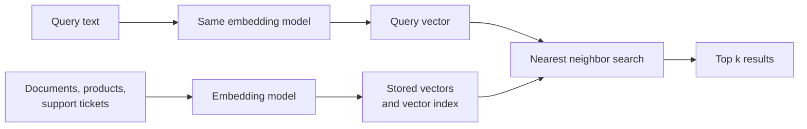

<Badge color="purple" size="sm">Concept</Badge>

Vector search is a retrieval method that represents items and queries as embeddings,
arrays of numbers produced by a machine learning model, and returns the items whose
embeddings are closest to the query's embedding. Because an embedding model places
inputs with similar meaning near each other, a query for "login failure" can find a
support ticket titled "can't sign in to my account" even though the two share no
words, which is why vector search is often called semantic search. Large collections
are usually searched with an approximate nearest neighbor index, which gives up a small
amount of accuracy in exchange for much lower latency.

  <Card title="Learning objectives" icon="graduation-cap">
    After reading this article you will be able to:

    - Explain how vector search matches by meaning using embeddings
    - Describe the indexing and query paths of a vector search system
    - Compare exact and approximate nearest neighbor search, including recall and top-k
    - Recognize when vector search fails and when to add keyword search or filters
  </Card>

## How does vector search work?

A vector search system has an indexing path and a query path, and both must produce
vectors in the same embedding space, which usually means the same embedding model.

1. **Embed the collection.** Each item, or each chunk of a long document, passes
   through an embedding model that typically outputs one vector.
2. **Store and index the vectors.** Each vector is saved with an ID and usually some
   metadata, then organized into an index built for nearest neighbor search.
3. **Embed the query** into the same embedding space, usually with the same model.
4. **Find the nearest neighbors.** The system compares the query vector with stored
   vectors using a distance metric and returns the `k` closest, called the top k.
5. **Use the results.** The application displays them, reranks them, or passes them
   to a language model as context in
   [retrieval-augmented generation (RAG)](/learn/ai-memory/what-is-rag).

## What role do embeddings play in vector search?

Embeddings are what vector search compares: each item and each query becomes a
fixed-length list of numbers, and items with similar meaning end up close together.
Vector search only works when stored vectors and query vectors come from the same
embedding space, normally the same model or a query and document encoder pair trained
together. Vectors from unrelated models, or from two versions of one model, are not
comparable. How models produce embeddings, how dimensions and chunking affect them,
and what changing models involves are covered in
[What are vector embeddings?](/learn/vector-search/what-are-vector-embeddings)

Closeness is computed with a distance or similarity function such as cosine
similarity, Euclidean distance, dot product, or Manhattan distance. The right choice is
usually the one the embedding model was trained with; see
[vector distance metrics](/learn/vector-search/vector-distance-metrics).

## What is the difference between exact and approximate nearest neighbor search?

Exact search always returns the true top k, while approximate nearest neighbor (ANN)
search uses an index to compare the query with only a small, promising fraction of the
vectors, which is much faster at scale but can miss a true neighbor. Both address the
k-nearest neighbor (kNN) problem: find the `k` stored vectors closest to the query.

The simplest exact method, brute-force or flat search, compares the query with every
stored vector, so its cost grows linearly with the collection. Exact tree indexes such
as k-d trees can skip work in low dimensions but approach a full scan at embedding
dimensions.

| | Exact (brute-force / flat) | Approximate (ANN) |
| --- | --- | --- |
| Work per query | Compares every vector | Compares a small fraction |
| Result quality | Always the true top k | Usually most of the true top k |
| Index | Not required | Built and maintained alongside the data |
| Typical fit | Small collections, small filtered subsets | Large collections |

ANN indexes differ in how they pick that fraction. Graph-based indexes such as HNSW
link each vector to some of its near neighbors and walk that graph toward the query,
while IVF (inverted file) indexes cluster the vectors and scan only the clusters
closest to the query. [What is HNSW?](/learn/vector-search/what-is-hnsw) explains how
these indexes are built, searched, and tuned.

## What do recall, latency, and top-k mean in vector search?

**Recall** measures how closely an ANN search matches exact search. Recall@k is the
fraction of the true k nearest neighbors, as found by exact search, that the ANN search
returned. A recall of 0.9 at k = 10 means that, on average, nine of the ten true
nearest neighbors were found.

Most ANN indexes expose a setting that trades recall for **latency**: search more of
the index and you find more true neighbors, but each query takes longer.

**Top-k** is how many results a query asks for. In RAG, k is usually bounded by how
much context the language model can use, and many pipelines retrieve a larger k and
rerank it down to a smaller set.

Recall is measured against exact search over the same vectors, not against what a
user considers relevant. A search with perfect recall can still return poor results if
the embedding model or the chunking does not capture what the user meant.

## When does vector search fail?

Vector search is good at paraphrase and fuzzy meaning. It is weak where exact
characters or the structure of the data matter:

- **Exact identifiers.** Order numbers, SKUs, error codes, and email addresses carry
  little semantic meaning, so a query for one ID can rank a different, similar-looking
  ID first.
- **Names and rare tokens.** New product names, internal jargon, and uncommon surnames
  may be poorly represented in the model's training data.
- **Hard constraints.** Dates, prices, ownership, and permissions are conditions to
  enforce, not similarities to score. "Tickets from last week" is a filter.
- **Relationships.** "Documents written by people on my team" depends on who is
  connected to whom, which a text embedding of the document does not encode.

Keyword search with [BM25](/learn/full-text-search/what-is-bm25) handles exact terms
and rare tokens well, and many systems combine the two in
[hybrid search](/learn/full-text-search/hybrid-search). Hard constraints belong in a
filter that runs before or during ranking, as described in
[filtered vector search](/learn/vector-search/filtered-vector-search).

## How does HelixDB do vector search?

The application computes embeddings; HelixDB stores them as properties on nodes or
edges, and a vector index you define over that property enables approximate nearest
neighbor search.

- A vector index covers one label and one top-level property, with a fixed dimension
  and one distance metric: cosine, Euclidean, or Manhattan.
- Search uses approximate nearest neighbor search, and the documentation states over
  90% recall.
- Search can run inside an exact candidate set defined by a graph traversal, such as
  the documents a user can read.
- Within one request, graph traversals, vector search, and text search run in the same
  ACID transaction over a committed snapshot. HelixDB has no built-in rank fusion, so
  the application combines vector and BM25 results.

See [vector indexes](/database/helix-db/query-guides/vector-indexes) and
[prefiltered search](/database/helix-db/query-guides/prefiltering) for working queries.

## Frequently asked questions

### Is vector search the same as semantic search?

Mostly. Semantic search names the goal, finding results by meaning, and vector search
over embeddings is the most common way to implement it.

### Do I need an index to run vector search?

Not for small collections. Comparing a query exhaustively against a few thousand
vectors is usually fast enough. An ANN index becomes worthwhile when exhaustive search
no longer fits your latency budget.

### Does vector search work for images or audio?

Yes, given an embedding model for that kind of data. Image and audio models produce
vectors that are searched the same way as text vectors. Multimodal models map
different kinds of input into one embedding space, so a text query can retrieve
images.

### How do you evaluate vector search quality?

Beyond recall@k, build a labeled set of real queries with known good answers and score
results with a relevance metric such as precision@k or nDCG. Relevance scores expose
problems in the embedding model, chunking, or filters that recall cannot see.

## Related topics

<CardGroup cols={2}>
  <Card title="What are vector embeddings?" icon="cube" href="/learn/vector-search/what-are-vector-embeddings">
    How models turn inputs into vectors, and how dimensions and chunking work.
  </Card>
  <Card title="What is HNSW?" icon="diagram-project" href="/learn/vector-search/what-is-hnsw">
    How HNSW and IVF indexes find approximate nearest neighbors.
  </Card>
  <Card title="What is a vector database?" icon="database" href="/learn/vector-search/what-is-a-vector-database">
    What a vector database stores and when you need one.
  </Card>
  <Card title="What is filtered vector search?" icon="filter" href="/learn/vector-search/filtered-vector-search">
    Restrict results by metadata, permissions, or graph membership.
  </Card>
  <Card title="What is the difference between cosine, Euclidean, and Manhattan distance?" icon="ruler" href="/learn/vector-search/vector-distance-metrics">
    Cosine, Euclidean, Manhattan, and dot product compared.
  </Card>
  <Card title="What is hybrid search?" icon="layer-group" href="/learn/full-text-search/hybrid-search">
    Combine vector search with keyword search.
  </Card>
  <Card title="What is retrieval-augmented generation (RAG)?" icon="book-open" href="/learn/ai-memory/what-is-rag">
    Ground a language model's answers in retrieved data.
  </Card>
  <Card title="Vector indexes" icon="vector-square" href="/database/helix-db/query-guides/vector-indexes">
    Create a vector index and run nearest neighbor search in HelixDB.
  </Card>
</CardGroup>
