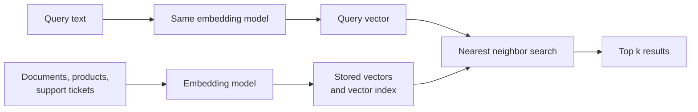

<Badge color="purple" size="sm">Concept</Badge>

Vector search is a retrieval method that represents items and queries as embeddings,
arrays of numbers produced by a machine learning model, and returns the items whose
embeddings are closest to the query's embedding. Because an embedding model places
inputs with similar meaning near each other, a query for "login failure" can find a
support ticket titled "can't sign in to my account" even though the two share no
words, which is why vector search is often called semantic search. Large collections
are usually searched with an approximate nearest neighbor index, which gives up a small
amount of accuracy in exchange for much lower latency.

## How does semantic search work?

A vector search system has an indexing path and a query path, and both must use the
same embedding model.

1. **Embed the collection.** Each item, or each chunk of a long document, passes
   through an embedding model that outputs one vector.
2. **Store and index the vectors.** Each vector is saved with an ID and usually some
   metadata, then organized into an index built for nearest neighbor search.
3. **Embed the query** with the same model.
4. **Find the nearest neighbors.** The system compares the query vector with stored
   vectors using a distance metric and returns the `k` closest, called the top k.
5. **Use the results.** The application displays them, reranks them, or passes them
   to a language model as context in retrieval-augmented generation (RAG).

## What are embeddings?

An embedding is a fixed-length list of floating-point numbers that encodes an input as
a point in a high-dimensional space. Text embedding models typically produce vectors
with hundreds to a few thousand dimensions. Individual dimensions rarely mean anything
on their own; what matters is how close vectors are.

A few properties shape every vector search design:

- **Embeddings are model-specific.** Vectors from two different models, or from two
  versions of one model, are not comparable. Changing models means re-embedding the
  collection.
- **The dimension is fixed.** Every vector from a given model has the same length, and
  an index is typically built for exactly one length.
- **Many input types can be embedded.** Text, images, audio, and code all have
  embedding models.
- **Long inputs are usually chunked.** One vector can only summarize so much, so long
  documents are split into passages and each passage is embedded separately.

Closeness is computed with a distance or similarity function such as cosine
similarity, Euclidean distance, dot product, or Manhattan distance. The right choice is
usually the one the embedding model was trained with; see
[vector distance metrics](/learn/vector-search/vector-distance-metrics).

## Exact vs approximate nearest neighbor search

Exact nearest neighbor search, also called k-nearest neighbor (kNN) or brute-force
search, compares the query with every stored vector, so it always returns the true top
k at a cost that grows linearly with the collection. Approximate nearest neighbor (ANN)
search uses an index to examine a small, promising fraction of the vectors: much faster
at scale, but it can occasionally miss a true neighbor.

| | Exact (kNN) | Approximate (ANN) |
| --- | --- | --- |
| Work per query | Compares every vector | Compares a small fraction |
| Result quality | Always the true top k | Usually most of the true top k |
| Index | Not required | Built and maintained alongside the data |
| Typical fit | Small collections, small filtered subsets | Large collections |

## How do HNSW and IVF indexes work?

**HNSW** (Hierarchical Navigable Small World) is a graph-based ANN index. Each vector
becomes a node linked to some of its near neighbors, and nodes are arranged in layers:
upper layers are sparse and hold long-range links, while the bottom layer holds every
vector. A search enters at the top layer, greedily moves to neighbors closer to the
query, and descends layer by layer. A query-time parameter, often called `ef`, sets how
many candidates the search keeps in play; a larger value explores more of the graph,
raising both recall and latency.

**IVF** (inverted file) indexes partition the collection instead. A clustering step,
usually k-means, chooses a set of centroids, and each vector is filed under its nearest
centroid. A query is compared with the centroids first, and only the lists belonging
to the closest few, a number often called `nprobe`, are scanned. IVF is often paired
with quantization, which compresses vectors to save memory at some cost in precision.

## Recall, latency, and top-k

**Recall** measures how closely an ANN search matches exact search. Recall@k is the
fraction of the true k nearest neighbors, as found by exact search, that the ANN search
returned. A recall of 0.9 at k = 10 means that, on average, nine of the ten true
nearest neighbors were found.

Most ANN indexes expose a setting that trades recall for **latency**: search more of
the index and you find more true neighbors, but each query takes longer.

**Top-k** is how many results a query asks for. In RAG, k is usually bounded by how
much context the language model can use, and many pipelines retrieve a larger k and
rerank it down to a smaller set.

Recall is measured against exact search over the same vectors, not against what a
user considers relevant. A search with perfect recall can still return poor results if
the embedding model or the chunking does not capture what the user meant.

## When does vector search fail?

Vector search is good at paraphrase and fuzzy meaning. It is weak where exact
characters or the structure of the data matter:

- **Exact identifiers.** Order numbers, SKUs, error codes, and email addresses carry
  little semantic meaning, so a query for one ID can rank a different, similar-looking
  ID first.
- **Names and rare tokens.** New product names, internal jargon, and uncommon surnames
  may be poorly represented in the model's training data.
- **Hard constraints.** Dates, prices, ownership, and permissions are conditions to
  enforce, not similarities to score. "Tickets from last week" is a filter.
- **Relationships.** "Documents written by people on my team" depends on who is
  connected to whom, which an embedding does not encode.

Keyword search with [BM25](/learn/full-text-search/what-is-bm25) handles exact terms
and rare tokens well, and many systems combine the two in
[hybrid search](/learn/full-text-search/hybrid-search). Hard constraints belong in a
filter that runs before or during ranking, as described in
[filtered vector search](/learn/vector-search/filtered-vector-search).

## How HelixDB does vector search

HelixDB is an open-source graph database with native vector search and BM25 full-text
search. The application computes embeddings; HelixDB stores them as properties on
nodes or edges and indexes them.

- A vector index covers one label and one top-level property, with a fixed dimension
  and one distance metric: cosine, Euclidean, or Manhattan.
- Search uses approximate nearest neighbor search, and the documentation states over
  90% recall.
- Search can run inside an exact candidate set defined by a graph traversal, such as
  the documents a user can read.
- Graph traversals, vector search, and text search run in the same ACID transaction.
  HelixDB has no built-in rank fusion, so the application combines vector and BM25
  results.

See [vector indexes](/database/helix-db/query-guides/vector-indexes) and
[prefiltered search](/database/helix-db/query-guides/prefiltering) for working queries.

## Frequently asked questions

### Is vector search the same as semantic search?

Mostly. Semantic search names the goal, finding results by meaning, and vector search
over embeddings is the most common way to implement it.

### Do I need an index to run vector search?

Not for small collections. Comparing a query exhaustively against a few thousand
vectors is usually fast enough. An ANN index becomes worthwhile when exhaustive search
no longer fits your latency budget.

### Can vector search find an exact product code or ID?

Not reliably. Embeddings capture meaning, and identifiers carry little of it. Use an
equality lookup or keyword search for identifiers, and combine it with vector search
when queries mix exact terms and natural language.

### What value of k should I use?

It depends on what consumes the results. A search page might show ten items, while a
RAG pipeline might retrieve a few dozen passages and rerank them down to what fits in
the model's context.

## Related topics

<CardGroup cols={2}>
  <Card title="What is a vector database?" icon="database" href="/learn/vector-search/what-is-a-vector-database">
    What a vector database stores and when you need one.
  </Card>
  <Card title="Filtered vector search" icon="filter" href="/learn/vector-search/filtered-vector-search">
    Restrict results by metadata, permissions, or graph membership.
  </Card>
  <Card title="Vector distance metrics" icon="ruler" href="/learn/vector-search/vector-distance-metrics">
    Cosine, Euclidean, Manhattan, and dot product compared.
  </Card>
  <Card title="Hybrid search" icon="layer-group" href="/learn/full-text-search/hybrid-search">
    Combine vector search with keyword search.
  </Card>
  <Card title="Vector indexes" icon="vector-square" href="/database/helix-db/query-guides/vector-indexes">
    Create a vector index and run nearest neighbor search in HelixDB.
  </Card>
  <Card title="Prefiltered search" icon="route" href="/database/helix-db/query-guides/prefiltering">
    Rank only the nodes or edges a traversal reaches.
  </Card>
</CardGroup>
