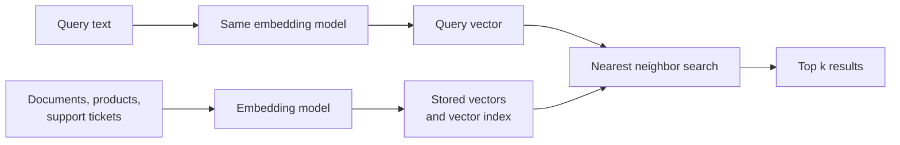

<Badge color="purple" size="sm">Concept</Badge>

Vector search finds results by meaning instead of exact words, by comparing
[embeddings](/learn/vector-search/what-are-vector-embeddings): lists of numbers that
capture what a piece of content is about. Think of it as a map where similar ideas sit
close together: a search drops your question onto the map and picks up whatever lies
nearby. That is why a help-center search for "login failure" can find a ticket titled
"can't sign in to my account," even though the two share no words. It powers search by
meaning, often called semantic search, along with product recommendations and chatbots
that [answer questions from your own documents](/learn/ai-memory/what-is-rag).

  <Card title="Learning objectives" icon="graduation-cap">
    After reading this article you will be able to:

    - Explain how vector search uses embeddings to find results by meaning
    - Describe how a vector search system stores and searches data
    - Tell exact search from approximate search, and explain recall and top-k
    - Spot when vector search needs help from keyword search or filters
  </Card>

## How does vector search work?

Put simply, vector search turns every item and every question into an embedding, then
returns the items whose embeddings sit closest to the question's.

For example, an online store embeds each product description once, when the product is
added. A shopper's search for "cozy reading chair for a small apartment" is embedded the
same way, and the nearest products can include a "compact armchair" or a "snug accent
seat."

Under the hood, a vector search system has an indexing path and a query path, and both
must produce vectors in the same embedding space, which usually means the same model.

1. **Embed the collection.** Each item, or each chunk of a long document, passes through
   an embedding model that typically outputs one vector.
2. **Store and index the vectors.** Each vector is saved with an ID and usually some
   metadata, often in a
   [vector database](/learn/vector-search/what-is-a-vector-database). The vectors are
   then organized into an index built for nearest neighbor search: finding the stored
   vectors closest to a given one.
3. **Embed the query** into the same embedding space, usually with the same model.
4. **Find the nearest neighbors.** The system compares the query vector with stored
   vectors using a distance metric and returns the `k` closest, called the top k.
5. **Use the results.** The application displays them, reranks them with a second, more
   careful scoring step, or passes them to a language model as context in
   [retrieval-augmented generation (RAG)](/learn/ai-memory/what-is-rag).

## What role do embeddings play in vector search?

Embeddings are what vector search actually compares: each item and each query becomes a
fixed-length list of numbers, and items with similar meaning end up close together.

The catch: stored vectors and query vectors must come from the same embedding space.
That normally means the same model, or a query encoder and a document encoder trained
together as a pair. Vectors from unrelated models, or from two versions of one model,
are not comparable, much like coordinates read off two differently drawn maps. The
[embeddings explainer](/learn/vector-search/what-are-vector-embeddings) covers how
models produce them and what changing models involves.

Closeness is measured with a distance or similarity function such as cosine similarity,
Euclidean distance, dot product, or Manhattan distance. The right choice is usually the
one the embedding model was trained with; see
[vector distance metrics](/learn/vector-search/vector-distance-metrics).

  <Card title="Try HelixDB" icon="rocket" href="/database/helix-db/start-here/quickstart" cta="Get started">
    Store embeddings on graph nodes and edges, and run vector search inside a graph
    traversal with open-source HelixDB.
  </Card>

## What is the difference between exact and approximate nearest neighbor search?

Exact search always finds the true closest matches, usually by checking every stored
vector. Approximate nearest neighbor (ANN) search checks only a small, promising
fraction, which is much faster on large collections but can miss a true match.

It is like walking every aisle for a book versus heading straight to the shelf where it
most likely sits: far quicker, but now and then the book was shelved elsewhere.

Under the hood, both solve the k-nearest neighbor (kNN) problem: find the `k` stored
vectors closest to the query. The simplest exact method, brute-force or flat search,
compares the query with every stored vector, so its cost grows linearly with the
collection: twice the vectors, twice the work. Exact tree indexes such as k-d trees can
skip work in low dimensions, but approach a full scan at the hundreds or thousands of
dimensions typical of embeddings.

| | Exact (brute-force / flat) | Approximate (ANN) |
| --- | --- | --- |
| Work per query | Compares every vector | Compares a small fraction |
| Result quality | Always the true top k | Usually most of the true top k |
| Index | Not required | Built and maintained alongside the data |
| Typical fit | Small collections, small filtered subsets | Large collections |

ANN indexes differ in how they pick that fraction. Graph-based indexes such as
[HNSW](/learn/vector-search/what-is-hnsw) link each vector to some of its near neighbors
and walk that graph toward the query. IVF (inverted file) indexes group the vectors into
clusters and scan only the clusters closest to the query.

## What do recall, latency, and top-k mean in vector search?

They are three numbers to watch: how many of the true matches you find, how long you
wait, and how many results you ask for.

- **Recall** measures how closely an ANN search matches exact search. Recall@k is the
  fraction of the true k nearest neighbors, as found by exact search, that the ANN
  search returned. A recall of 0.9 at k = 10 means that, on average, nine of the ten
  true nearest neighbors were found.
- **Latency** is how long a query takes. Most ANN indexes expose a setting that trades
  recall for latency: search more of the index and you find more true neighbors, but
  each query takes longer.
- **Top-k** is how many results a query asks for. In RAG, k is usually bounded by how
  much context the language model can use, and many pipelines retrieve a larger k and
  rerank it down to a smaller set.

One caveat: recall is measured against exact search over the same vectors, not against
what a user considers relevant. A search with perfect recall can still return poor
results if the embedding model or the chunking (how long documents are split into
passages) does not capture what the user meant.

## When does vector search fail?

Vector search is good at paraphrase and fuzzy meaning, but weak wherever exact
characters or the structure of the data matter.

- **Exact identifiers.** Order numbers, product codes, error codes, and email addresses
  carry little semantic meaning, so a support agent who pastes in one order number can
  get a different, similar-looking one ranked first.
- **Names and rare tokens.** New product names, internal jargon, and uncommon surnames
  may be poorly represented in the model's training data.
- **Hard constraints.** Dates, prices, ownership, and permissions are rules to enforce,
  not similarities to score. "Tickets from last week" is a filter.
- **Relationships.** "Documents written by people on my team" depends on who is
  connected to whom, which a text embedding of the document does not encode. That is a
  [graph database](/learn/graph-databases/what-is-a-graph-database) question.

[Keyword search](/learn/full-text-search/what-is-full-text-search) ranked with
[BM25](/learn/full-text-search/what-is-bm25) handles exact terms and rare tokens well,
and many systems combine the two in
[hybrid search](/learn/full-text-search/hybrid-search). Hard constraints belong in a
[filter that runs before or during ranking](/learn/vector-search/filtered-vector-search).

## How does HelixDB do vector search?

Your application computes the embeddings. HelixDB stores them as properties on nodes or
edges in a graph, and a vector index you define over that property makes them
searchable.

- A vector index covers one label (a node or edge type) and one top-level property, with
  a fixed dimension and one distance metric: cosine, Euclidean, or Manhattan.
- Search is approximate (ANN), and the documentation states over 90% recall.
- Search can run inside an exact candidate set defined by a graph traversal, such as the
  documents a user can read, and then never returns results outside that set.
- Within one request, graph traversals, vector search, and text search run in the same
  ACID transaction, so they all read one committed snapshot of the data. HelixDB has no
  built-in rank fusion (merging ranked lists into one), so the application combines
  vector and BM25 results.

Keeping all three kinds of search in one place is the idea behind
[one database for graph, vector, and text](/learn/database-architecture/one-database-for-graph-vector-and-text).
See [vector indexes](/database/helix-db/query-guides/vector-indexes) and
[prefiltered search](/database/helix-db/query-guides/prefiltering) for working queries.

## Frequently asked questions

### Is vector search the same as semantic search?

Mostly. Semantic search names the goal, finding results by meaning, and vector search
over embeddings is the most common way to implement it.

### Do I need an index to run vector search?

Not for small collections: comparing a query against every one of a few thousand vectors
is usually fast enough. An ANN index becomes worthwhile when exhaustive search no longer
fits your latency budget.

### Does vector search work for images or audio?

Yes, given an embedding model for that kind of data. Image and audio models produce
vectors that are searched just like text vectors. Multimodal models map different kinds
of input into one embedding space, so a text query such as "red running shoes" can
retrieve product photos.

### How do you evaluate vector search quality?

Beyond recall@k, build a labeled set of real queries with known good answers, and score
results with a relevance metric such as precision@k or nDCG (normalized discounted
cumulative gain, which rewards putting the best results first). Relevance scores expose
problems in the embedding model, chunking, or filters that recall cannot see.

## Related topics

<CardGroup cols={2}>
  <Card title="What are vector embeddings?" icon="cube" href="/learn/vector-search/what-are-vector-embeddings">
    How models turn inputs into vectors, and how dimensions and chunking work.
  </Card>
  <Card title="What is HNSW?" icon="diagram-project" href="/learn/vector-search/what-is-hnsw">
    How HNSW and IVF indexes find approximate nearest neighbors.
  </Card>
  <Card title="What is a vector database?" icon="database" href="/learn/vector-search/what-is-a-vector-database">
    What a vector database stores and when you need one.
  </Card>
  <Card title="What is filtered vector search?" icon="filter" href="/learn/vector-search/filtered-vector-search">
    Restrict results by metadata, permissions, or graph membership.
  </Card>
  <Card title="What is the difference between cosine, Euclidean, and Manhattan distance?" icon="ruler" href="/learn/vector-search/vector-distance-metrics">
    Cosine, Euclidean, Manhattan, and dot product compared.
  </Card>
  <Card title="What is hybrid search?" icon="layer-group" href="/learn/full-text-search/hybrid-search">
    Combine vector search with keyword search.
  </Card>
  <Card title="What is retrieval-augmented generation (RAG)?" icon="book-open" href="/learn/ai-memory/what-is-rag">
    Ground a language model's answers in retrieved data.
  </Card>
  <Card title="Vector indexes" icon="vector-square" href="/database/helix-db/query-guides/vector-indexes">
    Create a vector index and run nearest neighbor search in HelixDB.
  </Card>
</CardGroup>
